# Agentic Coordination Diagram: Runtime Interaction Model

**Document Version:** 1.0  
**Date:** December 2025  
**Audience:** Senior Engineers, Architects, Engineering Leadership

---

## 1. Purpose

This document illustrates how the Orchestrator, micro-agents, deterministic tools, and semantic warehouse graph interact at runtime in the execution plane. It focuses on coordination patterns and data flow rather than low-level implementation details.

The coordination model shows how agents generate proposals, how the Orchestrator detects and resolves conflicts, how the semantic layer enables cross-domain reasoning, and how human planners participate via HITL gates. This complements the architectural specifications in `architecture/wms_hybrid_architecture.md`, the semantic ontology in `semantics/warehouse_graph.md`, and the behavioral specifications in `prototype/orchestrator_logic.py` and `prototype/microagent_behaviors.py`.

Details about agent personalities, tool contracts, and evaluation frameworks are covered in their respective documents (`agent_design/agent_personalities.md`, `tool_contracts/tool_catalog.md`, `evals/evaluation_framework.md`).

---

## 2. High-Level Component Interaction Diagram

```mermaid
graph TD
    subgraph "Micro-Agents"
        SA[SlottingAgent]
        RA[ReplenishmentAgent]
        PA[PickingAgent]
        DYA[DockYardAgent]
        LSA[LaborSyncAgent]
        IAA[InventoryAccuracyAgent]
    end
    
    subgraph "WMS Orchestrator"
        OR[Orchestrator Core]
        CD[Conflict Detection]
        CR[Conflict Resolution]
        SV[Semantic Validator]
        OR --> CD
        OR --> CR
        OR --> SV
    end
    
    subgraph "Deterministic Tools"
        subgraph "Slotting Tools"
            ST1[Storage Location Scoring]
            ST2[Travel Time Estimator]
            ST3[Capacity Checker]
        end
        subgraph "Replenishment Tools"
            RT1[Replenishment Job Generator]
            RT2[Safety Stock Checker]
        end
        subgraph "Picking Tools"
            PT1[Wave Builder]
            PT2[Route Optimizer]
            PT3[SLA Risk Estimator]
        end
        subgraph "Shared Tools"
            CT[Aisle Congestion Estimator]
            LT[Labor Capacity Forecaster]
        end
    end
    
    subgraph "Semantic Warehouse Graph"
        SG[Knowledge Graph]
        EN[Entities: SKU, Location, Task, Worker, Order]
        REL[Relationships: adjacency, capacity, constraints]
        CON[Constraints: safety, compatibility, SLA]
    end
    
    subgraph "Human Planner"
        HITL[HITL Decision Interface]
    end
    
    subgraph "WMS Execution"
        EX[Deterministic Execution Services]
    end
    
    SA -->|proposals| OR
    RA -->|proposals| OR
    PA -->|proposals| OR
    DYA -->|proposals| OR
    LSA -->|proposals| OR
    IAA -->|proposals| OR
    
    SA -->|tool invocations| ST1
    SA -->|tool invocations| ST2
    SA -->|tool invocations| ST3
    RA -->|tool invocations| RT1
    RA -->|tool invocations| RT2
    PA -->|tool invocations| PT1
    PA -->|tool invocations| PT2
    PA -->|tool invocations| PT3
    
    OR -->|queries| SG
    OR -->|tool invocations| CT
    OR -->|tool invocations| LT
    OR -->|tool invocations| PT3
    
    SA -->|queries| SG
    RA -->|queries| SG
    PA -->|queries| SG
    DYA -->|queries| SG
    LSA -->|queries| SG
    IAA -->|queries| SG
    
    ST1 -->|queries| SG
    ST2 -->|queries| SG
    ST3 -->|queries| SG
    RT1 -->|queries| SG
    RT2 -->|queries| SG
    PT1 -->|queries| SG
    PT2 -->|queries| SG
    PT3 -->|queries| SG
    CT -->|queries| SG
    LT -->|queries| SG
    
    OR -->|conflicts + constraints| CD
    CD -->|conflict groups| CR
    CR -->|validated resolutions| SV
    SV -->|auto-approve| EX
    SV -->|HITL decisions| HITL
    HITL -->|planner decisions| OR
    OR -->|approved actions| EX
    
    style OR fill:#e1f5ff
    style SG fill:#fff4e1
    style HITL fill:#ffe1f5
    style EX fill:#e1ffe1
```

**Key Interactions:**

- **Proposals:** Micro-agents generate `ProposedAction` objects with priority, risk, uncertainty, and explanations, sending them to the Orchestrator
- **Conflicts + Constraints:** Orchestrator queries the semantic graph to detect conflicts on shared resources (aisles, workers, doors, equipment) and validate safety/SLA constraints
- **Tool Invocations:** Agents call domain-specific tools; Orchestrator calls shared tools (congestion estimator, SLA risk estimator) for global reasoning
- **HITL Decisions:** Orchestrator routes ambiguous or high-risk tradeoffs to planners via structured decision cards
- **Approved Actions:** Orchestrator sends `ApprovedAction` objects to deterministic execution services

---

## 3. Roles of Each Layer

### 3.1 Micro-Agents

Micro-agents are goal-directed, domain-specialized components that observe warehouse state, reason about local optimization objectives, and generate proposals for actions. Each agent operates with bounded autonomy: they focus on their domain (slotting, replenishment, picking, dock/yard, labor, inventory accuracy) and respect local constraints, but do not see the full warehouse picture.

**Key Characteristics:**
- **Goal-directed:** Each agent optimizes for domain-specific objectives (pick efficiency, stockout prevention, dock utilization)
- **Tool-driven:** Agents call deterministic tools to validate constraints, compute metrics, and generate proposals
- **Personality-constrained:** Agents follow defined risk postures, escalation triggers, and explanation styles
- **Local perspective:** Agents reason about their domain but cannot resolve cross-domain conflicts autonomously
- **Proposal-based:** Agents generate structured `ProposedAction` objects with priority, risk, uncertainty, and rationale

### 3.2 Orchestrator

The Orchestrator aggregates proposals from all micro-agents, queries the semantic graph and shared tools to detect conflicts and global constraints, and applies arbitration rules to resolve conflicts. It acts as a referee and judge, not a player: it evaluates proposals but does not generate its own actions.

**Key Responsibilities:**
- **Conflict Detection:** Groups proposals that compete for shared resources or violate safety/SLA rules
- **Semantic Validation:** Queries the semantic graph to validate entity state consistency and constraint compliance
- **Global Optimization:** Applies arbitration rules that balance safety, SLA adherence, and operational efficiency
- **Decision Routing:** Auto-approves low-risk resolutions, routes ambiguous or high-risk decisions to HITL
- **Safety Enforcement:** Never compromises on safety constraints, even under SLA pressure

### 3.3 Tools and Semantic Warehouse Graph

**Deterministic Tools** perform narrow, well-defined computations and checks. Tools are shared capabilities: multiple agents may call the same tool (e.g., Travel Time Estimator, Congestion Estimator) with different context, and the Orchestrator calls shared tools for global reasoning. Tools query the semantic graph to access warehouse meaning (adjacency, capacity, constraints) rather than hardcoding rules.

**Semantic Warehouse Graph** encodes entities (SKU, Location, Task, Worker, Order), relationships (adjacency, capacity, constraints), and warehouse-native semantics (safety rules, compatibility rules, SLA dependencies). Agents and Orchestrator query the graph to reason about conflicts, feasibility, and constraints. The graph serves as the single source of truth for warehouse meaning, preventing semantic drift and enabling cross-domain reasoning.

---

## 4. Data and Decision Flow (Narrated Walkthrough)

**Typical Coordination Cycle:**

1. **Agents Observe State:** Each micro-agent queries the semantic graph and WMS data sources to understand current warehouse state (inventory levels, active tasks, worker availability, congestion patterns). Agents use domain-specific tools to evaluate constraints and compute metrics.

2. **Agents Generate Proposals:** Each agent calls its tools and builds `ProposedAction` objects that include:
   - Target entities (locations, SKUs, orders, workers)
   - Time windows and required resources
   - Priority, risk score, uncertainty, and confidence
   - Explanation with evidence and constraints evaluated
   - Potential conflicts the agent suspects

3. **Orchestrator Collects Proposals:** The Orchestrator receives proposals from all active agents, performs basic validation (schema checks, stale proposal detection, duplicate filtering), and adds valid proposals to the active set.

4. **Orchestrator Detects Conflicts:** The Orchestrator queries the semantic graph to detect conflicts:
   - **Spatial conflicts:** Multiple proposals compete for the same aisle segment, location, or door
   - **Resource conflicts:** Multiple proposals require the same worker, forklift, or equipment
   - **Safety violations:** Proposals violate forklift-worker proximity rules or aisle capacity constraints
   - **SLA tradeoffs:** Multiple orders at risk, requiring prioritization decisions

5. **Orchestrator Groups Conflicts:** Conflicting proposals are grouped into `ConflictGroup` objects. The Orchestrator calls shared tools (congestion estimator, SLA risk estimator) to assess global impact and risk.

6. **Orchestrator Resolves Conflicts:** For each conflict group, the Orchestrator applies arbitration rules:
   - **Safety first:** Reject or reschedule proposals that violate safety constraints
   - **SLA priority:** Prioritize high-priority orders and expedite requests
   - **Temporal ordering:** First-come-first-served for equal-priority conflicts
   - **Resource optimization:** Minimize total delay across operations

7. **Orchestrator Routes Decisions:**
   - **Auto-approval:** Low-risk resolutions (safety risk < 0.1, SLA risk < 0.2, clear policy alignment) are approved and sent to execution
   - **HITL escalation:** Ambiguous or high-risk tradeoffs (risk exceeds thresholds, confidence < 0.95, multiple valid options) are routed to planners via structured decision cards

8. **Planner Reviews (HITL):** Planners review decision cards that include conflict summary, orchestrator recommendation, evidence panel, and impact preview. Planners can approve, modify, or reject resolutions.

9. **Execution:** Approved actions are converted to `ApprovedAction` objects and sent to deterministic WMS execution services. Outcomes are logged for evaluation and root-cause analysis.

10. **State Updates:** Physical operations trigger event bus updates that refresh the semantic graph, enabling agents to observe updated state in the next cycle.

---

## 5. Relationship to Other Diagrams

**Conflict Resolution Sequence:** Detailed conflict resolution flows, including agent-to-agent negotiation patterns and HITL decision card structures, are documented in `ux-flows/conflict_resolution_flow.md`. This coordination diagram shows the high-level interaction pattern; the conflict resolution flow shows the detailed sequence of escalations and decisions.

**Evaluation Framework:** The evaluation framework (`evals/evaluation_framework.md`) uses this interaction pattern to simulate agent behavior and score system performance. Evaluators generate test scenarios that respect semantic graph relationships, simulate agent proposals and orchestrator resolutions, and measure correctness against expected behavior.

**Architecture Complement:** This diagram is a coordination view that complements the system-level architecture in `architecture/wms_hybrid_architecture.md`. The architecture document defines components, design principles, and failure modes; this document shows how those components interact at runtime.

**Semantic Layer Integration:** The semantic warehouse graph (`semantics/warehouse_graph.md`) defines the ontology and relationships that enable the coordination patterns shown here. Without the semantic layer, conflict detection, constraint validation, and cross-domain reasoning would not be possible.

---

**Document Status:** Coordination Model Specification  
**Next Steps:** Implement orchestrator conflict detection and resolution logic, build HITL decision card interface, integrate semantic graph queries into agent and orchestrator workflows

