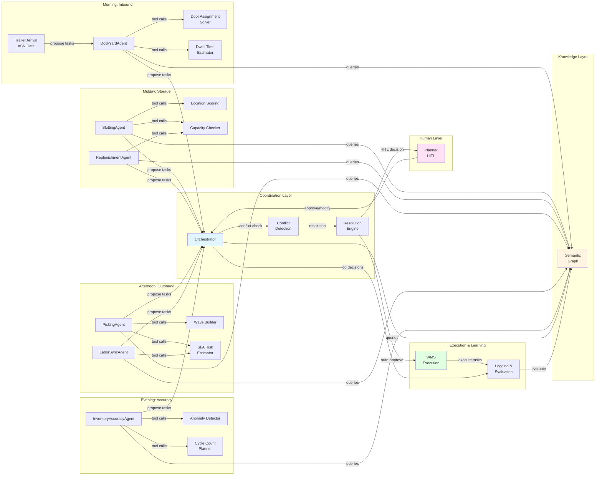

# Day in the Life of an Agentic WMS

**Document Version:** 1.0  
**Date:** December 2025  
**Audience:** Senior Product and Engineering Stakeholders

---

## 1. Purpose

This document tells an operational story from the warehouse point of view, not just a component story. It follows a typical workday in an agentic warehouse management system, showing how inbound trailers become outbound shipments through coordinated decisions made by micro-agents, validated by deterministic tools, mediated by the Orchestrator, and reviewed by human planners when needed.

The goal is to show how agentic decisions, deterministic tools, the semantic layer, and planner input fit together over a typical workday. This narrative complements the static architecture diagrams (`architecture/wms_hybrid_architecture.md`, `architecture/agentic_coordination_diagram.md`) and behavioral specifications (`agent_design/agent_personalities.md`) by illustrating runtime behavior in realistic warehouse scenarios. By walking through a day's operations, we demonstrate how the system maintains safety, meets service level commitments, and optimizes efficiency while providing visibility and control to warehouse planners.

---

## 2. Overview Diagram

**Key Flow Labels:**
- **"propose tasks"** → Agents generate ProposedAction objects with priorities, risks, and explanations
- **"conflict check"** → Orchestrator queries semantic graph to detect spatial, resource, and safety conflicts
- **"HITL decision"** → High-risk or ambiguous resolutions routed to planners via structured decision cards
- **"execute tasks"** → Approved actions sent to deterministic WMS execution services
- **"log and evaluate"** → All decisions logged with context for evaluation, RCA, and continuous improvement

---

## 3. Morning: Inbound and Dock Decisions

**6:00 AM - 10:00 AM: Peak Inbound Operations**

The warehouse day begins with inbound trailers arriving at the yard, each carrying advance shipping notices (ASNs) that specify contents, priorities, and appointment schedules. The DockYardAgent wakes up to coordinate this flow, ensuring trailers are assigned to appropriate dock doors, yard slots are managed efficiently, and inbound operations do not block critical outbound shipments.

**Trailer Arrival and State Reading**

At 6:15 AM, Trailer TR-123 arrives with an ASN indicating 45 pallets of fast-moving consumer goods destined for the forward pick zone. The DockYardAgent queries the semantic warehouse graph to understand current state: which dock doors are available, which zones they serve, what equipment is operational, and what outbound operations are scheduled. The agent queries `Door → Zone` relationships to identify doors that serve the forward pick zone, `Trailer → Door` relationships to see current assignments, and `YardSlot → Door` relationships to assess yard proximity.

The agent calls the **Door Assignment Solver** tool, passing trailer characteristics (temperature requirements, equipment needs, priority level) and current door state. The tool queries the semantic graph for door capabilities (height, width, equipment compatibility) and zone associations, then returns ranked door assignments with scores. The agent also calls the **Trailer Dwell Time Estimator** tool to predict how long unloading will take given current warehouse congestion and labor availability.

**Proposal Generation and Conflict Detection**

The DockYardAgent generates a `ProposedAction` object: assign Trailer TR-123 to Door 5 (forward pick zone, available 6:30 AM, estimated completion 8:15 AM). The proposal includes priority (high, fast-moving goods), risk assessment (low safety risk, moderate congestion risk), and explanation: "Door 5 serves forward pick zone, available at appointment time, estimated dwell time 1h 45m based on 45 pallets and current labor capacity."

The agent sends this proposal to the Orchestrator, which immediately queries the semantic graph to detect conflicts. The Orchestrator finds that Door 5 is currently occupied by Trailer TR-120 (scheduled completion 6:45 AM), but the semantic graph shows `Door → Zone` relationships indicating Door 6 also serves the forward pick zone and is available at 6:30 AM. The Orchestrator detects a temporal conflict (TR-123 appointment at 6:30 AM, but Door 5 occupied until 6:45 AM) and evaluates alternatives.

**Orchestrator Resolution and HITL Routing**

The Orchestrator applies arbitration rules: safety first (no forklift congestion violations), then SLA priority (inbound blocking outbound is high risk), then optimization (minimize dwell time). The Orchestrator queries the semantic graph for `Trailer → Order` relationships to assess if TR-123 contents are needed for urgent outbound orders. Finding no urgent dependencies, the Orchestrator resolves the conflict by: (1) approving TR-123 assignment to Door 6 (available at appointment time, same zone), (2) validating that Door 6 has required equipment and capacity, (3) auto-approving the resolution (low risk: safety risk < 0.1, SLA risk < 0.2, clear policy alignment).

However, at 7:30 AM, a different scenario unfolds: Trailer TR-145 arrives with temperature-sensitive pharmaceuticals requiring refrigerated doors, but all refrigerated doors are occupied until 9:00 AM. The DockYardAgent proposes Door 8 (refrigerated, available 9:00 AM), but this creates a 90-minute delay that risks product integrity. The Orchestrator detects high risk (SLA risk > 0.4, temperature-sensitive shipment) and routes the decision to the planner via HITL.

The planner sees a structured decision card: "Trailer TR-145 (temperature-sensitive pharmaceuticals) requires refrigerated door, but all doors occupied until 9:00 AM. Options: (1) Wait for Door 8 at 9:00 AM (90-minute delay, risk to product), (2) Expedite Door 7 completion (requires rescheduling TR-140, 30-minute delay), (3) Use temporary cold storage in yard (requires equipment coordination)." The planner reviews evidence panel showing temperature requirements, current door schedules, and equipment availability, then approves expediting Door 7 completion.

**Logging and Evaluation**

All decisions are logged with context from the semantic graph: trailer characteristics, door assignments, conflict resolutions, and planner decisions. The evaluation system tracks metrics: door utilization, dwell time accuracy, conflict resolution rate, and HITL frequency. These logs enable root cause analysis: if dwell time estimates are consistently inaccurate, RCA agents can trace through semantic relationships (labor capacity, congestion patterns, equipment availability) to identify improvement opportunities.

---

## 4. Midday: Slotting and Replenishment

**10:00 AM - 2:00 PM: Storage Optimization and Stock Protection**

As inbound operations peak and outbound picking accelerates, the warehouse enters a period where storage optimization and inventory protection become critical. The SlottingAgent and ReplenishmentAgent operate concurrently, each focused on their domain objectives but potentially competing for shared resources like aisle segments, forklifts, and worker capacity.

**SlottingAgent Identifies Re-slotting Candidates**

At 10:30 AM, the SlottingAgent queries the semantic warehouse graph to identify storage optimization opportunities. The agent queries `SKU → InventoryRecord` relationships to find slow-moving items in forward pick locations and fast-moving items in reserve storage. The agent calls the **Storage Location Scoring** tool, which queries `Location → AisleSegment` and `AisleSegment → Zone` relationships to evaluate candidate locations based on pick frequency, travel time, and congestion patterns.

The tool returns ranked locations: Item SKU-789 (picked 12x/day, currently in reserve Location R-45) should move to forward pick Location A-12-05 (67% travel time reduction). The SlottingAgent generates a proposal: move SKU-789 from R-45 to A-12-05, scheduled for 11:00 AM (off-peak window). The proposal includes explanation: "Current location: R-45 (reserve), average pick travel time: 45 seconds. Proposed location: A-12-05 (forward pick), projected travel time: 15 seconds. Historical data: 12 picks/day, forward pick locations have 30% faster average pick times."

Before proposing, the agent calls the **Capacity and Compatibility Checker** tool, which queries `Location → ConstraintNode` relationships to validate that A-12-05 has sufficient capacity and is compatible with SKU-789's requirements (weight, volume, hazard class). The tool confirms compatibility and capacity, and the agent calls the **Aisle Congestion Estimator** tool to assess congestion risk. The tool queries `Task → AisleSegment` relationships to predict occupancy, finding moderate congestion (0.4 score) at 11:00 AM, which is acceptable.

**ReplenishmentAgent Monitors Pick Face Thresholds**

Simultaneously, at 10:45 AM, the ReplenishmentAgent queries the semantic graph for `InventoryRecord → Location` relationships to identify pick faces approaching reorder points. The agent finds Location A-12-08 (adjacent to A-12-05) has 15 units remaining, reorder point 20 units, daily consumption 8 units/day. The agent calls the **Safety Stock Threshold Checker** tool, which confirms stockout risk within 6 hours if not replenished.

The ReplenishmentAgent calls the **Replenishment Job Generator** tool, which queries `Location → AisleSegment` relationships to identify source locations in reserve storage and compute replenishment moves. The tool proposes: replenish 25 units from Reserve R-50 to Location A-12-08, estimated time 15 minutes, requires forklift access to Aisle A-12. The agent generates a proposal: schedule replenishment at 11:00 AM (same time window as slotting movement), with explanation: "Location A-12-08: 15 units remaining, reorder point 20 units, projected stockout: 6 hours. Replenish 25 units from R-50, estimated time: 15 minutes, prevents stockout for 3 high-priority orders."

**Orchestrator Detects Conflict and Resolves**

Both agents send proposals to the Orchestrator, which immediately detects a conflict: both operations require forklift access to Aisle A-12 at 11:00 AM. The Orchestrator queries the semantic graph for `AisleSegment → ConstraintNode` relationships to determine aisle capacity (can only accommodate one forklift at a time) and `Task → AisleSegment` relationships to assess current occupancy.

The Orchestrator applies arbitration rules: safety first (no simultaneous forklift access), then SLA priority (stockout prevention vs. optimization), then temporal ordering. The Orchestrator evaluates that replenishment prevents stockout (time-critical) while slotting is optimization (not time-critical). The resolution: (1) approve Replenishment at 11:00 AM (prevents stockout), (2) reschedule Slotting to 11:20 AM (after replenishment completes, acceptable delay for optimization), (3) validate no safety violations (forklift clears aisle before next operation).

The Orchestrator auto-approves this resolution (safety risk < 0.1, clear policy alignment: stockout prevention over optimization). However, the Orchestrator logs the conflict and resolution for evaluation: did the resolution maintain safety? Did it prevent stockout? Did it minimize operational disruption?

**Semantic Constraints Enforced**

Throughout this process, semantic constraints are enforced through the semantic graph. The **Capacity and Compatibility Checker** tool queries `SKU → ConstraintNode` relationships to ensure SKU-789 is compatible with A-12-05 (no hazmat violations, temperature requirements met). The **Aisle Congestion Estimator** tool queries `AisleSegment → ConstraintNode` relationships to ensure aisle capacity is not exceeded. The Orchestrator validates that both proposals respect these constraints before approving resolutions.

---

## 5. Afternoon: Picking and Service Levels

**2:00 PM - 6:00 PM: Peak Outbound and SLA Protection**

The afternoon shift focuses on outbound order fulfillment, where service level commitments create temporal pressure and resource contention. The PickingAgent and LaborSyncAgent work together to ensure orders meet promise dates while respecting labor constraints, equipment availability, and congestion patterns.

**PickingAgent Builds Waves with SLA Awareness**

At 2:15 PM, the PickingAgent receives 50 new orders with varying priorities and promise dates. The agent queries the semantic graph for `Order → ConstraintNode` relationships to identify SLA commitments and `Order → OrderLine` relationships to understand fulfillment requirements. The agent calls the **SLA Risk Estimator** tool, which queries temporal relationships (promise dates, current time, estimated pick/pack/ship durations) to assess risk for each order.

The tool identifies 12 orders with high SLA risk (promise dates within 2-3 hours, tight buffers). The PickingAgent calls the **Wave Builder** tool, which groups orders into efficient pick waves while respecting SLA priorities. The tool queries `Order → Wave` relationships to understand wave boundaries and `Wave → Task` relationships to sequence operations. The tool proposes: Wave W-45 contains 8 high-priority orders (Tier 1, promise dates 4:00-5:00 PM), Wave W-46 contains 15 standard orders (Tier 2, promise dates 5:00-6:00 PM).

The PickingAgent calls the **Route Optimizer** tool for each wave, which queries `Location → AisleSegment` relationships to generate efficient pick paths. The tool returns optimized routes that minimize travel time while respecting aisle constraints and congestion patterns. The agent generates proposals: assign Wave W-45 to Worker 123 (experienced, high accuracy, currently in Zone A), estimated completion 3:45 PM (15-minute buffer before promise date).

**LaborSyncAgent Forecasts Capacity and Assigns Workers**

The LaborSyncAgent queries the semantic graph for `Worker → ConstraintNode` relationships to assess current labor capacity, skills, and availability. The agent calls the **Labor Capacity Forecaster** tool, which queries `Worker → Task` relationships to predict workload and `Worker → Zone` relationships to assess zone assignments. The tool forecasts: Worker 123 has 4 hours capacity remaining, skills match Wave W-45 requirements, currently in Zone A (optimal location).

However, the tool also identifies a conflict: Worker 123 is currently assigned to Order #7891 (Tier 2, 40% complete, promise date 5:00 PM), but Wave W-45 (Tier 1, promise date 4:00 PM) requires immediate assignment. The LaborSyncAgent calls the **Task to Worker Assignment** tool, which evaluates reassignment impact: Order #7891 would be delayed by 20 minutes (still within 2-hour buffer), but Wave W-45 would meet promise date.

The LaborSyncAgent generates a proposal: reassign Worker 123 from Order #7891 to Wave W-45, with explanation: "Worker 123: 4 hours capacity, skills match Wave W-45, currently in Zone A. Reassignment delays Order #7891 by 20 minutes (acceptable, 2-hour buffer), enables Wave W-45 to meet 4:00 PM promise date."

**Orchestrator Mediates Conflicts and Prioritizes SLAs**

The Orchestrator receives proposals from both agents and detects a labor conflict: Worker 123 cannot simultaneously work on Order #7891 and Wave W-45. The Orchestrator queries the semantic graph for `Order → ConstraintNode` relationships to assess SLA priorities and `Task → Worker` relationships to understand current assignments.

The Orchestrator applies arbitration rules: safety first (no worker overload), then SLA priority (Tier 1 over Tier 2, tight buffers over loose buffers), then optimization (minimize total delay). The Orchestrator evaluates: Wave W-45 (Tier 1, 4:00 PM promise, 15-minute buffer) has higher priority than Order #7891 (Tier 2, 5:00 PM promise, 2-hour buffer). Resolution: (1) approve Worker 123 reassignment to Wave W-45, (2) reschedule Order #7891 completion (20-minute delay acceptable, still within buffer), (3) validate no safety violations (worker capacity respected, no overload).

The Orchestrator auto-approves this resolution (safety risk < 0.1, SLA risk < 0.2 for Order #7891 after delay, clear policy alignment). However, the Orchestrator also detects a spatial conflict: Wave W-45 requires picking from Aisle A-12, but the ReplenishmentAgent has scheduled replenishment in Aisle A-12 at 2:30 PM. The Orchestrator queries `Task → AisleSegment` relationships to assess temporal overlap and resolves: (1) approve Wave W-45 picking (SLA-critical), (2) reschedule replenishment to 2:45 PM (after picking completes, acceptable delay for stockout prevention).

**Planner Reviews High-Risk Tradeoffs**

At 3:30 PM, a more complex scenario emerges: Wave W-47 (12 orders, Tier 1, promise dates 5:00-5:30 PM) requires 6 hours of picking work, but only 4 workers with required skills are available, each with 3-4 hours capacity remaining. The PickingAgent calculates that wave cannot be fulfilled within SLA given current labor constraints and escalates to the Orchestrator.

The Orchestrator evaluates alternatives: (1) split wave across multiple workers (increases travel time, reduces efficiency), (2) delay lower-priority orders to free capacity (risks SLA violations), (3) request overtime approval (requires planner decision). The Orchestrator detects high risk (SLA risk > 0.4, operational impact > 30 minutes) and routes the decision to the planner via HITL.

The planner sees a structured decision card: "Wave W-47 (12 Tier 1 orders, promise dates 5:00-5:30 PM) requires 6 hours picking work, but only 4 workers available with 3-4 hours capacity each. Options: (1) Split wave across 4 workers (increases travel time 20%, reduces efficiency, but meets SLA), (2) Delay 3 lower-priority orders to free capacity (risks SLA violations for delayed orders), (3) Approve overtime for 2 workers (adds 2 hours capacity, maintains efficiency, requires labor cost approval)."

The planner reviews evidence panel showing SLA calculations, worker availability, alternative options, and impact assessments. The planner approves overtime for 2 workers, enabling Wave W-47 to meet promise dates while maintaining efficiency. The Orchestrator logs this decision for evaluation: did overtime approval maintain SLA? Did it optimize labor utilization? Did it respect labor constraints?

**Explanations Enable Planner Understanding**

Throughout the afternoon, agent explanations help planners understand why waves or assignments changed. When the PickingAgent proposes Wave W-45, the explanation includes: "Order context: 8 Tier 1 orders, promise dates 4:00-5:00 PM, 75 minutes remaining. Proposed action: Assign Worker 123, estimated completion 3:45 PM, 15-minute buffer. SLA status: On track. Constraints evaluated: Worker 123 has required skills, Aisle A-12 available, all locations confirmed available. Alternatives: Worker 456 available but requires 5 additional minutes travel time, reduces buffer to 10 minutes."

These explanations enable planners to understand agent reasoning, trust recommendations, and make informed decisions when tradeoffs are ambiguous.

---

## 6. Evening: Exceptions, Inventory Accuracy, and RCA

**6:00 PM - 10:00 PM: Closing the Loop and Continuous Improvement**

As the day winds down, the system shifts focus to exception handling, inventory accuracy maintenance, and root cause analysis. The InventoryAccuracyAgent identifies discrepancies, the Orchestrator coordinates exception resolution, and evaluation systems analyze the day's decisions to inform continuous improvement.

**InventoryAccuracyAgent Detects Anomalies**

At 6:30 PM, the InventoryAccuracyAgent queries the semantic graph for `InventoryRecord → Location` relationships and compares system records against sensor data and transaction history. The agent calls the **Inventory Anomaly Detector** tool, which queries `Location → ConstraintNode` relationships to assess confidence scores and `Task → Location` relationships to identify recent movements.

The tool detects a discrepancy at Location A-12-05: system shows 15 units, but sensor data and transaction history suggest only 8 units are physically present. The tool calculates confidence score 0.85 (below 0.95 threshold due to conflicting signals: recent picks not fully recorded, or possible location misidentification). The InventoryAccuracyAgent calls the **Cycle Count Planner** tool, which queries `Location → ConstraintNode` relationships to assess risk and `Task → Location` relationships to identify non-disruptive time windows.

The tool proposes: immediate cycle count verification (15 minutes, acceptable disruption), with explanation: "Location A-12-05: System shows 15 units, suspected 8 units (discrepancy: -7 units). Investigation: Last movement 2 days ago, no recent picks from this location, sensor data confirms low occupancy. Root cause hypothesis: (1) Unrecorded pick transaction, (2) Theft or damage, (3) Location misidentification in previous cycle count. Recommendation: Cycle count verification, then adjust system to 8 units if verified, investigate missing 7 units."

However, the agent also identifies that Order #7892 (Tier 1, promise date 7:00 PM) requires 5 units from Location A-12-05. If the discrepancy is real (only 8 units available), the order cannot be fulfilled from this location. The InventoryAccuracyAgent escalates to the Orchestrator with high risk (customer impact risk > 0.5, confidence < 0.95).

**Orchestrator Coordinates Exception Resolution**

The Orchestrator receives the escalation and evaluates customer order impact. The Orchestrator queries `Order → OrderLine` relationships to understand fulfillment requirements and `InventoryRecord → Location` relationships to assess availability. The Orchestrator detects that Order #7892 is at risk if discrepancy is confirmed and resolves: (1) approve immediate cycle count verification (15 minutes, acceptable disruption), (2) hold Order #7892 pick assignment until verification completes, (3) prepare alternative resolution (expedited replenishment or alternative location) if discrepancy confirmed.

The Orchestrator coordinates with the ReplenishmentAgent to prepare expedited replenishment if needed: if cycle count confirms only 8 units available, replenish 10 units from reserve storage to meet Order #7892 requirements. The Orchestrator logs this coordination for evaluation: did exception handling maintain SLA? Did it prevent customer impact? Did it minimize operational disruption?

**Evaluation Systems Replay the Day**

As the day concludes, evaluation systems replay the day's operations using logged decisions and semantic graph snapshots. The evaluation harness runs "what-if" analyses: what if the SlottingAgent had different congestion thresholds? What if the Orchestrator prioritized efficiency over SLA in conflict resolution? What if labor capacity was 20% higher?

The evaluation system queries the semantic graph to reconstruct warehouse state at each decision point, then simulates alternative agent policies and measures outcomes: safety violations, SLA adherence, throughput, and planner workload. These analyses inform continuous improvement: if evaluation shows that higher congestion thresholds would improve efficiency without safety violations, agent personalities can be refined. If evaluation shows that SLA prioritization created excessive delays, orchestrator arbitration rules can be adjusted.

**RCA Agents Analyze Patterns**

Root cause analysis (RCA) agents analyze the day's logs to identify patterns and suggest improvements. RCA agents query semantic relationships to trace through decision chains: why did the DockYardAgent propose Door 6 instead of Door 5? (Temporal conflict detected, alternative evaluated, resolution applied.) Why did the Orchestrator reschedule slotting instead of replenishment? (Stockout prevention prioritized over optimization, policy alignment.)

RCA agents identify improvement opportunities: dwell time estimates were consistently 10% optimistic (trailers took longer than predicted), suggesting the Dwell Time Estimator tool needs calibration. Conflict resolution between picking and replenishment occurred 15 times during the day, suggesting the Orchestrator could benefit from predictive conflict avoidance (scheduling replenishment during known picking gaps).

These insights inform agent personality adjustments, tool tuning, and semantic constraint refinements. The evaluation system tracks whether improvements actually enhance performance: after refining dwell time estimates, do trailers complete on time more frequently? After implementing predictive conflict avoidance, do conflicts decrease?

---

## 7. Logging, Evaluation, and Learning Loop

**Continuous Logging Throughout the Day**

Over the course of the day, tools, agents, and the Orchestrator log every decision with structured context. ProposedActions include: proposal ID, agent ID, timestamp, proposal details (action type, target entities, time window), confidence level, risk score, uncertainty, constraints evaluated, data sources, and explanation. ApprovedActions include: decision type, rationale, alternatives considered, impact assessment, and outcome.

All logs include trace IDs that enable correlation across agents, orchestrator, and execution layer. When a picking task completes, trace IDs link the task back to: (1) PickingAgent proposal, (2) Orchestrator resolution, (3) LaborSyncAgent assignment, (4) tool invocations (Wave Builder, Route Optimizer, SLA Risk Estimator), (5) semantic graph queries (Order → ConstraintNode, Location → AisleSegment, Worker → ConstraintNode).

**Evaluation Systems Compare Behavior Against Baselines**

Evaluation systems compare the day's behavior against baselines and expectations. Tool-level evaluations verify that deterministic tools (Door Assignment Solver, Location Scoring, SLA Risk Estimator) produced correct outputs for known inputs. Agent-level evaluations verify that micro-agents (DockYardAgent, SlottingAgent, PickingAgent) behaved consistently with their defined personalities: did they escalate when uncertainty exceeded thresholds? Did they respect non-negotiables? Did they generate high-quality explanations?

System-level evaluations measure end-to-end performance: safety violation rate (target: 0%), order promise accuracy (target: 99.5%+), autonomous conflict resolution rate (target: 90%+), planner approval rate (target: 85%+). These metrics are tracked over time to detect regressions and measure improvements.

**Insights Inform Continuous Improvement**

Insights from RCA and evaluations inform agent personality adjustments, tool tuning, and semantic constraint refinements. If evaluation shows that the SlottingAgent is too conservative (defers slotting too frequently), personality risk postures can be refined. If evaluation shows that the SLA Risk Estimator underestimates risk, tool calibration can be adjusted. If evaluation shows that semantic constraints are too restrictive (blocking valid operations), constraint definitions can be relaxed.

The learning loop is continuous: evaluation → RCA → improvement → re-evaluation. Each day's operations provide data for improvement, and each improvement is validated through evaluation before deployment. This ensures that the system improves over time while maintaining safety and performance guarantees.

**Connection to Evaluation Architecture**

This learning loop is implemented through the evaluation architecture defined in `evals/evals_architecture.md`, which provides the infrastructure (data sources, harnesses, metrics, reporting) that enables three-level evaluation (tools, agents, system) and continuous improvement. The evaluation architecture ensures that improvements are measurable, regressions are detected early, and root cause analysis integrates with evaluation logs for systematic learning.

---

## 8. How This Story Appears in a Customer Demo

**Before and After: Traditional vs. Agentic Orchestration**

In a customer or leadership demo, this narrative can be presented as a "before and after" story that shows the value of agentic orchestration with semantic awareness and human-in-the-loop decision support.

**Before (Traditional Rule-Based Orchestration):**

In a traditional WMS, inbound trailers are assigned to doors based on simple rules (first available, zone matching), without considering dwell time, outbound priorities, or equipment compatibility. When conflicts occur (multiple trailers competing for same door), planners manually resolve them by reviewing spreadsheets and making phone calls. Slotting and replenishment operate independently, often creating aisle conflicts that planners discover reactively when forklifts block each other. Picking waves are built based on order priority alone, without considering labor capacity, congestion patterns, or SLA risk. When exceptions occur (inventory discrepancies, equipment failures), planners investigate manually by querying multiple systems and correlating data.

**After (Agentic Orchestration with Semantic Awareness):**

In an agentic WMS, the DockYardAgent proactively coordinates inbound operations, considering dwell time, outbound priorities, and equipment compatibility. When conflicts occur, the Orchestrator detects them automatically, evaluates alternatives using semantic relationships, and either resolves them autonomously (low risk) or presents structured decision cards to planners (high risk). Slotting and replenishment agents coordinate through the Orchestrator, avoiding conflicts before they occur. Picking waves are built with SLA awareness, labor capacity forecasting, and congestion prediction. When exceptions occur, agents investigate automatically using semantic relationships, propose resolutions, and escalate only when human judgment is required.

**Planner Visibility and Control**

The demo shows where planners gain better visibility and control. Instead of reactive conflict resolution, planners see proactive conflict alerts with structured information: conflict type, agents involved, risk assessment, orchestrator recommendation, impact preview. Instead of manual data correlation, planners see evidence panels showing data sources, constraint evaluations, historical patterns, and alternative options. Instead of guessing why decisions were made, planners see clear explanations: "Replenishment prioritized over slotting because stockout risk is time-critical (6 hours to stockout) while slotting is optimization (not time-critical)."

Planners can approve, modify, or reject recommendations, and the system learns from these decisions. Over time, the system escalates less frequently (as it learns planner preferences) while maintaining safety and SLA commitments. Planners report reduced cognitive load (fewer manual decisions, clearer information) and improved outcomes (fewer stockouts, better SLA adherence, reduced congestion).

**Gradual Introduction Without Disruption**

The demo emphasizes that Manhattan can introduce agentic capabilities gradually without disrupting existing operations. Phase 0 (shadow ontology) is completely invisible to customers—agents use semantic reasoning behind the scenes, but no UI changes or configuration changes are required. Phase 1 (semantic enrichment) replaces duplicate logic gradually, with fallback mechanisms ensuring operations continue even if semantic layer is unavailable. Phase 2 (explicit configuration) enables customers to configure semantic constraints at their own pace, with traditional configurations continuing to work.

Customers can start with advisory mode (agents propose, planners decide) and gradually move to supervised mode (agents execute autonomously, planners review exceptions) and auto-execution mode (agents execute autonomously, planners review only high-risk decisions). Each transition is gated by evaluation results: system-level evaluations must demonstrate safety, SLA adherence, and planner trust before reducing HITL frequency.

**Tone and Presentation**

The demo narrative is clear, anchored in warehouse reality, and avoids marketing language. It focuses on operational outcomes (safety maintained, SLAs met, efficiency improved) rather than technical capabilities. It shows concrete examples (Trailer TR-123 assignment, Wave W-45 picking, Location A-12-05 discrepancy) that warehouse operators can relate to. It emphasizes that the system is a partner to planners, not a replacement, providing visibility and control while automating routine decisions.

The path is easy to present on a slide: a day's operations flow from inbound (morning) through storage optimization (midday) and outbound fulfillment (afternoon) to exception handling (evening), with each stage showing how agents, tools, orchestrator, and planners work together. The story demonstrates that agentic WMS capabilities deliver immediate value (better conflict resolution, proactive exception handling) while enabling long-term improvements (continuous learning, predictive optimization, systematic RCA).

---

**Document Status:** Ready for Product and Engineering Review  
**Next Steps:** Use this narrative in customer demos, refine based on stakeholder feedback, connect to implementation roadmap

