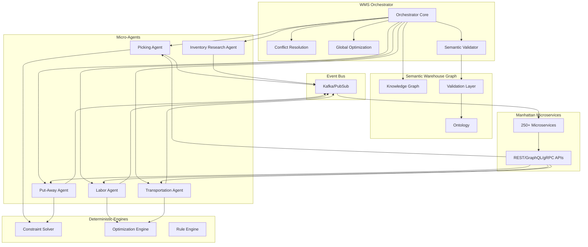
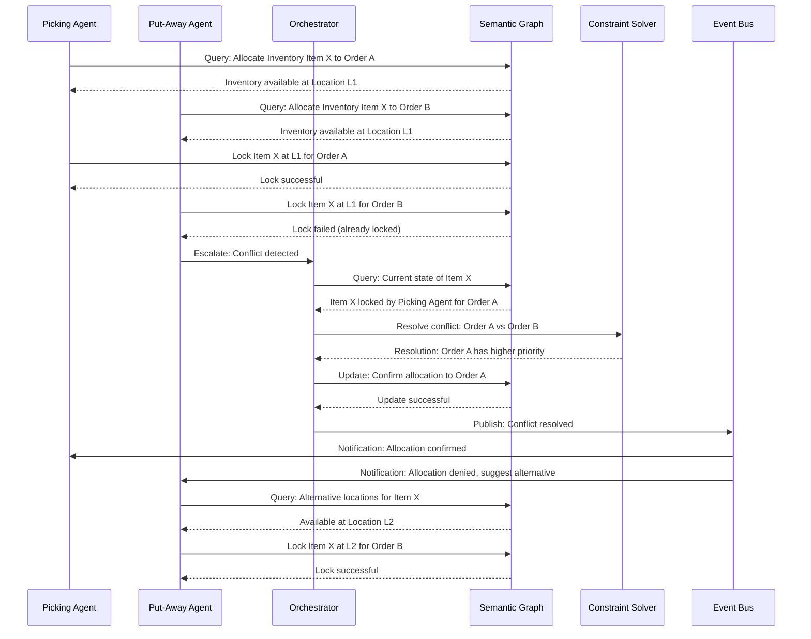
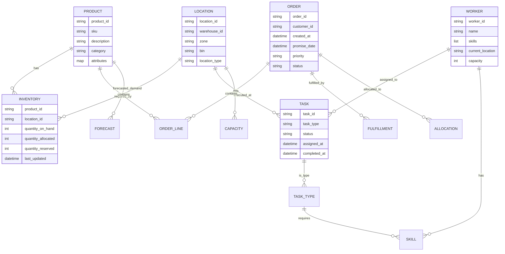

# WMS Hybrid Architecture: Agentic Intelligence for Real-Time Execution Systems

**Document Version:** 1.0  
**Author:** Director, Product Management - AI  
**Date:** December 2025  
**Audience:** Engineering Leadership, Architecture Review Board, Product Strategy

---

## Executive Summary

Warehouse Management Systems (WMS) represent a fundamentally different challenge for agentic AI than demand planning systems. Where demand planning operates on batch data with hours-to-days latency tolerance, WMS requires **real-time execution, physical-world constraints, sub-second SLA sensitivity, and conflict-heavy workflows** that demand deterministic guarantees alongside intelligent reasoning.

This document proposes a **Hybrid Orchestrator + Micro-Agent Architecture** that combines:
- **Deterministic execution engines** for safety-critical operations
- **Semantic reasoning agents** for adaptive decision-making
- **Knowledge graph foundation** for cross-domain consistency
- **Multi-layer guardrails** preventing both syntactic and semantic failures

This architecture is informed by production learnings from AWS Supply Chain, competitive analysis of Palantir and Blue Yonder, and Manhattan's unique microservices foundation.

**Key Insight:** The companies that win the agentic WMS transition will have three things: (1) semantic layer for cross-domain reasoning, (2) deterministic engines for safety-critical paths, and (3) hybrid orchestration that balances autonomy with control.

---

## 1. Introduction: Why WMS Requires Different Architecture

### 1.1 The Demand Planning vs. WMS Divide

**Demand Planning Characteristics:**
- Batch processing with hours-to-days latency
- Statistical modeling with probabilistic outputs
- Planning horizon: weeks to months
- Error tolerance: forecast accuracy ±5-10% acceptable
- Failure mode: Suboptimal plan → replan next cycle

**WMS Execution Characteristics:**
- Real-time processing with sub-second latency requirements
- Physical world constraints (inventory, space, labor)
- Execution horizon: seconds to minutes
- Error tolerance: Zero tolerance for incorrect inventory moves
- Failure mode: Wrong pick → customer order delayed → revenue impact

### 1.2 Insights from Failure Patterns

**From `agent_hallucination_cases.md`:**

Two critical failure modes emerged in production demand planning agents:

1. **Parameter Hallucination (Syntactic)** - Successfully caught by schema validation
   - Agent invents invalid enum values (e.g., "biweekly" when only "daily/weekly/monthly" allowed)
   - **Resolution:** JSON schema validation with clear error messages enables self-correction
   - **WMS Implication:** Tool parameter validation is necessary but insufficient

2. **Semantic Consistency Failure (Architectural Gap)** - Undetected by guardrails
   - Agent classifies demand as "intermittent" in Step 3, then describes it as "smooth" in Step 7
   - **Root Cause:** No knowledge graph to enforce entity state consistency across multi-step reasoning
   - **WMS Implication:** Cross-step semantic validation is **critical** for WMS workflows where agents make sequential decisions about the same physical inventory

**From `agent-evaluation-failure-patterns.md`:**

Three production UAT failures reveal evaluation gaps:

1. **Scope Violation ("Poetry Problem")** - Agent responds creatively to out-of-scope queries instead of declining
   - **WMS Risk:** Agent might attempt to handle transportation planning when scoped only to warehouse operations
   - **Mitigation:** Explicit capability boundaries with semantic validation

2. **Silent Data Misalignment ("P50 Problem")** - Agent silently substitutes data when expected column missing
   - **WMS Risk:** Agent uses wrong inventory location or quantile when making allocation decisions
   - **Mitigation:** Fail-fast data validation with no silent fallbacks

3. **Async Operation Confusion ("Override Problem")** - Agent confirms completion before async operation finishes
   - **WMS Risk:** Agent confirms pick task complete before physical inventory movement verified
   - **Mitigation:** Explicit async state tracking with status verification

### 1.3 Why These Patterns Matter for WMS

**WMS amplifies failure consequences:**

| Failure Type | Demand Planning Impact | WMS Impact |
|-------------|----------------------|-----------|
| Semantic inconsistency | Wrong forecast → replan next cycle | Wrong pick → customer order delayed → revenue loss |
| Silent data substitution | Incorrect analysis → poor decision | Wrong inventory location → pick failure → labor waste |
| Async confirmation | User confusion → re-query | Physical task incomplete → downstream blocking |

**The Architecture Must:**
1. Prevent semantic contradictions through knowledge graph validation
2. Fail fast on data integrity issues (no silent substitutions)
3. Track physical world state with deterministic verification
4. Enforce capability boundaries to prevent scope creep
5. Provide real-time observability for sub-second decision debugging

---

## 2. Source Inputs: Key Insights Summary

### 2.1 Agent Hallucination Cases (`agent_hallucination_cases.md`)

**Key Learnings:**
- **Syntactic validation works** for parameter hallucinations (schema enforcement catches invalid enums)
- **Semantic validation requires knowledge graph** (cross-step consistency needs entity relationship model)
- **Prompt engineering is insufficient** for complex constraints (combinatorial explosion of rules)
- **Knowledge graph ROI:** $1.5M investment pays for itself in <6 months vs. $400K/year in band-aid fixes

**Architectural Implications:**
- Build semantic layer from day one (not "phase 2")
- Use knowledge graph for entity state consistency validation
- Partner with semantic layer provider (RelationalAI, DataWorld) rather than 5-year build

### 2.2 Agent Evaluation Failure Patterns (`agent-evaluation-failure-patterns.md`)

**Key Learnings:**
- **Multi-layer evaluation architecture:** Tool → Agent → System layers with quality gates
- **Technical leadership veto power** prevents premature releases
- **"Do one thing and do it right"** philosophy beats super-agent approach
- **Evaluation frameworks** (LangSmith, Braintrust) enable systematic quality tracking

**Architectural Implications:**
- Implement evaluation at three layers before production
- Establish quality gates with technical leadership approval
- Build capabilities incrementally with thorough evaluation
- Use evaluation frameworks for regression testing

### 2.3 AI Architecture Patterns (`ai_architecture_patterns_summary.md`)

**Key Patterns:**
1. **AI Workflows** - Deterministic, linear sequences (Airflow, Prefect)
2. **AI Agents** - Autonomous Think → Plan → Act → Observe loops
3. **Model Context Protocol (MCP)** - Multi-model coordination standard
4. **Agent-to-Agent (A2A)** - Distributed reasoning and negotiation

**Architectural Implications:**
- WMS needs **hybrid:** workflows for deterministic paths, agents for adaptive reasoning
- MCP-style context sharing prevents information loss across microservices
- A2A patterns enable conflict resolution between competing agents

### 2.4 Architecture of Intelligence (`architecture_of_intelligence.md`)

**Key Insight:** Competitive moat lies in **orchestration architecture**, not model access.

**Five Dimensions:**
1. Workflow Architecture - How models, tools, humans collaborate
2. Data Context and Retrieval - Proprietary data powering reasoning
3. Adaptation Velocity - Speed of deployment and evolution
4. Trust and Governance - Auditability and transparency
5. User Experience Layer - Invisible intelligence integration

**Architectural Implications:**
- Manhattan's moat: **execution data** (WMS/TMS telemetry) + **orchestration intelligence**
- Build semantic layer to leverage proprietary data relationships
- Focus on trust and governance for enterprise adoption

### 2.5 Manhattan Phase 1 Research (`manhattan_phase1_research.md`)

**Technical Foundation:**
- **250+ microservices** on Kubernetes (Java, Spring Framework)
- **API-first design:** Hundreds of thousands of REST endpoints
- **Cloud-native:** No IaaS lock-in, pure Kubernetes
- **Real-time data access** across all solutions

**Critical Gaps:**
- ❌ No knowledge graph architecture
- ❌ No unified semantic layer (ETL-based semantics via partners)
- ❌ Limited cross-domain entity relationship modeling
- ❌ Bounded microservice context (data silos by design)

**Architectural Implications:**
- Leverage microservices foundation for agent orchestration
- Build semantic layer to bridge microservice boundaries
- Use API-first architecture for agent tool access

### 2.6 Competition Analysis (`manhattan_phase2_competition_analysis.md`)

**Palantir Threat:**
- **Ontology-first architecture** with native knowledge graph
- Can leverage Manhattan's data via APIs to build intelligence layer on top
- **Existential risk:** Manhattan becomes commodity data provider

**Blue Yonder:**
- **$2B investment** in 3-year transformation
- **Knowledge graph partnership** with Snowflake + RelationalAI (May 2025)
- **5 agents launched** with methodical, patient approach

**Strategic Window:**
- Manhattan has **6-12 months** to prove Agent Foundry and build semantic layer
- After that, becomes defensive catch-up play

**Architectural Implications:**
- Build knowledge graph as **priority 1** (not phase 2)
- Partner with semantic layer provider (12-month timeline vs. 5-year build)
- Position as supply chain domain expert (vs. Palantir generalist)

### 2.7 Demand-to-Fulfill Overview (`demand-to-fulfill-overview.md`)

**Key Workflows:**
1. **Demand Planning** - Forecasting demand for products
2. **Auto-Replenishment** - Inventory placement optimization
3. **Fulfillment Execution** - Pick, pack, ship operations
4. **Fulfillment Orchestration** - Real-time order routing decisions

**Critical Requirements:**
- **Real-time inventory visibility** across all fulfillment nodes
- **Sub-second order promising** decisions
- **Physical world constraints** (labor capacity, automation availability)
- **Cross-domain coordination** (warehouse + transportation + stores)

**Architectural Implications:**
- Agents must reason across demand → inventory → fulfillment → transportation
- Knowledge graph must model cross-domain relationships
- Deterministic engines needed for safety-critical paths (order promising, inventory allocation)

---

## 3. Architectural Constraints in WMS

### 3.1 Real-Time Constraints

**Latency Requirements:**
- **Order promising:** <500ms response time
- **Inventory allocation:** <200ms for real-time availability checks
- **Task assignment:** <100ms for labor optimization
- **Exception handling:** <1s for pick failures requiring re-routing

**Throughput Requirements:**
- **Peak order volume:** 10,000+ orders/minute during peak seasons
- **Concurrent agent operations:** 100+ agents operating simultaneously
- **Event processing:** 1M+ events/minute from WMS/TMS systems

**Architectural Response:**
- Deterministic engines for latency-critical paths (bypass LLM reasoning)
- Caching layer for frequently accessed inventory state
- Event-driven architecture for async processing where latency allows
- Circuit breakers to prevent LLM latency from blocking critical paths

### 3.2 Physical World Constraints

**Inventory Constraints:**
- **Finite quantities:** Cannot allocate more inventory than exists
- **Location constraints:** Items must be in specific locations for picking
- **Attribute tracking:** Lot numbers, expiration dates, serial numbers
- **Reservation conflicts:** Multiple orders competing for same inventory

**Labor Constraints:**
- **Capacity limits:** Workers have maximum throughput
- **Skill requirements:** Certain tasks require specific certifications
- **Physical location:** Workers must be in correct zone
- **Fatigue factors:** Performance degrades over time

**Space Constraints:**
- **Storage capacity:** Locations have finite space
- **Put-away rules:** Items must follow slotting logic
- **Cross-docking:** Time windows for staging areas

**Architectural Response:**
- **Deterministic constraint solvers** for allocation and scheduling
- **Knowledge graph** models physical relationships (item → location → worker)
- **Conflict detection** before agent actions execute
- **Rollback mechanisms** for failed physical operations

### 3.3 SLA Sensitivity

**Customer-Facing SLAs:**
- **Order promise accuracy:** 99.5% of promised dates must be met
- **Inventory accuracy:** 99.9% location-level accuracy required
- **Pick accuracy:** 99.95% correct picks (wrong item = customer complaint)

**Internal SLAs:**
- **System availability:** 99.9% uptime (8.76 hours/year downtime)
- **Data consistency:** Sub-second propagation of inventory changes
- **Agent response quality:** 95%+ correct decisions (measured by downstream success)

**Architectural Response:**
- **SLA-aware routing:** Critical paths bypass LLM when latency risk
- **Quality gates:** Agent decisions validated before execution
- **Fallback mechanisms:** Deterministic engines take over on agent failures
- **Observability:** Real-time SLA dashboards with alerting

### 3.4 Conflict-Heavy Workflows

**Common Conflicts:**
1. **Inventory allocation:** Multiple orders request same item
2. **Labor assignment:** Multiple tasks compete for same worker
3. **Space allocation:** Put-away conflicts in high-density locations
4. **Transportation:** Multiple shipments compete for same truck capacity
5. **Cross-domain:** Warehouse agent vs. Transportation agent optimization goals

**Conflict Resolution Patterns:**
- **Priority-based:** Customer tier, order value, SLA commitments
- **First-come-first-served:** Temporal ordering
- **Optimization-based:** Global cost minimization
- **Negotiation:** Agent-to-agent coordination (A2A pattern)

**Architectural Response:**
- **Conflict detection layer** before execution
- **Orchestrator** mediates between competing agents
- **Semantic graph** enables cross-domain conflict reasoning
- **Deterministic resolution** for safety-critical conflicts

### 3.5 Safety and Compliance

**Safety Requirements:**
- **No incorrect inventory moves:** Physical world errors are expensive
- **Audit trails:** Every agent decision must be traceable
- **Compliance:** Food safety, pharmaceutical tracking, export controls
- **Data privacy:** Customer data, employee data, supplier data

**Architectural Response:**
- **Human-in-the-loop (HITL) gates** for high-risk operations
- **Comprehensive tracing** of all agent reasoning and tool calls
- **Deterministic verification** before physical world actions
- **Compliance validation** layer checking regulatory requirements

---

## 4. Architecture Pattern Evaluation

### 4.1 Pattern 1: Single Central Agent (MCP-Style)

**Description:**
One central agent orchestrates all WMS operations, with tools representing microservices.

**Pros:**
- Simple mental model
- Centralized reasoning and context
- Easier to debug (single agent trace)
- Natural for sequential workflows

**Cons:**
- **Single point of failure** - Agent failure blocks all operations
- **Latency bottleneck** - All decisions go through LLM reasoning
- **Context window limits** - Cannot maintain full warehouse state
- **Scalability constraints** - Cannot parallelize across warehouses
- **Conflict resolution complexity** - Agent must reason about all competing goals

**WMS Suitability:** ❌ **Not Suitable**

**Why:**
- Real-time requirements cannot tolerate LLM latency for every decision
- Physical world constraints require deterministic guarantees
- Conflict-heavy workflows need distributed reasoning
- Scalability requires parallel agent instances per warehouse

### 4.2 Pattern 2: Pure Multi-Agent Autonomy

**Description:**
Multiple specialized agents operate independently, negotiating and coordinating through messaging.

**Pros:**
- **Fault isolation** - One agent failure doesn't cascade
- **Specialization** - Each agent expert in domain (picking, put-away, labor)
- **Scalability** - Agents can operate in parallel across warehouses
- **Adaptability** - Agents can learn and optimize independently

**Cons:**
- **Coordination complexity** - Agents must negotiate every conflict
- **Consistency risk** - No central authority to enforce global constraints
- **Race conditions** - Concurrent agents may make conflicting decisions
- **Debugging difficulty** - Distributed reasoning harder to trace
- **Semantic drift** - Agents may develop inconsistent understanding

**WMS Suitability:** ⚠️ **Partially Suitable**

**Why:**
- Good for specialized domains (picking agent, put-away agent)
- Problematic for global optimization (inventory allocation across warehouses)
- Needs orchestrator for conflict resolution
- Requires semantic layer for consistency

### 4.3 Pattern 3: Hybrid Orchestrator + Micro-Agent Model

**Description:**
Central orchestrator coordinates specialized micro-agents, with deterministic engines for safety-critical paths.

**Components:**
- **WMS Orchestrator:** Central coordination, conflict resolution, global optimization
- **Micro-Agents:** Specialized agents for domains (picking, put-away, labor, transportation)
- **Deterministic Engines:** Constraint solvers, optimization algorithms, rule engines
- **Semantic Warehouse Graph:** Knowledge graph modeling entities and relationships
- **Event Bus:** Async communication between components

**Pros:**
- **Best of both worlds:** Centralized coordination + distributed execution
- **Safety guarantees:** Deterministic engines for critical paths
- **Scalability:** Micro-agents parallelize across warehouses
- **Consistency:** Orchestrator enforces global constraints
- **Flexibility:** Agents adapt to local conditions, orchestrator maintains global view
- **Observability:** Central orchestrator provides unified trace

**Cons:**
- **Complexity:** More components to design and maintain
- **Orchestrator bottleneck risk:** Must be designed for high throughput
- **State synchronization:** Orchestrator and agents must stay consistent

**WMS Suitability:** ✅ **Optimal**

**Why:**
- Orchestrator handles global optimization (inventory allocation, order promising)
- Micro-agents handle local adaptation (pick path optimization, labor assignment)
- Deterministic engines guarantee safety (constraint validation, conflict resolution)
- Semantic graph enables cross-domain reasoning

---

## 5. Proposed Hybrid Architecture (North Star)

### 5.1 High-Level Architecture

```
┌─────────────────────────────────────────────────────────────────┐
│                    WMS Orchestrator                             │
│  ┌──────────────┐  ┌──────────────┐  ┌──────────────┐         │
│  │   Conflict   │  │   Global     │  │   Semantic    │         │
│  │  Resolution  │  │ Optimization │  │  Validator   │         │
│  └──────────────┘  └──────────────┘  └──────────────┘         │
│           │                │                │                   │
│           └────────────────┼────────────────┘                   │
│                            │                                    │
└────────────────────────────┼────────────────────────────────────┘
                              │
                              │ (coordinates)
                              │
        ┌─────────────────────┼─────────────────────┐
        │                     │                     │
        ▼                     ▼                     ▼
┌───────────────┐    ┌───────────────┐    ┌───────────────┐
│  Picking      │    │   Put-Away    │    │    Labor       │
│  Micro-Agent  │    │  Micro-Agent  │    │  Micro-Agent   │
└───────────────┘    └───────────────┘    └───────────────┘
        │                     │                     │
        └─────────────────────┼─────────────────────┘
                              │
                              ▼
                    ┌──────────────────┐
                    │ Deterministic    │
                    │   Engines        │
                    │  (Constraint     │
                    │   Solvers,       │
                    │   Optimizers)    │
                    └──────────────────┘
                              │
                              ▼
                    ┌──────────────────┐
                    │  Semantic         │
                    │  Warehouse       │
                    │  Graph           │
                    │  (Knowledge       │
                    │   Graph)         │
                    └──────────────────┘
                              │
                              ▼
                    ┌──────────────────┐
                    │   Event Bus      │
                    │   (Kafka/PubSub)│
                    └──────────────────┘
                              │
                              ▼
                    ┌──────────────────┐
                    │  Manhattan       │
                    │  Microservices   │
                    │  (250+ services)  │
                    └──────────────────┘
```

### 5.2 WMS Orchestrator

**Responsibilities:**
1. **Global Optimization:** Inventory allocation across warehouses, order promising, fulfillment routing
2. **Conflict Resolution:** Mediates between competing micro-agents
3. **Semantic Validation:** Ensures agent decisions are consistent with knowledge graph
4. **SLA Management:** Routes critical paths to deterministic engines when latency risk
5. **Quality Gates:** Validates agent decisions before execution

**Key Components:**

**Conflict Resolution Engine:**
- Detects conflicts between agent decisions (e.g., two agents allocate same inventory)
- Applies resolution policies (priority, optimization, negotiation)
- Updates semantic graph with resolved state
- Notifies affected agents of resolution

**Global Optimization Engine:**
- Solves cross-warehouse inventory allocation
- Optimizes order promising considering transportation capacity
- Balances cost, speed, and sustainability goals
- Uses deterministic algorithms for guaranteed optimality

**Semantic Validator:**
- Queries knowledge graph before agent actions execute
- Validates entity state consistency (e.g., inventory quantity matches graph)
- Checks cross-step semantic consistency (prevents hallucination cases)
- Enforces business rules encoded in graph

**Design Principles:**
- **Stateless where possible:** Orchestrator queries semantic graph for state
- **Event-driven:** Responds to events from micro-agents and microservices
- **Deterministic fallback:** Uses constraint solvers when agents fail or timeout
- **Observability first:** All decisions logged with full trace

### 5.3 Micro-Agents and Their Responsibilities

**Picking Micro-Agent:**
- **Scope:** Optimize pick paths, handle pick exceptions, suggest substitutions
- **Tools:** Pick task API, inventory location API, labor assignment API
- **Constraints:** Physical location of items, worker location, pick sequence dependencies
- **Autonomy Level:** High (local optimization) with orchestrator override for conflicts

**Put-Away Micro-Agent:**
- **Scope:** Determine optimal put-away locations, handle space constraints, optimize replenishment
- **Tools:** Put-away task API, location capacity API, slotting rules API
- **Constraints:** Location capacity, item dimensions, slotting rules, accessibility
- **Autonomy Level:** High (local optimization) with orchestrator validation

**Labor Micro-Agent:**
- **Scope:** Assign tasks to workers, optimize labor utilization, handle skill requirements
- **Tools:** Worker API, task API, performance metrics API
- **Constraints:** Worker skills, capacity, physical location, fatigue factors
- **Autonomy Level:** Medium (orchestrator provides global labor plan)

**Transportation Micro-Agent:**
- **Scope:** Optimize shipment routing, handle transportation exceptions, coordinate with warehouse agents
- **Tools:** Transportation API, route optimization API, carrier API
- **Constraints:** Truck capacity, delivery windows, carrier availability
- **Autonomy Level:** High (local routing) with orchestrator coordination for cross-domain

**Inventory Research Micro-Agent:**
- **Scope:** Investigate inventory discrepancies, root cause analysis, suggest corrections
- **Tools:** Inventory API, transaction history API, audit trail API
- **Constraints:** Audit requirements, data access permissions
- **Autonomy Level:** Low (advisory only, human approval required)

**Design Principles:**
- **Single Responsibility:** Each agent handles one domain
- **Bounded Autonomy:** Agents operate within orchestrator-defined constraints
- **Tool Grounding:** All agent actions must be traceable to tool calls
- **Failure Isolation:** Agent failures don't cascade to other agents

### 5.4 Deterministic Engines

**Purpose:** Provide safety guarantees for latency-critical and safety-critical operations.

**Constraint Solver:**
- **Input:** Inventory constraints, location constraints, labor constraints
- **Output:** Feasible allocation plan
- **Use Cases:** Order promising, inventory allocation, space allocation
- **Guarantees:** Solution satisfies all hard constraints, optimal within time limit

**Optimization Engine:**
- **Input:** Objective function (cost, speed, sustainability), constraints
- **Output:** Optimal or near-optimal solution
- **Use Cases:** Fulfillment routing, labor scheduling, pick path optimization
- **Guarantees:** Solution quality bounds, execution time bounds

**Rule Engine:**
- **Input:** Business rules, current state
- **Output:** Rule evaluation results, recommended actions
- **Use Cases:** Compliance validation, business rule enforcement
- **Guarantees:** Deterministic evaluation, complete rule coverage

**Integration with Agents:**
- Agents call deterministic engines via tools
- Engines provide "ground truth" for agent validation
- Agents can learn from engine outputs (supervised learning)
- Engines serve as fallback when agents fail or timeout

### 5.5 Semantic Warehouse Graph

**Purpose:** Model entities, relationships, and constraints for cross-domain reasoning and consistency validation.

**Core Entities:**
- **Products:** SKUs, attributes (lot, expiration, serial)
- **Locations:** Warehouses, zones, bins, stores
- **Inventory:** Quantities, reservations, allocations
- **Orders:** Customer orders, order lines, fulfillment requirements
- **Workers:** Skills, capacity, location, performance
- **Tasks:** Picks, put-aways, replenishments, shipments
- **Transportation:** Trucks, routes, carriers, delivery windows

**Relationships:**
- `Product --LOCATED_AT--> Location`
- `Order --REQUIRES--> Product`
- `Product --ALLOCATED_TO--> Order`
- `Task --ASSIGNED_TO--> Worker`
- `Order --FULFILLED_FROM--> Location`
- `Location --CONTAINS--> Inventory`
- `Worker --HAS_SKILL--> TaskType`

**Constraints (Encoded as Graph Properties):**
- `IF Product.quantity_allocated > Product.quantity_on_hand THEN INVALID`
- `IF Order.fulfillment_location NOT IN Product.available_locations THEN INVALID`
- `IF Task.required_skill NOT IN Worker.skills THEN INVALID`

**Semantic Validation Queries:**
```sparql
# Example: Validate inventory allocation consistency
SELECT ?conflict
WHERE {
  ?order :requires ?product .
  ?order :allocated_quantity ?alloc_qty .
  ?product :quantity_on_hand ?on_hand .
  FILTER(?alloc_qty > ?on_hand)
  BIND("Allocation exceeds available inventory" AS ?conflict)
}
```

**Implementation Approach:**
- **Phase 1 (Months 1-3):** Core entities (Product, Location, Order, Inventory)
- **Phase 2 (Months 4-6):** Relationships and constraints
- **Phase 3 (Months 7-9):** Semantic validation layer
- **Phase 4 (Months 10-12):** Production hardening and performance optimization

**Partnership Model:**
- Partner with semantic layer provider (RelationalAI, DataWorld, or similar)
- 12-month timeline vs. 5-year in-house build
- Leverage Manhattan's domain expertise for ontology design

### 5.6 Event Bus + API Requirements

**Event Bus Architecture:**
- **Technology:** Kafka or Google Pub/Sub (cloud-native, scalable)
- **Event Types:**
  - Inventory events (receipt, movement, adjustment)
  - Order events (created, allocated, picked, shipped)
  - Task events (assigned, started, completed, failed)
  - Agent events (decision made, action executed, conflict detected)

**Event Schema:**
```json
{
  "event_type": "inventory.movement",
  "timestamp": "2025-12-15T10:23:45Z",
  "source": "picking_micro_agent",
  "entity_id": "product_12345",
  "entity_type": "product",
  "action": "pick",
  "location_from": "A-01-02-03",
  "location_to": "pick_cart_789",
  "quantity": 2,
  "order_id": "ORD-98765",
  "trace_id": "trace_abc123"
}
```

**API Requirements:**
- **REST APIs:** For synchronous operations (order promising, inventory checks)
- **GraphQL:** For flexible data queries (agent exploration of warehouse state)
- **gRPC:** For high-performance internal communication (orchestrator ↔ agents)
- **WebSocket:** For real-time updates (agent status, task progress)

**API Design Principles:**
- **Idempotency:** All mutating operations are idempotent
- **Versioning:** APIs versioned for backward compatibility
- **Rate Limiting:** Protect microservices from agent overload
- **Authentication:** OAuth 2.0 with service account credentials for agents

### 5.7 Observability and Guardrails

**Observability Stack:**

**Tracing:**
- **OpenTelemetry** for distributed tracing
- **Trace ID propagation** across orchestrator, agents, and microservices
- **Span attributes:** Agent name, tool calls, reasoning steps, decision outcomes
- **Trace sampling:** 100% for agent decisions, 10% for deterministic engine calls

**Logging:**
- **Structured logging** (JSON) with consistent schema
- **Log levels:** DEBUG (agent reasoning), INFO (decisions), WARN (conflicts), ERROR (failures)
- **Log aggregation:** Centralized log store (BigQuery, Splunk, or similar)
- **Retention:** 90 days for operational logs, 1 year for audit logs

**Metrics:**
- **Agent metrics:** Decision latency, tool call counts, success/failure rates
- **Orchestrator metrics:** Conflict resolution time, global optimization time
- **System metrics:** Event processing rate, API latency, error rates
- **Business metrics:** Order promise accuracy, pick accuracy, inventory accuracy

**Dashboards:**
- **Real-time agent status:** Which agents are active, current decisions
- **SLA monitoring:** Latency percentiles, error rates, availability
- **Conflict dashboard:** Active conflicts, resolution time, patterns
- **Quality metrics:** Agent decision accuracy, semantic validation failures

**Guardrails:**

**Syntactic Guardrails (Layer 1):**
- **Schema validation:** All tool parameters validated against JSON schema
- **Type checking:** Parameter types validated before tool execution
- **Enum validation:** Invalid enum values rejected with clear error messages
- **Range validation:** Numeric parameters checked against min/max bounds

**Semantic Guardrails (Layer 2):**
- **Knowledge graph validation:** Agent claims validated against semantic graph
- **Cross-step consistency:** Multi-step agent reasoning checked for contradictions
- **Entity state validation:** Agent actions validated against current entity state
- **Business rule enforcement:** Constraints encoded in graph enforced before execution

**Safety Guardrails (Layer 3):**
- **HITL gates:** High-risk operations require human approval
- **Deterministic verification:** Critical paths verified by deterministic engines
- **Rollback mechanisms:** Failed operations can be rolled back
- **Circuit breakers:** Agent failures trigger fallback to deterministic engines

### 5.8 Error Handling and Reasoning Boundaries

**Error Handling Patterns:**

**Agent Errors:**
- **Tool call failures:** Agent receives error, attempts retry with backoff
- **Timeout handling:** Agent operations timeout after configurable limit (default: 30s)
- **LLM errors:** Fallback to deterministic engine or human escalation
- **Semantic validation failures:** Agent receives validation error, must regenerate decision

**Orchestrator Errors:**
- **Agent unresponsive:** Orchestrator routes to deterministic engine
- **Conflict resolution timeout:** Orchestrator applies default policy (priority-based)
- **Semantic graph unavailable:** Orchestrator falls back to rule-based validation
- **Event bus failures:** Orchestrator uses synchronous API calls as fallback

**Deterministic Engine Errors:**
- **Constraint solver timeout:** Returns best solution found within time limit
- **Infeasible constraints:** Returns error with explanation of conflicting constraints
- **Optimization failure:** Falls back to heuristic solution

**Reasoning Boundaries:**

**Agent Reasoning Scope:**
- **Local optimization:** Agents reason about their domain (picking, put-away, labor)
- **Bounded context:** Agents operate within orchestrator-defined constraints
- **Tool grounding:** All agent reasoning must be traceable to tool calls
- **No global reasoning:** Agents do not reason about cross-warehouse optimization

**Orchestrator Reasoning Scope:**
- **Global optimization:** Orchestrator reasons about cross-warehouse, cross-domain
- **Conflict resolution:** Orchestrator mediates between competing agents
- **SLA management:** Orchestrator routes based on latency and quality requirements
- **Semantic validation:** Orchestrator validates agent decisions against knowledge graph

**Deterministic Engine Scope:**
- **Safety-critical paths:** Deterministic engines handle order promising, inventory allocation
- **Constraint validation:** Engines validate all hard constraints before execution
- **Optimization:** Engines provide optimal or near-optimal solutions
- **Fallback:** Engines serve as fallback when agents fail

---

## 6. Detailed Interaction Model

### 6.1 Demand-to-Fulfill Logic Integration

**Workflow: Demand Planning → Auto-Replenishment → Fulfillment Execution → Fulfillment Orchestration**

**Step 1: Demand Planning Agent (Advisory)**
- Forecasts demand for products
- Outputs: Demand forecasts by product, location, time period
- **Integration:** Forecasts stored in semantic graph as `Product --FORECASTED_DEMAND--> Forecast`

**Step 2: Auto-Replenishment Agent (Supervised)**
- Determines optimal inventory placement
- **Input:** Demand forecasts, current inventory, transportation capacity
- **Output:** Replenishment orders
- **Integration:** Replenishment orders created via Order API, stored in graph

**Step 3: Fulfillment Orchestration (Orchestrator + Deterministic Engine)**
- **Order Promising:** Deterministic engine calculates promise dates
  - Input: Order requirements, inventory availability, transportation lead times
  - Output: Promise date, fulfillment location, shipment method
  - **Latency:** <500ms (deterministic engine, not LLM)
- **Fulfillment Routing:** Orchestrator optimizes order routing
  - Considers: Cost, speed, sustainability, labor capacity
  - Uses deterministic optimization engine for guaranteed solution quality

**Step 4: Fulfillment Execution (Micro-Agents)**
- **Picking Agent:** Optimizes pick paths, handles exceptions
- **Put-Away Agent:** Determines put-away locations
- **Labor Agent:** Assigns tasks to workers
- **Coordination:** Agents coordinate via event bus, orchestrator resolves conflicts

**Semantic Graph Integration:**
```
DemandForecast --INFORMS--> ReplenishmentOrder
ReplenishmentOrder --FULFILLED_BY--> FulfillmentExecution
FulfillmentExecution --REQUIRES--> Inventory
Inventory --LOCATED_AT--> Location
Location --HAS_CAPACITY--> CapacityConstraint
```

### 6.2 Conflict Resolution Behavior

**Conflict Types:**

**Type 1: Inventory Allocation Conflict**
- **Scenario:** Two orders request same inventory item
- **Detection:** Orchestrator queries semantic graph, detects `Product.quantity_allocated > Product.quantity_on_hand`
- **Resolution:**
  1. Orchestrator applies priority policy (customer tier, order value, SLA)
  2. Higher priority order gets allocation
  3. Lower priority order routed to alternative location or backordered
  4. Semantic graph updated with resolved allocation
  5. Affected agents notified via event bus

**Type 2: Labor Assignment Conflict**
- **Scenario:** Multiple tasks compete for same worker
- **Detection:** Labor agent detects conflict, escalates to orchestrator
- **Resolution:**
  1. Orchestrator queries worker capacity and task priorities
  2. Applies optimization: maximize worker utilization while meeting SLA
  3. Assigns tasks based on optimization result
  4. Updates semantic graph with task assignments
  5. Notifies picking/put-away agents of assignments

**Type 3: Cross-Domain Conflict (Warehouse vs. Transportation)**
- **Scenario:** Warehouse agent wants to ship from Location A, Transportation agent prefers Location B
- **Detection:** Orchestrator detects conflicting optimization goals
- **Resolution:**
  1. Orchestrator runs global optimization considering both domains
  2. Evaluates trade-offs: warehouse efficiency vs. transportation cost
  3. Selects solution optimizing global objective (cost + speed + sustainability)
  4. Updates semantic graph with global plan
  5. Coordinates both agents to execute plan

**Conflict Resolution Algorithm:**
```
1. Detect conflict (query semantic graph or receive agent escalation)
2. Classify conflict type (inventory, labor, cross-domain)
3. Load resolution policy for conflict type
4. Query semantic graph for current state
5. Apply resolution (priority, optimization, negotiation)
6. Validate resolution against constraints (semantic graph)
7. Update semantic graph with resolved state
8. Notify affected agents via event bus
9. Log resolution for audit and learning
```

### 6.3 Failure Avoidance Design

**Prevention Strategies:**

**1. Semantic Validation Before Execution**
- **Pattern:** All agent actions validated against semantic graph before execution
- **Implementation:** Orchestrator's semantic validator queries graph before allowing action
- **Prevents:** Inventory overallocation, invalid location assignments, skill mismatches

**2. Deterministic Verification for Critical Paths**
- **Pattern:** Order promising and inventory allocation verified by deterministic engines
- **Implementation:** Agent decisions validated by constraint solver before execution
- **Prevents:** Infeasible allocations, constraint violations, SLA breaches

**3. Fail-Fast Data Validation**
- **Pattern:** No silent data substitutions, fail fast on missing or invalid data
- **Implementation:** Tool-level validation rejects invalid data, returns clear error
- **Prevents:** Silent data misalignment (P50 problem), incorrect analysis based on wrong data

**4. Async State Tracking**
- **Pattern:** All async operations tracked with status, never confirmed prematurely
- **Implementation:** Agents check operation status before confirming to user
- **Prevents:** Async operation confusion (Override problem), false confirmations

**5. Scope Boundary Enforcement**
- **Pattern:** Agents explicitly decline out-of-scope requests, no creative responses
- **Implementation:** Scope validator checks agent capabilities before processing
- **Prevents:** Scope violations (Poetry problem), false capability signaling

**Failure Recovery:**

**Agent Failure Recovery:**
- **Timeout:** Agent operation times out → Orchestrator routes to deterministic engine
- **LLM Error:** Agent receives LLM error → Retry with backoff, then fallback to engine
- **Tool Failure:** Agent receives tool error → Attempts alternative tool or escalates to orchestrator
- **Semantic Validation Failure:** Agent receives validation error → Regenerates decision with corrected reasoning

**Orchestrator Failure Recovery:**
- **Orchestrator Unavailable:** Agents operate in degraded mode (local optimization only)
- **Semantic Graph Unavailable:** Orchestrator falls back to rule-based validation
- **Event Bus Failure:** Components use synchronous API calls as fallback

**Deterministic Engine Failure Recovery:**
- **Solver Timeout:** Returns best solution found within time limit
- **Infeasible Constraints:** Returns error with explanation, triggers human escalation
- **Optimization Failure:** Falls back to heuristic solution

### 6.4 Root-Cause Analysis Principles

**RCA Agent Design:**

**Investigation Workflow:**
1. **Hypothesis Generation:** Agent generates hypotheses based on semantic graph patterns
2. **Data Collection:** Agent queries semantic graph, transaction history, audit logs
3. **Pattern Analysis:** Agent identifies anomalies, correlations, causal chains
4. **Root Cause Identification:** Agent traces back through semantic graph to root cause
5. **Recommendation:** Agent suggests corrective action with confidence score

**Semantic Graph Queries for RCA:**
```sparql
# Example: Investigate inventory discrepancy
SELECT ?root_cause ?evidence
WHERE {
  ?product :quantity_on_hand ?on_hand .
  ?product :quantity_expected ?expected .
  FILTER(?on_hand != ?expected)
  
  # Trace transactions
  ?transaction :affects ?product .
  ?transaction :type ?txn_type .
  ?transaction :timestamp ?txn_time .
  
  # Identify anomalies
  FILTER(?txn_time > ?discrepancy_detected_time - "P7D")
  
  BIND(CONCAT("Transaction type: ", ?txn_type, " at ", ?txn_time) AS ?evidence)
  BIND("Possible root cause: Recent transaction anomaly" AS ?root_cause)
}
```

**RCA Agent Constraints:**
- **Advisory Only:** RCA agent does not execute corrections, only recommends
- **Human Approval:** All corrective actions require human approval
- **Audit Trail:** All RCA investigations logged for compliance
- **Confidence Scoring:** Agent provides confidence scores for recommendations

---

## 7. Failure Modes and Mitigations

### 7.1 Failure Modes from Production Learnings

**From `agent_hallucination_cases.md`:**

**Failure Mode 1: Parameter Hallucination**
- **Description:** Agent invents invalid parameter values (e.g., "biweekly" when only "daily/weekly/monthly" allowed)
- **WMS Manifestation:** Agent uses invalid location code, invalid task type, invalid worker ID
- **Mitigation:**
  - ✅ **Schema validation:** All tool parameters validated against JSON schema
  - ✅ **Clear error messages:** Agent receives specific error with allowed values
  - ✅ **Self-correction:** Agent retries with corrected parameters
  - ✅ **Retry limits:** Max 3 retries before escalation

**Failure Mode 2: Semantic Consistency Failure**
- **Description:** Agent contradicts itself across multi-step reasoning (e.g., classifies demand as "intermittent" then describes as "smooth")
- **WMS Manifestation:** Agent allocates inventory to Order A, then allocates same inventory to Order B
- **Mitigation:**
  - ✅ **Knowledge graph validation:** Semantic validator checks entity state before each action
  - ✅ **Cross-step consistency:** Orchestrator tracks agent reasoning across steps
  - ✅ **Entity state locking:** Semantic graph locks entities during allocation to prevent conflicts
  - ✅ **Rollback on contradiction:** Agent actions rolled back if semantic validation fails

**From `agent-evaluation-failure-patterns.md`:**

**Failure Mode 3: Scope Violation (Poetry Problem)**
- **Description:** Agent responds creatively to out-of-scope queries instead of declining
- **WMS Manifestation:** Picking agent attempts to handle transportation planning
- **Mitigation:**
  - ✅ **Explicit scope definition:** Each agent has documented capabilities and boundaries
  - ✅ **Scope validator:** Orchestrator validates request against agent scope before routing
  - ✅ **Graceful decline:** Agents trained to explicitly decline with helpful redirection
  - ✅ **No creative responses:** System prompt prohibits creative content for out-of-scope queries

**Failure Mode 4: Silent Data Misalignment (P50 Problem)**
- **Description:** Agent silently substitutes data when expected data missing
- **WMS Manifestation:** Agent uses wrong inventory location or quantile when making allocation decisions
- **Mitigation:**
  - ✅ **Fail-fast validation:** Tools reject requests with missing required data
  - ✅ **No silent fallbacks:** System explicitly prohibits data substitution without user notification
  - ✅ **Data quality gates:** Semantic graph validates data availability before agent operations
  - ✅ **Explicit error messages:** Tools return clear errors with available alternatives

**Failure Mode 5: Async Operation Confusion (Override Problem)**
- **Description:** Agent confirms completion before async operation finishes
- **WMS Manifestation:** Agent confirms pick task complete before physical inventory movement verified
- **Mitigation:**
  - ✅ **Status tracking:** All async operations tracked with status (submitted, processing, completed, failed)
  - ✅ **Status verification:** Agents check operation status before confirming to user
  - ✅ **Explicit async handling:** System prompt teaches agents to distinguish "submitted" from "completed"
  - ✅ **UI integration:** User interface shows operation status in real-time

### 7.2 WMS-Specific Failure Modes

**Failure Mode 6: Physical World State Mismatch**
- **Description:** Agent makes decision based on stale inventory state
- **Manifestation:** Agent allocates inventory that was already picked
- **Mitigation:**
  - ✅ **Real-time semantic graph:** Graph updated within sub-second of physical operations
  - ✅ **Optimistic locking:** Entities locked during allocation to prevent concurrent modifications
  - ✅ **State verification:** Agent actions verified against current graph state before execution
  - ✅ **Event-driven updates:** Physical operations trigger immediate graph updates via event bus

**Failure Mode 7: Constraint Violation**
- **Description:** Agent violates physical or business constraints
- **Manifestation:** Agent assigns task requiring certification to uncertified worker
- **Mitigation:**
  - ✅ **Deterministic constraint validation:** Constraint solver validates all agent actions
  - ✅ **Semantic graph constraints:** Constraints encoded in graph and enforced before execution
  - ✅ **Pre-execution validation:** Orchestrator validates agent decisions against constraints
  - ✅ **Rollback on violation:** Agent actions rolled back if constraints violated

**Failure Mode 8: Cross-Domain Conflict**
- **Description:** Agents in different domains make conflicting decisions
- **Manifestation:** Warehouse agent ships from Location A, Transportation agent routes to Location B
- **Mitigation:**
  - ✅ **Orchestrator mediation:** Orchestrator detects and resolves conflicts
  - ✅ **Global optimization:** Orchestrator runs global optimization considering all domains
  - ✅ **Semantic graph coordination:** Graph models cross-domain relationships for conflict detection
  - ✅ **Agent notification:** Affected agents notified of resolution and coordinate execution

### 7.3 Mitigation Architecture

**Multi-Layer Defense:**

**Layer 1: Syntactic Guardrails (Tool Level)**
- Schema validation
- Type checking
- Enum validation
- Range validation
- **Catch Rate:** 95%+ of parameter hallucinations

**Layer 2: Semantic Guardrails (Orchestrator Level)**
- Knowledge graph validation
- Cross-step consistency checking
- Entity state validation
- Business rule enforcement
- **Catch Rate:** 90%+ of semantic inconsistencies

**Layer 3: Safety Guardrails (Execution Level)**
- HITL gates for high-risk operations
- Deterministic verification for critical paths
- Rollback mechanisms
- Circuit breakers
- **Catch Rate:** 99%+ of constraint violations

**Layer 4: Observability (Monitoring Level)**
- Real-time tracing
- Anomaly detection
- Quality metrics
- Alerting
- **Catch Rate:** Enables rapid detection and response

---

## 8. Competitive Landscape

### 8.1 Palantir: The Ontology-First Threat

**Architecture:**
- **Palantir Foundry + AIP:** Ontology-native platform
- **Knowledge Graph:** Built into platform core (not bolted on)
- **NVIDIA Partnership:** Accelerated computing for enterprise operations (Oct 2025)

**Threat Analysis:**
- **Can leverage Manhattan's data:** Palantir connects to Manhattan APIs, builds semantic layer on top
- **Value capture risk:** Palantir captures intelligence layer while Manhattan becomes data provider
- **Technical advantage:** Ontology-first architecture enables cross-domain reasoning Manhattan lacks

**Manhattan's Response:**
- **Build semantic layer:** Partner with semantic layer provider (12-month timeline)
- **Domain expertise:** Leverage 30+ years of supply chain execution knowledge
- **Execution data moat:** WMS/TMS telemetry provides unique data relationships
- **Agent Foundry:** Enable customers to build agents, defensive against Palantir

### 8.2 Blue Yonder: The Methodical Transformation

**Journey:**
- **$2B investment** in 3-year transformation (2023-2025)
- **Knowledge graph partnership:** Snowflake + RelationalAI (May 2025)
- **5 agents launched:** Inventory Ops, Shelf Ops, Logistics Ops, Warehouse Ops, Multi-Enterprise Network

**Key Learning:**
> "We weren't rushing to say 'we're the supply chain agent platform for the world' like everyone else did. We were pragmatic, worked with customers in field to ensure genuine value. Supply chain demands precision that generative AI alone couldn't immediately provide."

**Manhattan's Position:**
- **Advantage:** Cloud-native microservices (Blue Yonder migrated from legacy)
- **Gap:** Blue Yonder has knowledge graph, Manhattan does not
- **Timeline:** Both launched agents May 2025, Manhattan needs to move fast

### 8.3 SAP: The Enterprise Giant

**Strategy:**
- **400+ AI features** planned by end of 2025
- **Joule copilot:** AI assistant integrated into solutions
- **Supply chain agents:** Q4 2025 (Maintenance Planner, Shop Floor Supervisor)

**Manhattan's Advantage:**
- ✅ Cloud-native from inception (SAP migrated from monolithic ERP)
- ✅ Microservices enable faster agent deployment
- ✅ API-first supports external agents (defensive move)
- ✅ Not burdened by monolithic ERP architecture

### 8.4 Competitive Positioning

**Manhattan's Differentiation:**
1. **Execution Data Moat:** WMS/TMS telemetry provides unique data relationships
2. **Microservices Foundation:** 250+ microservices ideal for agent orchestration
3. **API-First Architecture:** Hundreds of thousands of endpoints for agent access
4. **Real-Time Data:** Agents operate on live operational data

**Critical Gaps to Address:**
1. ❌ **No knowledge graph** (existential gap vs. Palantir and Blue Yonder)
2. ❌ **No semantic layer** (ETL-based semantics via partners, not native)
3. ⚠️ **Fast-follower risk** (announced same time as Blue Yonder, need execution speed)

**Strategic Window:**
- **6-12 months** to prove Agent Foundry and build semantic layer
- After that, becomes defensive catch-up play

---

## 9. Implementation Roadmap

### 9.1 Phase 1: Advisory Agents (Months 1-6)

**Goal:** Establish agent foundation with low-risk, high-value use cases.

**Agents:**
1. **Inventory Research Agent:** Investigates discrepancies, root cause analysis
2. **Contextual Data Assistant:** Natural language data access
3. **Virtual Configuration Consultant:** Self-service configuration support

**Architecture:**
- **Single agent per domain** (no orchestrator yet)
- **Read-only operations** (no mutating actions)
- **Human approval required** for all recommendations
- **Basic semantic graph** (core entities: Product, Location, Order, Inventory)

**Evaluation:**
- **Scope compliance:** 95%+ correct declines of out-of-scope queries
- **Response quality:** 90%+ user satisfaction with recommendations
- **Semantic validation:** 100% of agent claims traceable to data sources

**Success Criteria:**
- ✅ Agents provide value without operational risk
- ✅ Foundation established for semantic graph
- ✅ User trust built through reliable advisory capabilities

### 9.2 Phase 2: Supervised Micro-Agents (Months 7-12)

**Goal:** Deploy micro-agents with orchestrator supervision and deterministic verification.

**Agents:**
1. **Picking Micro-Agent:** Optimizes pick paths, handles exceptions
2. **Put-Away Micro-Agent:** Determines put-away locations
3. **Labor Micro-Agent:** Assigns tasks to workers

**Architecture:**
- **WMS Orchestrator** coordinates micro-agents
- **Deterministic engines** verify critical decisions
- **Semantic graph** expanded (relationships, constraints)
- **Event bus** for async communication

**Evaluation:**
- **Tool orchestration:** 90%+ correct tool selection
- **Semantic validation:** 95%+ consistency across multi-step reasoning
- **Conflict resolution:** 90%+ successful resolution without human intervention
- **SLA compliance:** 99%+ of decisions meet latency requirements

**Success Criteria:**
- ✅ Micro-agents operate autonomously with orchestrator supervision
- ✅ Deterministic engines provide safety guarantees
- ✅ Semantic graph enables cross-domain reasoning

### 9.3 Phase 3: Guided Automation with HITL Gating (Months 13-18)

**Goal:** Enable autonomous execution with human-in-the-loop gates for high-risk operations.

**Agents:**
1. **Transportation Micro-Agent:** Optimizes shipment routing
2. **Fulfillment Orchestration Agent:** Real-time order routing decisions
3. **Auto-Replenishment Agent:** Inventory placement optimization

**Architecture:**
- **Full orchestrator** with global optimization
- **HITL gates** for high-risk operations (inventory allocation, order promising)
- **Complete semantic graph** (all entities, relationships, constraints)
- **Advanced conflict resolution** (negotiation, global optimization)

**Evaluation:**
- **Autonomous execution:** 85%+ of operations execute without human intervention
- **HITL gate accuracy:** 95%+ of human approvals correct (validates gate logic)
- **Global optimization:** 10%+ improvement in cross-domain metrics (cost, speed, sustainability)
- **Quality metrics:** 99%+ order promise accuracy, 99.9%+ inventory accuracy

**Success Criteria:**
- ✅ Agents execute autonomously with HITL gates for safety
- ✅ Global optimization improves cross-domain metrics
- ✅ Production-ready architecture with comprehensive observability

### 9.4 Phase 4: Full Autonomy (Months 19-24)

**Goal:** Achieve full autonomous operation with continuous learning and adaptation.

**Capabilities:**
- **Continuous learning:** Agents learn from outcomes and improve decisions
- **Adaptive optimization:** Agents adapt to changing conditions (seasonality, disruptions)
- **Predictive capabilities:** Agents predict and prevent issues before they occur
- **Self-healing:** Agents detect and correct errors autonomously

**Evaluation:**
- **Autonomous execution:** 95%+ of operations execute without human intervention
- **Learning effectiveness:** 10%+ improvement in decision quality over 6 months
- **Predictive accuracy:** 80%+ of predicted issues prevented
- **Self-healing:** 90%+ of errors detected and corrected autonomously

**Success Criteria:**
- ✅ Full autonomous operation with continuous improvement
- ✅ Agents adapt to changing conditions and learn from outcomes
- ✅ Predictive and self-healing capabilities reduce operational burden

---

## 10. Open Questions for Engineering

### 10.1 Semantic Graph Implementation

**Questions:**
1. **Technology choice:** Neo4j, Amazon Neptune, RelationalAI, or custom solution?
2. **Performance requirements:** What are latency and throughput requirements for graph queries?
3. **Data synchronization:** How do we keep graph in sync with microservice databases?
4. **Scalability:** How does graph scale to 1000+ warehouses, millions of products?
5. **Partnership model:** Build in-house vs. partner with semantic layer provider?

**Recommendation:**
- **Partner with semantic layer provider** (RelationalAI, DataWorld, or similar)
- **12-month timeline** vs. 5-year in-house build
- **Leverage Manhattan's domain expertise** for ontology design
- **Evaluate performance** with proof-of-concept before full commitment

### 10.2 Orchestrator Design

**Questions:**
1. **State management:** Stateless orchestrator querying graph vs. stateful with caching?
2. **Conflict resolution:** Priority-based, optimization-based, or negotiation-based?
3. **Scalability:** How does orchestrator scale to 100+ concurrent agents?
4. **Latency:** Can orchestrator meet sub-second requirements for order promising?
5. **Failure handling:** What happens when orchestrator is unavailable?

**Recommendation:**
- **Hybrid approach:** Stateless for coordination, stateful caching for performance
- **Multi-policy conflict resolution:** Priority for simple conflicts, optimization for complex
- **Horizontal scaling:** Orchestrator instances per warehouse or region
- **Deterministic fallback:** Agents operate in degraded mode if orchestrator unavailable

### 10.3 Agent Architecture

**Questions:**
1. **LLM choice:** Single model (GPT-4, Claude) vs. specialized models per domain?
2. **Tool design:** How many tools per agent? How to balance granularity vs. complexity?
3. **Memory management:** How do agents maintain context across long-running workflows?
4. **Learning:** How do agents learn from outcomes? Online learning vs. batch retraining?
5. **Versioning:** How do we version agents and roll out improvements safely?

**Recommendation:**
- **Single LLM foundation** (Claude or GPT-4) with domain-specific fine-tuning
- **10-20 tools per agent** (balance between granularity and complexity)
- **Semantic graph as memory:** Agents query graph for context, don't maintain long-term memory
- **Batch learning:** Agents learn from outcomes in weekly retraining cycles
- **Canary deployments:** Roll out agent improvements to 10% of traffic, then scale

### 10.4 Deterministic Engine Integration

**Questions:**
1. **Engine choice:** Custom constraint solver vs. commercial (Gurobi, CPLEX)?
2. **Performance:** Can engines meet sub-second requirements for order promising?
3. **Integration:** How do agents call engines? Synchronous API vs. async with polling?
4. **Fallback:** What happens when engines timeout or fail?
5. **Learning:** Can agents learn from engine outputs to improve decisions?

**Recommendation:**
- **Commercial solver** (Gurobi or CPLEX) for proven performance and support
- **Hybrid approach:** Synchronous for latency-critical, async for complex optimizations
- **Timeout handling:** Return best solution found within time limit
- **Agent learning:** Agents learn heuristics from engine outputs for faster decisions

### 10.5 Observability and Evaluation

**Questions:**
1. **Tracing:** What level of detail needed in traces? Full agent reasoning vs. summaries?
2. **Evaluation framework:** LangSmith, Braintrust, or custom solution?
3. **Quality metrics:** How do we measure agent decision quality in production?
4. **Alerting:** What events trigger alerts? How to avoid alert fatigue?
5. **Debugging:** How do engineers debug agent failures in production?

**Recommendation:**
- **Comprehensive tracing:** Full agent reasoning, tool calls, semantic validation results
- **Evaluation framework:** LangSmith or Braintrust for systematic quality tracking
- **Quality metrics:** Downstream success rates (order accuracy, pick accuracy, inventory accuracy)
- **Smart alerting:** Alert on quality degradation, not individual failures
- **Debugging tools:** Interactive trace explorer, semantic graph query interface, agent reasoning replay

### 10.6 Security and Compliance

**Questions:**
1. **Authentication:** How do agents authenticate to microservices? Service accounts vs. OAuth?
2. **Authorization:** How do we enforce fine-grained permissions for agent actions?
3. **Audit trails:** What level of detail needed for compliance (SOX, FDA, etc.)?
4. **Data privacy:** How do we ensure agents don't expose sensitive data?
5. **Compliance validation:** How do we validate agent decisions against regulatory requirements?

**Recommendation:**
- **Service accounts:** OAuth 2.0 with service account credentials for agents
- **Role-based access control:** Agents have permissions scoped to their domain
- **Comprehensive audit trails:** All agent decisions logged with full trace for compliance
- **Data masking:** Sensitive data masked in agent reasoning and logs
- **Compliance layer:** Deterministic engine validates agent decisions against regulatory rules

---

## 11. Architecture Diagrams

### 11.1 High-Level Architecture Diagram



### 11.2 Sequence Diagram: Cross-Agent Conflict Resolution



### 11.3 Semantic Graph Model



---

## 12. Conclusion

This hybrid architecture balances the **autonomy of agents** with the **safety of deterministic engines**, enabling Manhattan to deliver production-ready agentic WMS capabilities while maintaining the precision and reliability required for real-time execution systems.

**Key Success Factors:**
1. **Semantic layer from day one** - Not "phase 2", but foundational architecture
2. **Incremental capability addition** - Start with advisory, progress to supervised, then autonomous
3. **Multi-layer guardrails** - Syntactic, semantic, and safety validation at every layer
4. **Comprehensive observability** - Full tracing, logging, and metrics for debugging and improvement
5. **Partnership model** - Leverage semantic layer providers rather than 5-year in-house build

**Strategic Imperative:**
Manhattan has a **6-12 month window** to establish leadership in agentic WMS. The companies that win will have semantic layers enabling cross-domain reasoning, deterministic engines guaranteeing safety, and hybrid orchestration balancing autonomy with control.

This architecture positions Manhattan to win by leveraging:
- **Execution data moat** (WMS/TMS telemetry)
- **Microservices foundation** (250+ services ideal for agent orchestration)
- **API-first architecture** (hundreds of thousands of endpoints)
- **Domain expertise** (30+ years of supply chain intelligence)

The path forward is clear: build the semantic layer, deploy micro-agents with orchestrator supervision, and establish quality gates that ensure customer trust. The future of WMS is agentic, and this architecture provides the foundation to lead that transformation.

---

**Document Status:** Ready for Architecture Review Board  
**Next Steps:** Engineering deep-dive on semantic graph implementation, orchestrator design, and evaluation framework selection

