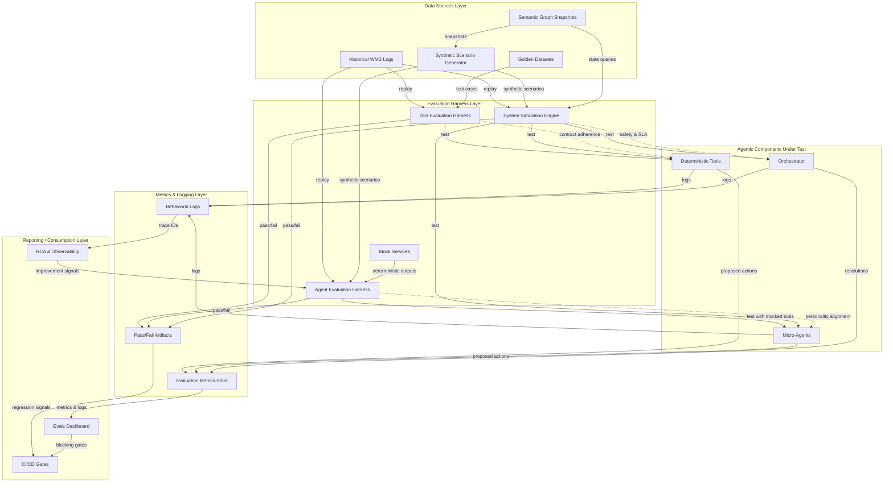

# Evaluation Architecture (Tools → Agents → System)

**Document Version:** 1.0  
**Author:** Engineering Architecture & Product Management  
**Date:** December 2025  
**Audience:** Senior Engineers, Architects, Technical PMs, Quality Assurance Leadership

---

## 1. Purpose

The evaluation layer is the safety and quality gate that ensures agentic warehouse management systems operate correctly, predictably, and safely before enabling automation in production warehouses. Unlike traditional rule-based systems where correctness can be verified through unit tests alone, agentic systems introduce non-deterministic reasoning, multi-step decision chains, and emergent behaviors that only become visible when components interact in realistic scenarios. The evaluation architecture must test three distinct layers—tools, agents, and the full system orchestrated through the semantic warehouse graph—because failures manifest differently at each layer and require different detection and remediation strategies.

This document shows how datasets, harnesses, evaluators, metrics, and reporting all connect in a unified testing workflow that enables incremental deployment: tools first (verified correctness), then agents (verified policy alignment), then system integration (verified safety and performance). The architecture ensures that behavioral drift is detected early, system performance improvements are measurable, and root cause analysis integrates with evaluation logs for continuous improvement. By establishing explicit evaluation contracts at each layer, we enable safe, rapid iteration while maintaining human trust and operational excellence.

---

## 2. High-Level Architecture Diagram

**Key Data Flows:**

- **Golden datasets** → Tool harness validates deterministic correctness against known inputs/outputs
- **Synthetic scenarios** → Agent harness tests behavioral alignment with controlled warehouse contexts
- **Semantic graph snapshots** → System simulation generates realistic multi-agent scenarios
- **Proposed actions** → Metrics store tracks risk scores, uncertainty, confidence levels
- **Pass/fail** → CI/CD gates block deployment if regressions detected
- **Metrics & logs** → Dashboard surfaces trends, regressions, and improvement opportunities
- **Trace IDs** → RCA systems reconstruct root causes from evaluation logs

---

## 3. Components Description

### 3.1 Data Sources

The evaluation architecture relies on three types of data sources that enable reproducible, realistic testing across all three evaluation levels.

**Historical WMS Logs:** Anonymized production warehouse operations data (order patterns, inventory movements, congestion events, worker assignments) are replayed to create test scenarios that mirror real-world conditions. Historical logs provide ground truth for golden datasets (known correct tool outputs), agent behavior baselines (how human planners handled similar situations), and system performance benchmarks (SLA adherence rates, throughput metrics). Logs are anonymized to protect customer privacy, versioned to track warehouse evolution, and curated to represent diverse operational conditions (peak seasons, equipment failures, data quality issues).

**Synthetic Scenario Generator:** Generates controlled warehouse contexts derived from the semantic warehouse graph to test specific agent behaviors and system interactions. The generator queries semantic relationships (location-to-aisle-segment, task-to-worker, order-to-constraint-node) to create valid test scenarios that respect warehouse constraints. For example, when testing PickingAgent escalation behavior, the generator creates scenarios with insufficient labor capacity by querying worker-to-constraint-node relationships to ensure test assignments respect skill requirements and capacity limits. Synthetic scenarios enable targeted testing of edge cases, failure modes, and specific personality traits that may not appear frequently in historical data.

**Semantic Graph Snapshots:** Point-in-time captures of the semantic warehouse graph provide consistent state for evaluation runs. Snapshots include entity relationships (locations, SKUs, workers, equipment), constraint definitions (capacity limits, compatibility rules, safety boundaries), and temporal state (active operations, scheduled tasks, inventory levels). Evaluators query snapshots to understand warehouse meaning, validate test scenario validity, and measure behavioral correctness against semantic expectations. Snapshots are versioned alongside code to enable reproducible evaluation and detect semantic drift when warehouse configurations change.

**Golden Datasets:** Curated test cases with known correct answers, derived from historical operations and validated by domain experts. Golden datasets represent realistic warehouse scenarios (SKU slotting decisions, congestion estimates, SLA risk calculations) where correct outputs are known. Tools are tested against golden datasets to verify contract adherence, deterministic behavior, and correctness. Datasets are versioned and updated as warehouse operations evolve, ensuring that tool evaluations remain aligned with production requirements.

### 3.2 Evaluation Harness Layer

The evaluation harness layer provides three distinct execution environments that isolate and test components at different levels of abstraction.

**Tool Evaluation Harness:** Runs deterministic tools in isolation with mocked inputs and golden datasets to verify contract adherence, correctness, and performance. The harness validates that tools produce expected outputs for known inputs, respect their contracts (input/output schemas, preconditions, postconditions), maintain deterministic behavior (identical outputs for identical inputs), and meet performance bounds (latency, throughput). Tool harness failures block rollout of new tool versions, ensuring that agents build decisions on correct foundations. The harness supports property-based testing (verifying mathematical properties like monotonicity, transitivity) and regression suites (testing known edge cases that caused failures in the past).

**Agent Evaluation Harness:** Tests micro-agents with mocked or deterministic tool outputs to isolate agent decision quality from tool correctness. The harness feeds agents controlled warehouse contexts (inventory levels, order priorities, congestion patterns) and collects ProposedAction objects for analysis. By mocking tool outputs, the harness tests agent reasoning independently: does the agent call the right tools under the right preconditions? Does it interpret tool outputs correctly? Does it escalate when uncertainty exceeds thresholds? Does it generate explanations that align with its defined personality? The harness uses scenario-based tests derived from historical operations and synthetic generators to verify personality alignment, escalation correctness, and explanation quality.

**System Simulation Engine:** Runs multi-agent and orchestrator interactions across realistic warehouse states to measure emergent properties that cannot be detected at individual component levels. The simulation engine creates closed-loop scenarios where agents propose actions, the orchestrator detects conflicts and resolves them, and system-level metrics (safety violations, SLA adherence, throughput) are measured across thousands of simulated orders. Simulations use semantic graph snapshots to ensure warehouse state respects relationships and constraints, and inject exceptions (equipment failures, data quality issues, peak loads) at realistic frequencies. System simulations enable end-to-end evaluation of safety compliance, SLA performance, stability under load, and human trust (HITL frequency, planner approval rates).

**Mock Services (Optional):** Provide deterministic, controlled outputs for tools and external dependencies during agent and system evaluation. Mock services enable reproducible testing by eliminating non-deterministic behavior from external systems (sensor data, third-party APIs, time-dependent services). Mocks return predefined outputs for given inputs, allowing evaluators to create controlled test scenarios that stress specific agent behaviors (escalation thresholds, conflict detection, uncertainty handling) without depending on external system availability or behavior.

### 3.3 Agentic Components Under Test

The evaluation architecture tests three categories of agentic components, each with distinct evaluation objectives and methods.

**Tools: Correctness, Contract Adherence, Constraint Enforcement:** Deterministic components (slotting engines, congestion estimators, SLA risk calculators) are evaluated for functional correctness (outputs match expected results for golden datasets), contract adherence (inputs/outputs match documented schemas, preconditions/postconditions satisfied), deterministic behavior (identical outputs for identical inputs), and constraint enforcement (never output actions that violate hard rules). Tool evaluations run independently of agents and block rollout if failures are detected. Tools are versioned, and evaluation results are tracked per version to enable rollback if regressions are detected in production.

**Micro-Agents: Behavior, Personality Alignment, Escalation, Explanation Quality:** Goal-directed decision makers (SlottingAgent, PickingAgent, ReplenishmentAgent) are evaluated for personality alignment (behavior consistent with defined objectives, risk postures, non-negotiables), tool usage correctness (calls right tools under right preconditions, respects tool contracts, interprets outputs correctly), escalation behavior (escalates when uncertainty exceeds thresholds, conflicts detected, constraints cannot be satisfied), and explanation quality (explanations include required elements, are clear and evidence-based, enable human trust). Agent evaluations use scenario-based tests that feed agents controlled warehouse contexts and measure behavioral alignment rather than optimality. Evaluations verify that agents behave consistently with their defined personalities (see `agent_design/agent_personalities.md`) and use tools correctly as specified in `tool_contracts/tool_catalog.md`.

**Orchestrator: Conflict Resolution, HITL Routing, Global Optimization:** The central coordination layer is evaluated for conflict detection accuracy (identifies all conflicts across agents, resources, and time windows), resolution correctness (applies safety-first, SLA-priority, optimization rules correctly), HITL routing appropriateness (escalates when risk/uncertainty exceeds thresholds, routes to planners with structured decision requests), and global optimization effectiveness (maintains safety, meets SLAs, maximizes throughput). Orchestrator evaluations use system simulations with multiple agents proposing conflicting actions and measure end-to-end metrics (safety violation rate, order promise accuracy, autonomous conflict resolution rate, planner approval rate). Evaluations verify that the orchestrator behaves consistently with its defined personality (see `agent_design/agent_personalities.md`) and implements conflict resolution logic correctly (see `prototype/orchestrator_logic.py`).

### 3.4 Metrics & Logging

The metrics and logging layer captures structured evaluation data that enables trend analysis, regression detection, and root cause analysis.

**Structured Logs for ProposedActions:** Every agent proposal is logged with proposal ID, agent ID, timestamp, proposal details (action type, target entities, time window), confidence level, risk score, uncertainty, constraints evaluated, data sources, and explanation. Logs include trace IDs that enable correlation across agents, orchestrator, and execution layer for debugging and audit. Structured logs enable evaluators to measure personality alignment (does agent respect defined risk postures?), escalation correctness (does agent escalate when thresholds exceeded?), and explanation quality (do explanations include required elements?).

**Risk and Uncertainty Tracking:** Evaluation metrics track risk scores (safety risk, SLA risk, operational impact) and uncertainty levels (confidence in location availability, data quality, tool outputs) across all proposals and resolutions. Risk tracking enables detection of behavioral drift (agents becoming more or less risk-averse over time), identification of high-risk scenarios that require additional testing, and measurement of system-level risk trends. Uncertainty tracking enables detection of over-confident or under-confident agents, identification of data quality issues that impact decision quality, and measurement of confidence calibration (do agents escalate appropriately when uncertainty is high?).

**Evaluation Metrics (Precision, Calibration, Consistency, SLA Impact):** Quantitative metrics measure evaluation quality and system performance. Precision metrics (tool correctness rate, agent personality alignment score, orchestrator conflict detection accuracy) measure how often components behave correctly. Calibration metrics (escalation correctness rate, confidence calibration) measure how well uncertainty estimates match actual outcomes. Consistency metrics (behavioral consistency across similar scenarios, explanation structure consistency) measure how predictably components behave. SLA impact metrics (order promise accuracy, pick accuracy, inventory accuracy) measure end-to-end performance. Metrics are aggregated across evaluation runs to detect regressions, measure improvement over time, and identify patterns that inform continuous improvement.

**Storage and Versioning for Auditability:** Evaluation results are stored in a central data warehouse with versioning for auditability. Tool evaluation results are tracked per tool version, agent evaluation results are tracked per agent version and personality version, and system evaluation results are tracked per system configuration version. Versioning enables rollback if regressions are detected, comparison of performance across versions, and audit trails for compliance and debugging. Storage includes retention policies (operational logs 90 days, audit logs 1 year, safety incidents 7 years) and access controls to protect sensitive data.

### 3.5 Reporting & Consumption Layer

The reporting and consumption layer surfaces evaluation results to engineering teams, product managers, and quality assurance for decision-making and continuous improvement.

**Dashboards for Engineering & Product Reviews:** Interactive dashboards display evaluation metrics, trends, and regressions across tool, agent, and system levels. Dashboards show pass/fail rates, metric trends over time, regression alerts, and drill-down capabilities for detailed analysis. Engineering teams use dashboards to identify failing tests, measure improvement after code changes, and prioritize fixes. Product managers use dashboards to track system performance (SLA adherence, safety compliance, planner trust) and make deployment decisions. Dashboards surface red/yellow/green indicators for tool, agent, and system layers, enabling quick assessment of evaluation health.

**CI/CD Integration: Blocking Merges if Regressions Occur:** Evaluation results are integrated into CI/CD pipelines as quality gates that block merges and deployments if regressions are detected. Tool-level evaluations block rollout of new tool versions if contract adherence or correctness degrades. Agent-level evaluations block changes to agent personalities or logic if personality alignment or escalation correctness degrades. System-level evaluations block enabling new automation levels (advisory → supervised → auto-execution) if safety, SLA, or performance metrics degrade. CI/CD gates enforce evaluation as a continuous process, not a one-time checkpoint, ensuring that unsafe or ineffective changes never reach production.

**RCA & Observability Systems Consuming Logs for Long-Term Improvement:** Root cause analysis (RCA) systems consume evaluation logs to reconstruct why failures occurred, identify patterns in failures, and inform continuous improvement. RCA systems use trace IDs to correlate agent proposals, orchestrator resolutions, and execution outcomes, enabling end-to-end debugging of evaluation failures. Observability systems analyze evaluation metrics to detect behavioral drift, identify high-risk scenarios that require additional testing, and measure system performance trends. RCA and observability systems feed improvement signals back into evaluation harnesses (add new test cases for discovered failure modes), agent personalities (refine risk postures based on escalation patterns), and orchestrator logic (update arbitration rules based on resolution outcomes).

---

## 4. Example Evaluation Flow

This end-to-end flow illustrates how the evaluation architecture tests components at each level and gates deployment based on results.

**Step 1: Synthetic Scenario Generation Based on Semantic Graph**

The synthetic scenario generator queries the semantic warehouse graph to create a test scenario: high service level pressure (15 orders due in 60-90 minutes), sufficient labor (8 workers available), low congestion (all aisles < 0.3 congestion score). The generator uses semantic relationships (order-to-constraint-node for SLA commitments, worker-to-constraint-node for capacity limits, location-to-aisle-segment for congestion context) to ensure the scenario respects warehouse constraints and is semantically valid.

**Step 2: Tools Run Against Golden Datasets → Tool-Level Pass**

The tool evaluation harness runs deterministic tools (Service Level Risk Estimator, Pick Path Optimizer, Congestion Estimator) against golden datasets derived from historical operations. Tools produce outputs that match expected results within tolerance, respect their contracts (input/output schemas, preconditions, postconditions), and maintain deterministic behavior. Tool-level evaluations pass, enabling agents to build decisions on correct foundations.

**Step 3: Agent Run with Mocked Deterministic Tool Outputs → Check Behavior and Explanation**

The agent evaluation harness runs PickingAgent with mocked tool outputs (Service Level Risk Estimator returns high risk scores for near-due orders, Congestion Estimator returns low congestion scores). The harness feeds the agent the synthetic scenario context and collects ProposedAction objects. Evaluators verify that the agent calls Service Level Risk Estimator before proposing waves, prioritizes near-due orders (places all 5 orders due in 60-90 minutes in Wave 1 or Wave 2), includes service level rationale in explanations, and does not escalate unnecessarily (sufficient capacity, low risk). Agent-level evaluation passes, verifying personality alignment and tool usage correctness.

**Step 4: System Simulation Runs All Agents + Orchestrator → Conflict Resolution Evaluated**

The system simulation engine runs a full warehouse day with PickingAgent, SlottingAgent, ReplenishmentAgent, and Orchestrator operating concurrently. The simulation injects conflicts (SlottingAgent and ReplenishmentAgent both require Aisle A-12 simultaneously) and measures orchestrator behavior. Evaluators verify that the orchestrator detects conflicts correctly, applies safety-first and SLA-priority rules, resolves conflicts autonomously when risk is low, and escalates to HITL when risk exceeds thresholds. System-level evaluation passes, verifying end-to-end safety compliance, SLA adherence, and conflict resolution correctness.

**Step 5: Metrics Logged and Compared Against Baselines**

Evaluation metrics are logged to the metrics store: tool correctness rate (99.2%), agent personality alignment score (92%), orchestrator conflict detection accuracy (98%), system safety violation rate (0%), order promise accuracy (99.6%). Metrics are compared against baselines (tool correctness > 99%, agent alignment > 90%, system safety = 0%) to verify no regressions. All metrics meet or exceed baselines.

**Step 6: Dashboard Shows Red/Yellow/Green for Tool, Agent, and System Layers**

The evals dashboard displays green indicators for all three layers: tool layer (all tools passing, correctness > 99%), agent layer (personality alignment > 90%, escalation correctness > 95%), system layer (safety = 0%, SLA adherence > 99.5%). Dashboard shows no regressions or alerts, indicating evaluation health is good.

**Step 7: CI/CD Blocks Release if Regression Detected**

CI/CD pipeline checks evaluation results as quality gates. Since all metrics meet baselines and no regressions are detected, the pipeline allows the release to proceed. If any metric had degraded below baseline (e.g., agent personality alignment dropped to 85%), the pipeline would block the release and require fixes before deployment.

---

## 5. How This Architecture Supports Safety & Governance

The evaluation architecture provides multi-level gating that prevents unsafe automation, detects behavioral drift early, enables measurable system performance improvements, and integrates with RCA for incident analysis.

**Multi-Level Gating Prevents Unsafe Automation:** Evaluation gates at tool, agent, and system levels ensure that unsafe changes never reach production. Tool-level gates block rollout of incorrect tools that could cause agents to make wrong decisions. Agent-level gates block changes to agent personalities or logic that could cause unsafe behavior (ignoring safety constraints, failing to escalate when required). System-level gates block enabling new automation levels (reducing HITL frequency, increasing autonomous conflict resolution) if safety, SLA, or performance metrics degrade. Multi-level gating provides defense in depth: even if one level misses a failure, other levels catch it before deployment.

**Behavioral Drift Detected Early:** Periodic re-evaluation (weekly for agents, monthly for system) detects behavioral drift even without code changes. Drift can occur due to LLM model updates (if agents use LLMs), warehouse state distribution shifts (seasonality, operational changes), or tool output distribution shifts (if tools use machine learning). Evaluation metrics track personality alignment, escalation correctness, and explanation quality over time, enabling detection of drift before it impacts production. When drift is detected, evaluation results trigger re-training, personality refinements, or tool updates to restore alignment.

**System Performance Improvements Are Measurable:** Evaluation metrics provide quantitative evidence of system performance improvements. Before deploying agentic automation, baseline metrics are established (current WMS order promise accuracy: 99.5%, pick accuracy: 99.95%, inventory accuracy: 99.9%). After deployment, evaluation metrics measure whether agentic systems meet or exceed baselines. Improvements are measurable (order promise accuracy improved to 99.7%, autonomous conflict resolution rate: 90%, planner approval rate: 85%), enabling data-driven decisions about expanding automation scope and reducing HITL frequency.

**RCA Integrates with Eval Logs for Incident Analysis:** When production incidents occur, RCA systems consume evaluation logs to reconstruct root causes. Trace IDs enable correlation of agent proposals, orchestrator resolutions, and execution outcomes, providing end-to-end visibility into why incidents occurred. Evaluation logs show whether incidents were caused by tool failures (incorrect outputs), agent behavioral misalignment (personality violations), orchestrator resolution errors (incorrect conflict resolution), or system-level emergent behaviors (cascading failures). RCA findings inform evaluation improvements (add new test cases for discovered failure modes, refine agent personalities based on escalation patterns, update orchestrator logic based on resolution outcomes).

---

## 6. Relationship to Other Diagrams

The evaluation architecture integrates with other system diagrams and specifications to provide a complete testing story.

**Semantic Warehouse Graph (`semantics/warehouse_graph.md`):** The semantic graph provides the knowledge layer that evaluators use to generate realistic test scenarios and measure behavioral correctness. Evaluators query semantic relationships (location-to-aisle-segment, task-to-worker, order-to-constraint-node) to create valid test scenarios that respect warehouse constraints. The graph enables consistent behavior scoring: evaluators determine expected behavior by querying semantic relationships, then compare agent outputs against semantic expectations. The graph also enables warehouse state simulation: evaluators create synthetic entities and establish relationships that define warehouse meaning, then simulate operations that maintain semantic consistency.

**Coordination Diagram (`architecture/agentic_coordination_diagram.md`):** The coordination diagram shows how agents, orchestrator, and tools interact at runtime. The evaluation architecture tests these interactions through system simulations that measure conflict detection, resolution correctness, and global optimization. Evaluators verify that runtime behavior matches the coordination patterns defined in the diagram: agents propose actions, orchestrator detects conflicts, resolutions are generated according to arbitration rules, and HITL routing occurs when risk exceeds thresholds.

**Conflict Resolution Sequence Diagram (`ux-flows/conflict_resolution_sequence.md`):** The sequence diagram shows the step-by-step flow of conflict resolution from detection to planner decision. The evaluation architecture tests this flow through system simulations that inject conflicts and measure orchestrator behavior. Evaluators verify that the orchestrator follows the sequence correctly: collects proposals, detects conflicts, scores and ranks proposals, applies safety and SLA rules, decides resolution, routes to HITL when required, and finalizes actions. Evaluation results measure the effectiveness of each step in the sequence.

**Picking Agent Cases (`evals/picking_agent_cases.md`):** The picking agent cases document provides concrete test scenarios that engineering teams can implement in the agent evaluation harness. The cases define specific warehouse contexts, expected agent behaviors, and pass/fail criteria that enable automated testing of PickingAgent personality alignment, tool usage correctness, escalation behavior, and explanation quality. The evaluation architecture executes these cases through the agent evaluation harness, measuring behavioral alignment against the defined expectations.

**Evaluation Framework (`evals/evaluation_framework.md`):** The evaluation framework defines the three-level evaluation approach (tools, agents, system) and establishes objectives, metrics, and methods for each level. This architecture document shows how the framework is implemented: data sources provide test scenarios, harnesses execute evaluations, metrics capture results, and reporting surfaces outcomes. The architecture enables the framework's goals: protect safety, maintain or improve SLA performance, ensure consistent agent behavior, and detect regressions early.

**Orchestrator Logic (`prototype/orchestrator_logic.py`):** The orchestrator logic specification defines how the orchestrator evaluates proposals, detects conflicts, and resolves them. The evaluation architecture tests orchestrator behavior through system simulations that verify the logic is implemented correctly: conflict detection accuracy, resolution correctness, HITL routing appropriateness, and global optimization effectiveness. Evaluation results measure whether runtime behavior matches the specification.

**Agent Personalities (`agent_design/agent_personalities.md`):** Agent personalities define behavioral contracts that agents must follow. The evaluation architecture tests personality alignment through scenario-based agent evaluations that verify agents respect defined objectives, risk postures, non-negotiables, escalation triggers, and explanation styles. Evaluation results measure consistency with personality specifications, enabling detection of behavioral drift and verification of personality refinements.

**Tool Contracts (`tool_contracts/tool_contract_template.md`):** Tool contracts define the input/output schemas, preconditions, postconditions, and deterministic guarantees that tools must satisfy. The evaluation architecture tests contract adherence through tool evaluations that verify tools produce correct outputs for known inputs, respect their contracts, maintain deterministic behavior, and enforce constraints. Evaluation results block rollout of tool versions that violate contracts, ensuring agents build decisions on correct foundations.

---

**Document Status:** Ready for Engineering and Architecture Review  
**Next Steps:** Implement evaluation harnesses, build metrics infrastructure, integrate with CI/CD pipelines, establish baseline metrics

