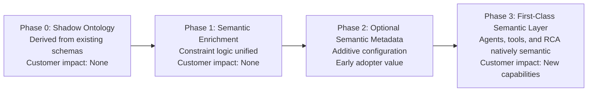

# Semantic Layer Rollout Strategy for Manhattan

**Document Version:** 1.0  
**Author:** Director, Product Management - AI  
**Date:** December 2025  
**Audience:** Senior Engineering Leadership, Product Strategy, Architecture Review Board

---

## 1. Purpose

A semantic warehouse graph is foundational for safe, scalable agentic orchestration in Manhattan's WMS architecture. Unlike traditional relational schemas that encode data structure but not semantic meaning, the semantic graph captures the intrinsic relationships, constraints, and contextual understanding that agents, tools, and orchestrators require to reason correctly about warehouse operations. Without a shared semantic understanding, each agent encodes warehouse rules privately, leading to inconsistent interpretations, constraint violations, and coordination failures that degrade system reliability.

However, Manhattan cannot adopt a "big bang" ontology rewrite like a startup. We operate in an enterprise environment with hundreds of WMS/TMS customers who rely on existing schemas, configuration tables, and operational workflows that have been refined over decades. These customers have mission-critical operations that cannot tolerate schema instability, configuration migrations, or operational disruptions. A multi-year replatforming effort that requires customers to migrate before delivering value would be both technically risky and commercially untenable.

This strategy aims to balance innovation with stability, introducing semantic meaning gradually without breaking existing customer operations. We will deliver immediate value to agentic orchestration in early phases while gradually unifying constraint logic, safety checks, congestion logic, and resource semantics. The rollout path is designed to be backward-compatible, additive, and customer-optional, ensuring that traditional configurations continue to work while new semantic capabilities unlock advanced agentic reasoning, simulation, root cause analysis, explainability, and global optimization.

---

## 2. Industry Reality: Ontology Is a Long-Timeline Investment

Enterprise ontology implementations are multi-year investments, not quick wins. Real-world benchmarks demonstrate the timeline and complexity:

**Blue Yonder's Semantic Signal Graph:** Blue Yonder's knowledge graph partnership with Snowflake and RelationalAI (announced May 2025) represents the culmination of a multi-year transformation journey. Their $2B investment over three years (2023-2025) included not just the knowledge graph infrastructure, but the careful migration of existing systems, customer configurations, and operational workflows. The semantic layer did not emerge overnight—it required patient, methodical work to ensure backward compatibility while introducing new capabilities.

**Palantir Foundry Ontology:** Palantir's ontology-first architecture has evolved over 5+ years into a stable, expressive layer that enables cross-domain reasoning. Their approach demonstrates that ontology maturity requires iterative refinement, customer feedback, and operational validation. The ontology did not replace existing systems—it augmented them, providing a semantic layer that sits above operational databases.

**Enterprise ERP/WMS Vendor Patterns:** Large-scale enterprise software vendors (SAP, Oracle, Infor) require slow, safe migrations due to customer variability and operational criticality. These vendors cannot force schema changes or require customers to migrate configurations before delivering value. Instead, they introduce semantic layers gradually, often starting with derived or materialized views that infer semantics from existing data, then gradually making semantics explicit through optional configuration.

**Manhattan's Pragmatic Approach:** Unlike a startup that can build a greenfield ontology, Manhattan must work within the constraints of an installed base. We require a pragmatic approach that delivers value incrementally, not a multi-year replatforming before value is delivered. Our strategy starts with a shadow ontology that derives semantics from existing WMS/TMS tables, enabling agentic orchestration immediately while gradually evolving toward explicit semantic configuration.

---

## 3. Goals of the Rollout Strategy

The rollout strategy has four core objectives:

1. **Introduce semantic meaning without breaking existing customer operations.** The semantic layer must be additive, not replacement. Existing schemas, configuration tables, and operational workflows continue to function unchanged. Customers can adopt semantic capabilities incrementally, at their own pace, without forced migrations.

2. **Provide immediate value to agentic orchestration, even in early phases.** Agents, tools, and orchestrators begin using semantic reasoning from Phase 0, enabling conflict detection, constraint validation, and coordination that would be impossible with raw database fields alone. The semantic layer is not a "nice to have" for future phases—it is foundational from day one.

3. **Gradually unify constraint logic, safety checks, congestion logic, and resource semantics.** Today, agents implement their own versions of safety rules, capacity checks, congestion logic, and adjacency reasoning. These are gradually centralized into the semantic layer, reducing drift, improving safety, and enabling orchestrator-mediated conflict resolution.

4. **Enable long-term capabilities: simulation, RCA, explainability, global optimization, agent evaluation.** The semantic layer unlocks capabilities that are impossible without shared semantics: realistic test scenario generation, root cause analysis that traces through entity relationships, explainable agent decisions, cross-domain optimization, and systematic agent evaluation.

---

## 4. Constraints and Realities

Enterprise-specific constraints shape the rollout strategy:

**Customer Dependencies on Existing Schemas:** Customers rely heavily on existing relational schemas and configuration tables that have been customized for their operations. These schemas encode business rules, operational preferences, and warehouse-specific logic that cannot be disrupted. Any semantic layer introduction must work alongside these schemas, not replace them.

**Mission-Critical Workloads:** WMS workloads are mission-critical and cannot tolerate schema instability. A warehouse that processes thousands of orders per day cannot pause operations for schema migrations or configuration rewrites. The semantic layer must be introduced without downtime, without data migration, and without operational risk.

**Multi-Warehouse and Multi-Tenant Realities:** Manhattan's platform serves customers with multiple warehouses, each with different configurations, layouts, and operational rules. The semantic layer must scale across warehouses while respecting tenant isolation. Staged rollouts allow us to validate semantics across diverse warehouse configurations before broad deployment.

**Customizations and Extensions:** Customer deployments include customizations and extensions that create edge-case risks. A semantic layer that works for standard configurations may fail for custom logic. Progressive rollout allows us to identify and address edge cases before they impact production operations.

**Backward Compatibility Requirements:** Backward compatibility must be preserved for years, not months. Customers invest in configurations, integrations, and operational procedures that depend on existing schemas. The semantic layer must support legacy configurations indefinitely, even as new semantic capabilities become available.

---

## 5. Phased Rollout Model (Recommended Path)

The rollout progresses through four phases, each building on the previous while maintaining backward compatibility and delivering incremental value.

---

### **Phase 0: Shadow Ontology (Derived, Non-Invasive)**

**What is Built:** A semantic graph inferred entirely from existing WMS/TMS tables. No schema changes, no customer-facing configuration changes. Semantic entities like `AisleSegment`, `Zone`, `ConstraintNode`, `Location`, `SKU`, `Worker`, `Task` are computed or materialized views derived from relational data.

**Where it Lives:** The semantic layer exists as a separate graph database (Neo4j, Amazon Neptune, or partner solution) that is populated via ETL processes from existing WMS/TMS microservices. The graph is read-only for agents and tools—no mutations occur in Phase 0. Updates flow one-way: relational databases → semantic graph.

**How Safe it Is:** Zero risk to existing operations. The semantic layer is completely isolated from production systems. If the graph is unavailable, agents fall back to direct database queries. No customer data is modified, no configurations are changed, no operational workflows are disrupted.

**How Customers Benefit:** Customers see no immediate changes, but agents begin using semantic reasoning for conflict detection, constraint validation, and coordination. The orchestrator can detect conflicts that would be invisible with raw database fields alone. Early RCA capabilities emerge as agents trace through semantic relationships.

**What Changes Are Visible:** None. Phase 0 is completely invisible to customers. No UI changes, no configuration changes, no operational changes. The semantic layer operates behind the scenes, enabling agentic capabilities without customer awareness.

**Time Horizon:** 3-6 months from project start.

**Key Deliverables:**
- Core entity extraction (Location, SKU, Worker, Task, Zone, AisleSegment)
- Relationship inference (Location → AisleSegment, Task → Location, Worker → Zone)
- Constraint node derivation (capacity, compatibility, congestion rules from existing configs)
- ETL pipeline from WMS/TMS microservices to semantic graph
- Agent integration (agents query graph for semantic reasoning)
- Fallback mechanisms (agents use direct database queries if graph unavailable)

---

### **Phase 1: Semantic Enrichment Replaces Duplicate Logic**

**What is Built:** Agents currently implement their own versions of safety rules, capacity checks, congestion logic, and adjacency reasoning. These are gradually centralized into the semantic layer. The semantic layer becomes the authoritative source for constraint validation, congestion computation, and compatibility checking.

**Where it Lives:** The semantic layer remains separate but becomes the primary source for constraint logic. Agents query the semantic layer for constraint validation rather than implementing their own rules. Tools (Capacity and Compatibility Checker, Aisle Congestion Estimator, Travel Time Estimator) query the semantic layer for consistent semantics.

**How Safe it Is:** Low risk. Agents continue to have fallback logic (direct database queries) if semantic layer is unavailable. Changes are internal to Manhattan's codebase—no customer-facing changes. Progressive rollout allows validation across customer clusters before broad deployment.

**How Customers Benefit:** Improved consistency and safety. Agents no longer drift in their interpretation of constraints. Congestion computation is standardized across all agents. Location compatibility is enforced via ConstraintNodes consistently. Path adjacency reasoning is shared between slotting and picking agents, eliminating inconsistencies.

**What Changes Are Visible:** None. All changes are internal to Manhattan's agent and tool implementations. Customers see improved agent behavior (fewer conflicts, better coordination) but no explicit configuration or operational changes.

**Time Horizon:** 6-12 months from Phase 0 completion.

**Key Deliverables:**
- Centralized congestion computation in semantic layer
- Standardized constraint validation via ConstraintNodes
- Unified adjacency reasoning for locations and aisle segments
- Compatibility checking via SKU → ConstraintNode relationships
- Agent migration (agents use semantic layer as primary source, database as fallback)
- Tool migration (tools query semantic layer for constraint logic)
- Validation framework (ensure semantic logic matches legacy behavior)

---

### **Phase 2: Optional Customer-Visible Semantic Metadata**

**What is Built:** Customers may begin configuring semantic concepts explicitly: zones, aisle boundaries, safety corridors, hazard areas, preferred routes, labor skill ontologies. These augment the derived graph rather than replacing existing configs. The semantic layer supports both derived semantics (from existing tables) and explicit semantics (from customer configuration).

**Where it Lives:** New configuration tables or UI screens allow customers to define semantic metadata. This metadata is stored alongside existing configurations and merged with derived semantics in the semantic graph. The graph supports hybrid semantics: some entities are derived, others are explicitly configured.

**How Safe it Is:** Medium risk, mitigated by optional adoption. Customers choose when to adopt semantic configuration. Traditional configurations continue to work. The semantic layer merges explicit and derived semantics, with explicit semantics taking precedence when both exist.

**How Customers Benefit:** High-value customers gain improved optimization and safety through explicit semantic configuration. Zone boundaries can be defined precisely, enabling better congestion prediction. Safety corridors can be marked explicitly, improving forklift-pedestrian separation. Labor skill ontologies enable more sophisticated task assignment. Customers who adopt semantic configuration see measurable improvements in agent coordination and conflict resolution.

**What Changes Are Visible:** New configuration options appear in UI (optional). Customers can define zones, aisle segments, safety corridors, hazard areas, preferred routes, and labor skill ontologies. These configurations augment existing configs—they do not replace them. Customers can adopt incrementally, starting with high-value concepts (zones, safety corridors) before expanding to others.

**Time Horizon:** 12-18 months from Phase 1 completion.

**Key Deliverables:**
- Configuration UI for semantic metadata (zones, aisle segments, safety corridors, hazard areas, preferred routes, labor skills)
- Storage layer for explicit semantic configuration
- Semantic graph merge logic (explicit semantics override derived semantics)
- Migration tools (help customers migrate from implicit to explicit semantics)
- Documentation and training for customer adoption
- Validation tools (ensure explicit semantics are consistent with warehouse layout)
- Progressive rollout (pilot with high-value customers before broad availability)

---

### **Phase 3: Semantic Layer as First-Class Platform Capability**

**What is Built:** The semantic ontology becomes authoritative for agents, tools, orchestrator, RCA, configuration governance, simulation, and forecasting. Constraint enforcement is standardized across all components. The graph becomes deeply integrated with optimization engines, labor management, inventory accuracy, and predictive models.

**Where it Lives:** The semantic layer is deeply integrated into Manhattan's platform. It is not a separate system—it is a core platform capability. All components (agents, tools, orchestrator, optimization engines, UI, reporting) query the semantic layer as the source of truth for warehouse meaning.

**How Safe it Is:** Low risk, due to gradual migration and extensive validation. Legacy flows are preserved through compatibility mappings. Customers who have not adopted explicit semantics continue to use derived semantics. The semantic layer supports both explicit and derived semantics indefinitely.

**How Customers Benefit:** New capabilities are unlocked: advanced simulation, predictive RCA, explainable agent decisions, global optimization across warehouses, systematic agent evaluation. The semantic layer enables capabilities that are impossible without shared semantics. Customers see improved system reliability, better agent coordination, and advanced analytics.

**What Changes Are Visible:** New capabilities appear in UI and APIs. Simulation tools use semantic relationships to generate realistic scenarios. RCA tools trace through semantic relationships to identify root causes. Agent decisions are explainable through semantic reasoning traces. Global optimization considers cross-warehouse relationships. Legacy flows continue to work through compatibility mappings.

**Time Horizon:** 2-5 years from Phase 2 completion.

**Key Deliverables:**
- Deep platform integration (semantic layer as core capability, not separate system)
- Simulation engine (uses semantic relationships for realistic scenario generation)
- Advanced RCA (traces through semantic relationships for root cause analysis)
- Explainability layer (agent decisions explained through semantic reasoning)
- Global optimization (cross-warehouse, cross-domain optimization using semantic relationships)
- Agent evaluation framework (systematic evaluation using semantic test scenarios)
- Configuration governance (semantic layer validates and enforces configuration consistency)
- Compatibility mappings (legacy flows preserved through semantic compatibility layer)

---

## 11. Visual Rollout Timeline (High-Level)

This diagram provides a compact, visual view of how the semantic layer evolves over time, from non-invasive shadow ontology to first-class platform capability, while preserving backward compatibility. The progression demonstrates how Manhattan can introduce semantic meaning gradually without disrupting existing customer operations, delivering immediate value to agentic orchestration in early phases while gradually unlocking advanced capabilities in later phases.

Key highlights:

- **Backward compatibility is preserved at every phase.** Existing schemas, configuration tables, and operational workflows continue to function unchanged. Customers can adopt semantic capabilities incrementally, at their own pace, without forced migrations.

- **Early phases provide value to agentic orchestration without schema changes.** Phase 0 and Phase 1 enable conflict detection, constraint validation, and coordination that would be impossible with raw database fields alone, while remaining completely invisible to customers.

- **Later phases unlock simulation, RCA, and deeper optimization use cases.** Phase 2 and Phase 3 enable advanced capabilities that are impossible without shared semantics: realistic test scenario generation, root cause analysis that traces through entity relationships, explainable agent decisions, and global optimization.

- **The timeline is indicative (multi-year), not a strict date-based plan.** Phase durations (3-6 months for Phase 0, 6-12 months for Phase 1, 12-18 months for Phase 2, 2-5 years for Phase 3) are estimates that will be refined based on customer feedback, validation results, and operational learnings.

---

## 6. Backward Compatibility Strategy

The backward compatibility strategy ensures that existing customer operations are never disrupted, even as semantic capabilities are introduced.

### **Principle 1: No customer schema changes forced early.**

The semantic layer starts as a derived or materialized model. No customer database schemas are modified. No customer configuration tables are changed. The semantic layer reads from existing schemas and infers semantics, but does not require schema changes. This principle holds through Phase 0 and Phase 1, ensuring zero customer migration burden in early phases.

### **Principle 2: Dual-read period for semantics-aware features.**

Agents and tools use the semantic layer as the primary source for constraint validation, congestion computation, and compatibility checking. However, they maintain fallback logic that queries legacy databases directly if the semantic layer is unavailable. This dual-read approach ensures that semantic layer failures do not disrupt operations. The fallback logic is maintained indefinitely, providing safety even as the semantic layer matures.

### **Principle 3: Additive configuration, not replacement.**

When customers begin configuring semantic metadata explicitly (Phase 2), these configurations augment existing configs rather than replacing them. Traditional configuration tables continue to function. The semantic layer merges explicit and derived semantics, with explicit semantics taking precedence when both exist. Customers can adopt semantic configuration incrementally, starting with high-value concepts before expanding to others.

### **Principle 4: Compatibility mapping layer.**

A compatibility mapping layer translates between legacy configuration values and semantic primitives. For example, a legacy zone configuration is mapped to a semantic Zone entity. A legacy capacity limit is mapped to a ConstraintNode. This mapping layer ensures that legacy configurations continue to work even as semantic capabilities are introduced. The mapping layer is maintained indefinitely, ensuring backward compatibility for years.

### **Principle 5: Versioning and change safety.**

The semantic model evolves with explicit versioning and contracts. Semantic entities, relationships, and constraints are versioned. When the semantic model changes, compatibility mappings ensure that legacy queries continue to work. Versioning allows the semantic layer to evolve while maintaining backward compatibility. Customers can adopt new semantic versions at their own pace, with legacy versions supported indefinitely.

---

## 7. Integration with Existing Manhattan Systems

The semantic layer integrates with existing Manhattan systems without disrupting operations:

**Relational Schemas:** The semantic layer reads from existing relational schemas via ETL processes. No schema changes are required. The semantic layer infers entities and relationships from existing tables (locations, SKUs, workers, tasks, zones, configurations). Updates flow one-way: relational databases → semantic graph.

**Optimization Engines:** Optimization engines (constraint solvers, route optimizers, labor schedulers) query the semantic layer for constraint validation, capacity checks, and compatibility rules. The semantic layer provides consistent semantics that optimization engines use for validation. Optimization engines continue to use deterministic algorithms—the semantic layer provides constraint semantics, not optimization logic.

**Tasking Engines:** Tasking engines (task assignment, sequencing, scheduling) query the semantic layer for worker skills, location adjacency, aisle segment capacity, and congestion constraints. The semantic layer provides consistent semantics that tasking engines use for validation. Tasking engines continue to use deterministic algorithms—the semantic layer provides semantic context, not tasking logic.

**Warehouse Execution Services:** Warehouse execution services (picking, put-away, replenishment, cycle counting) query the semantic layer for location compatibility, capacity constraints, and safety rules. The semantic layer provides consistent semantics that execution services use for validation. Execution services continue to use deterministic logic—the semantic layer provides constraint semantics, not execution logic.

**Agent Models:** Agents query the semantic layer for conflict detection, constraint validation, feasibility evaluation, and coordination. The semantic layer provides consistent semantics that agents use for reasoning. Agents use LLM reasoning—the semantic layer provides warehouse meaning, not reasoning logic.

**Event Streams:** Event streams (inventory movements, task completions, worker assignments) update the semantic layer via ETL processes. The semantic layer reflects current warehouse state, enabling real-time semantic reasoning. Event streams continue to flow to relational databases—the semantic layer receives updates via ETL, not direct event consumption.

**RCA Agents:** RCA agents query the semantic layer to trace through entity relationships when investigating root causes. The semantic layer provides consistent semantics that RCA agents use for investigation. RCA agents use LLM reasoning—the semantic layer provides warehouse meaning, not investigation logic.

**UI & Reporting:** UI and reporting systems query the semantic layer for explainable agent decisions, semantic relationship visualization, and constraint validation results. The semantic layer provides consistent semantics that UI and reporting systems use for presentation. UI and reporting systems continue to use existing frameworks—the semantic layer provides semantic context, not presentation logic.

**Integration Pattern:** All integrations follow a query-only pattern in early phases. The semantic layer is read-only for agents, tools, and orchestrators. Updates flow one-way: relational databases → semantic graph. This pattern ensures that semantic layer failures do not disrupt operations—components fall back to direct database queries if the semantic layer is unavailable.

---

## 8. Risks and Mitigations

Major risks and mitigations for the semantic layer rollout:

**Risk 1: Schema Drift in Customer Deployments**

**Description:** Customer deployments include customizations and extensions that create edge-case risks. A semantic layer that works for standard configurations may fail for custom logic. Schema drift (custom tables, custom fields, custom relationships) may cause semantic inference to fail or produce incorrect semantics.

**Mitigation:**
- Progressive validation: Validate semantic inference across diverse customer configurations before broad deployment.
- Customization detection: Identify custom schemas and configurations, provide customization-aware semantic inference.
- Fallback mechanisms: Agents fall back to direct database queries if semantic inference fails.
- Customer communication: Engage customers early to understand customizations and edge cases.

**Risk 2: Incorrect Inference in Derived Semantics**

**Description:** Phase 0 derives semantics from existing tables. If inference logic is incorrect, agents may make decisions based on wrong semantics. For example, incorrect aisle segment inference may cause agents to miss conflicts or detect false conflicts.

**Mitigation:**
- Validation framework: Compare semantic inference results with known warehouse layouts and operational rules.
- Human review: Warehouse operators review inferred semantics and flag incorrect inferences.
- Progressive refinement: Inference logic improves over time based on validation feedback.
- Explicit override: Customers can override incorrect inferences with explicit semantics (Phase 2).

**Risk 3: Performance Concerns for Graph Operations**

**Description:** Graph queries may be slower than direct database queries, especially for complex relationship traversals. If graph queries are too slow, agents may exceed latency requirements, causing operational disruption.

**Mitigation:**
- Performance optimization: Index graph relationships, cache frequently accessed semantics, optimize query patterns.
- Latency monitoring: Monitor graph query latency, alert on performance degradation.
- Fallback mechanisms: Agents fall back to direct database queries if graph queries exceed latency thresholds.
- Horizontal scaling: Scale graph database horizontally to handle increased load.

**Risk 4: Customer Hesitation to Adopt Semantic Metadata**

**Description:** Customers may be hesitant to adopt explicit semantic configuration (Phase 2) due to migration burden, learning curve, or perceived risk. If adoption is low, the semantic layer may not reach its full potential.

**Mitigation:**
- Value demonstration: Show clear value from semantic configuration (improved optimization, better safety, reduced conflicts).
- Migration tools: Provide tools to help customers migrate from implicit to explicit semantics.
- Progressive adoption: Allow customers to adopt incrementally, starting with high-value concepts.
- Training and support: Provide comprehensive training and support for semantic configuration.

**Risk 5: Internal Teams Duplicating Semantics Logic**

**Description:** Internal teams may continue to implement their own versions of constraint logic, congestion computation, and compatibility checking, rather than using the semantic layer. This defeats the purpose of centralizing semantics.

**Mitigation:**
- Clear ownership: Establish clear ownership of semantic logic in the semantic layer team.
- Code review: Require code reviews that check for semantic logic duplication.
- Documentation: Document semantic layer capabilities and encourage teams to use them.
- Migration support: Provide migration support to help teams adopt semantic layer.

**Risk 6: Semantic Layer Availability and Reliability**

**Description:** If the semantic layer is unavailable or unreliable, agents and tools that depend on it may fail, causing operational disruption.

**Mitigation:**
- High availability: Design semantic layer for high availability (redundancy, failover, health checks).
- Fallback mechanisms: All components maintain fallback logic (direct database queries) if semantic layer is unavailable.
- Monitoring and alerting: Monitor semantic layer availability and alert on failures.
- Gradual dependency: Components gradually increase dependency on semantic layer, maintaining fallback indefinitely.

---

## 9. Maturity Metrics

Metrics for evaluating rollout readiness and success:

**% of Decisions Validated Using Semantic Constraints:** Measures how many agent and tool decisions are validated against semantic constraints. Target: 80%+ in Phase 1, 95%+ in Phase 3.

**% of Agents Adopting Semantic Reasoning:** Measures how many agents query the semantic layer for reasoning. Target: 100% of agents in Phase 1.

**Frequency of Semantic Mismatch Incidents:** Measures how often semantic inference produces incorrect results or agents make decisions based on wrong semantics. Target: <1% of decisions in Phase 0, <0.1% in Phase 3.

**Number of Customers Onboarded to Optional Semantic Configurations:** Measures customer adoption of explicit semantic configuration (Phase 2). Target: 20% of customers in Year 1, 50% in Year 2.

**Reduction in Duplicated Logic Across Agents:** Measures how much constraint logic, congestion computation, and compatibility checking is centralized in the semantic layer vs. duplicated in agents. Target: 80%+ reduction in Phase 1, 95%+ in Phase 3.

**Semantic Layer Query Latency:** Measures graph query performance. Target: <100ms p95 latency for standard queries, <500ms p95 for complex relationship traversals.

**Semantic Layer Availability:** Measures semantic layer uptime. Target: 99.9% availability (8.76 hours/year downtime).

**Agent Fallback Rate:** Measures how often agents fall back to direct database queries due to semantic layer unavailability or performance issues. Target: <1% of queries in Phase 1, <0.1% in Phase 3.

**Customer Satisfaction with Semantic-Enabled Features:** Measures customer satisfaction with agent coordination, conflict resolution, and new capabilities enabled by semantic layer. Target: 90%+ satisfaction in Phase 2, 95%+ in Phase 3.

**ROI Metrics:** Measures business value delivered by semantic layer (reduced conflicts, improved optimization, faster RCA, better explainability). Target: Positive ROI within 12 months of Phase 1 completion.

---

## 10. Long-Term Vision

The semantic warehouse graph transforms Manhattan's agentic WMS architecture from a collection of intelligent but isolated agents into a unified, coordinated system that reasons about warehouse operations with shared understanding. The semantic layer enables agents to detect conflicts that would be invisible with raw database fields, coordinate actions on shared resources with consistent constraint interpretation, and explain decisions through semantic reasoning traces that warehouse operators can understand and trust.

This shared semantic foundation unlocks capabilities that are impossible without it: realistic test scenario generation for agent evaluation, root cause analysis that traces through entity relationships to identify systemic issues, explainable agent decisions that build operator trust, global optimization that considers cross-warehouse and cross-domain relationships, and systematic agent evaluation that measures semantic correctness, not just syntactic validity.

The semantic layer becomes Manhattan's long-term technical moat—a capability that competitors cannot easily replicate because it requires deep domain expertise, extensive customer validation, and iterative refinement over years. As the semantic layer matures, it enables advanced capabilities (simulation, predictive RCA, autonomous optimization) that differentiate Manhattan's platform and create sustainable competitive advantage.

The rollout strategy balances innovation with stability, delivering immediate value in early phases while gradually evolving toward a semantic-first architecture that positions Manhattan as the leader in agentic warehouse management. The semantic layer is not a "nice to have" for future phases—it is foundational from day one, enabling safe, scalable, explainable agentic orchestration that transforms how warehouses operate.

---

**Document Status:** Ready for Leadership Review  
**Next Steps:** Engineering deep-dive on Phase 0 implementation, ETL pipeline design, and semantic graph technology selection

