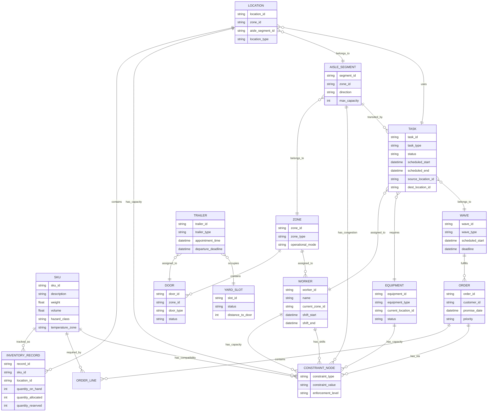

# Semantic Warehouse Graph

## 1. Purpose

A semantic warehouse graph is the foundational knowledge layer that enables safe, explainable, and scalable agentic reasoning in warehouse management systems. Unlike traditional relational schemas that encode data structure but not semantic meaning, the semantic graph captures the intrinsic relationships, constraints, and contextual understanding that agents, tools, and orchestrators require to reason correctly about warehouse operations.

Agents operating in a warehouse must understand more than raw database fields—they must comprehend that two locations share an aisle segment and cannot be accessed simultaneously by forklifts, that certain SKUs are incompatible due to temperature or hazard constraints, that task assignments must respect worker skill certifications and capacity limits, and that SLA commitments create temporal dependencies that constrain scheduling decisions. Without a shared semantic understanding, each agent would encode these relationships privately, leading to inconsistent interpretations, constraint violations, and coordination failures that degrade system reliability.

The semantic graph serves as the single source of truth for warehouse meaning, providing consistent, reusable, warehouse-native semantics that all components—tools that validate constraints, micro-agents that reason about conflicts, the orchestrator that coordinates actions, evaluators that generate test scenarios, and RCA systems that trace root causes—can rely upon. This shared understanding eliminates semantic drift, enables cross-domain reasoning, and ensures that safety constraints, optimization objectives, and operational rules are interpreted uniformly across the entire agentic system.

---

## 2. Core Semantic Entities

### SKU
Represents a stock-keeping unit—a distinct product variant identified by a unique code. SKUs have intrinsic properties (dimensions, weight, hazard class, temperature requirements) that determine compatibility, storage requirements, and handling constraints. Agents reason about SKUs when allocating inventory, selecting storage locations, planning pick paths, and ensuring compliance with safety rules. The semantic graph captures SKU properties not just as attributes, but as relationships to constraint nodes that encode what operations are feasible.

### Location
Represents a physical storage position within the warehouse—a bin, pallet position, staging area, or dock door. Locations exist within a hierarchical spatial structure (zone → aisle → segment → bin) that determines adjacency, travel time, and congestion patterns. Agents use location semantics to evaluate feasibility (can a forklift reach this location?), optimize travel (which locations are closest?), and detect conflicts (are two tasks competing for the same space?). The semantic graph models locations not as isolated coordinates, but as nodes within a spatial topology that encodes physical relationships.

### AisleSegment
Represents a contiguous section of an aisle that serves as a shared resource for material handling equipment. Aisle segments are the atomic units of congestion—multiple tasks competing for the same segment create bottlenecks that degrade throughput. Agents reason about aisle segments to predict congestion, coordinate access, and avoid conflicts. The semantic graph captures segment relationships (which segments are adjacent, which share capacity constraints) that enable congestion estimation and conflict detection.

### Zone
Represents a logical grouping of locations that share operational characteristics (forward pick zone, bulk storage, hazmat zone, refrigerated zone). Zones define boundaries for worker assignments, equipment types, and optimization objectives. Agents use zone semantics to scope optimization (improve efficiency within the forward pick zone), enforce constraints (hazmat items must stay in hazmat zone), and coordinate operations (zone-level labor capacity planning). The semantic graph models zones as containers that aggregate locations and define operational boundaries.

### Equipment
Represents material handling equipment (forklifts, pallet jacks, conveyor systems) that executes physical operations. Equipment has capabilities (weight capacity, reach height, speed), availability windows, and current location that determine what tasks are feasible. Agents reason about equipment to validate task assignments, predict completion times, and coordinate shared resources. The semantic graph captures equipment relationships to tasks, locations, and workers that enable resource allocation reasoning.

### Worker
Represents a warehouse employee with skills, certifications, current location, capacity constraints, and availability. Workers are assigned to tasks based on skill requirements, proximity, capacity, and fatigue factors. Agents use worker semantics to validate assignments (does worker have required certification?), optimize utilization (assign tasks to nearest qualified worker), and prevent overload (respect capacity limits). The semantic graph models worker relationships to tasks, zones, and equipment that enable labor optimization.

### Task
Represents a unit of work that moves inventory or processes orders (pick task, put-away task, replenishment task, cycle count task). Tasks have requirements (SKU, quantity, source location, destination location), dependencies (task B must complete before task C), and deadlines (SLA commitments). Agents reason about tasks to sequence operations, detect conflicts, and optimize execution. The semantic graph captures task relationships to locations, workers, equipment, and orders that enable coordination and scheduling.

### Wave
Represents a collection of tasks grouped together for efficient execution (pick wave, put-away wave). Waves define execution boundaries, resource allocation units, and SLA commitments that agents must respect. The semantic graph models wave relationships to tasks, orders, and workers that enable wave-level optimization and conflict resolution.

### Order
Represents a customer order containing order lines that specify SKUs, quantities, and fulfillment requirements. Orders have priorities (customer tier, expedite flags), SLA commitments (promise dates), and fulfillment constraints (must ship together, specific carrier requirements). Agents reason about orders to allocate inventory, sequence picking operations, and ensure SLA adherence. The semantic graph captures order relationships to waves, tasks, inventory, and locations that enable end-to-end fulfillment reasoning.

### Trailer
Represents an inbound or outbound trailer that occupies dock doors and yard slots. Trailers have schedules (appointment times, departure deadlines), contents (inbound inventory, outbound shipments), and constraints (door compatibility, yard space requirements). Agents reason about trailers to coordinate dock assignments, manage yard congestion, and optimize material flow. The semantic graph models trailer relationships to doors, yard slots, and inventory that enable dock and yard coordination.

### Door
Represents a dock door that receives inbound trailers or stages outbound shipments. Doors have capabilities (height, width, equipment compatibility), schedules (appointments), and zone associations that determine what operations are feasible. Agents use door semantics to assign trailers, coordinate inbound/outbound flows, and manage dock congestion. The semantic graph captures door relationships to trailers, zones, and yard slots that enable dock optimization.

### YardSlot
Represents a parking position in the yard where trailers wait for dock assignments or departures. Yard slots have capacity constraints, proximity relationships (distance to doors), and temporal occupancy that determine yard congestion. Agents reason about yard slots to schedule trailer movements, predict yard congestion, and optimize dock utilization. The semantic graph models yard slot relationships to trailers and doors that enable yard management.

### InventoryRecord
Represents the current state of inventory at a location (quantity on hand, quantity allocated, quantity reserved). Inventory records link SKUs to locations and track availability for allocation decisions. Agents use inventory records to validate allocations (is quantity available?), detect discrepancies (expected vs. actual), and optimize placement (forward pick vs. bulk storage). The semantic graph captures inventory relationships to SKUs, locations, orders, and tasks that enable availability reasoning.

### ConstraintNode
Represents a capacity, compatibility, safety, or temporal constraint that limits what operations are feasible. Constraint nodes encode warehouse rules that are not inherent properties of individual entities, but emerge from relationships (location weight capacity, hazmat incompatibility, aisle congestion limits, worker skill requirements). Agents query constraint nodes to validate proposals, detect violations, and evaluate feasibility. The semantic graph models constraints as first-class entities connected to the entities they constrain, enabling systematic constraint validation.

---

## 3. Relationships Between Entities

### Location → AisleSegment
**Meaning:** Each location belongs to an aisle segment that defines its access path and congestion context. Locations in the same segment share capacity constraints and cannot be accessed simultaneously by conflicting equipment.

**Why it matters:** Agents use this relationship to predict congestion (if location A and location B are in the same segment, tasks to both locations conflict), optimize sequencing (schedule non-conflicting locations first), and detect spatial conflicts during orchestration.

### AisleSegment → Zone
**Meaning:** Aisle segments belong to zones that define operational boundaries, equipment types, and optimization scopes. Segments in the same zone share operational characteristics and constraints.

**Why it matters:** Agents scope congestion estimation and conflict detection to zones, enforce zone-level constraints (hazmat items cannot leave hazmat zone), and coordinate zone-level labor allocation. The orchestrator uses this relationship to validate that agent proposals respect zone boundaries.

### Task → Location
**Meaning:** Tasks have source and destination locations that determine travel distance, congestion impact, and spatial constraints. A task's locations define which aisle segments it occupies and which zones it affects.

**Why it matters:** Agents use location relationships to sequence tasks (minimize travel), detect conflicts (do two tasks compete for the same location?), and validate feasibility (can equipment reach the location?). Tools query this relationship to compute travel time, estimate congestion, and check capacity constraints.

### Task → AisleSegment
**Meaning:** Tasks transit through aisle segments during execution, creating temporal occupancy that contributes to congestion. A task's path through segments determines when and where it competes with other tasks.

**Why it matters:** Agents reason about segment relationships to predict congestion (how many tasks will occupy segment X in the next hour?), detect conflicts (do two tasks require the same segment simultaneously?), and optimize sequencing (schedule tasks that share segments at different times). The congestion estimator tool uses this relationship to compute occupancy.

### Task → Worker
**Meaning:** Tasks are assigned to workers who execute them based on skill, location, capacity, and availability. A worker's assigned tasks determine their workload, travel path, and capacity utilization.

**Why it matters:** Agents use worker relationships to validate assignments (does worker have required skills?), optimize load balancing (distribute tasks evenly), and prevent overload (respect worker capacity). The orchestrator uses this relationship to detect labor conflicts and coordinate assignments.

### Task → Equipment
**Meaning:** Tasks require specific equipment types (forklift, pallet jack) and may be assigned to specific equipment instances. Equipment assignments determine task feasibility, execution speed, and resource conflicts.

**Why it matters:** Agents validate that required equipment is available, schedule equipment to minimize idle time, and detect conflicts when multiple tasks compete for the same equipment. Tools use this relationship to check equipment availability and estimate task duration.

### Wave → Tasks
**Meaning:** Waves contain multiple tasks that execute together as a unit, sharing resources, deadlines, and optimization objectives. Wave boundaries define coordination scope and conflict resolution units.

**Why it matters:** Agents reason at the wave level to optimize task sequencing, allocate resources, and ensure SLA adherence. The orchestrator coordinates waves to resolve conflicts and optimize global throughput.

### Order → Waves
**Meaning:** Orders are fulfilled through waves that group tasks for efficient execution. Multiple waves may fulfill different order lines, creating temporal and resource dependencies.

**Why it matters:** Agents trace order fulfillment through waves to ensure SLA commitments, detect dependencies (order line A must ship before order line B), and coordinate cross-wave optimization. Tools use this relationship to compute order-level SLA risk.

### Trailer → Door
**Meaning:** Trailers are assigned to dock doors for loading or unloading operations. Door assignments determine execution timeline, resource requirements, and coordination needs.

**Why it matters:** Agents optimize door assignments to minimize dwell time, coordinate inbound/outbound flows, and manage dock congestion. The orchestrator uses this relationship to resolve dock conflicts and schedule appointments.

### Door → Zone
**Meaning:** Dock doors belong to zones that define operational characteristics, access patterns, and equipment types. Zone associations determine what operations are feasible at each door.

**Why it matters:** Agents validate that door assignments respect zone constraints (refrigerated trailers must use refrigerated zone doors), scope congestion estimation to zones, and coordinate zone-level resource allocation.

### Location → ConstraintNode
**Meaning:** Locations have capacity constraints (max weight, max volume, max pallet count) and compatibility constraints (temperature, hazard class) that limit what SKUs can be stored there. Constraint nodes encode these rules as reusable, queryable semantics.

**Why it matters:** Tools query constraint nodes to validate storage proposals (does location have capacity? is SKU compatible?), agents reason about constraints to select feasible locations, and the orchestrator enforces constraints to prevent violations. This relationship enables systematic constraint validation without hardcoding rules in every tool and agent.

### AisleSegment → ConstraintNode
**Meaning:** Aisle segments have congestion constraints (max simultaneous equipment, directional flow restrictions) and safety constraints (forklift/pedestrian separation) that limit concurrent operations. Constraint nodes encode these rules that emerge from spatial relationships.

**Why it matters:** Agents use segment constraints to predict congestion, detect conflicts, and optimize sequencing. Tools query constraint nodes to estimate occupancy and validate that proposals respect segment capacity. The orchestrator enforces segment constraints to prevent safety violations.

### SKU → ConstraintNode
**Meaning:** SKUs have compatibility constraints (hazmat incompatibilities, temperature requirements, weight/volume limits) that determine storage and handling rules. Constraint nodes encode these rules as reusable semantics.

**Why it matters:** Tools validate SKU compatibility when proposing storage locations, agents reason about constraints to avoid violations, and the orchestrator enforces compatibility to ensure safety and compliance. This relationship enables consistent constraint interpretation across all components.

### Worker → ConstraintNode
**Meaning:** Workers have capacity constraints (max tasks per hour, max weight capacity, fatigue limits) and skill constraints (certifications required for certain tasks) that limit assignments. Constraint nodes encode these rules.

**Why it matters:** Agents validate worker assignments against constraint nodes to prevent overload and ensure skill requirements are met. Tools query constraint nodes to check worker availability and capacity. The orchestrator enforces worker constraints to maintain safety and compliance.

---

## 4. Semantic Constraints

Semantic constraints are warehouse rules and limitations that exist as relationships between entities, not as raw data fields. These constraints encode the "meaning layer" that agents, tools, and orchestrators consume to reason safely and efficiently.

### Capacity Semantics
Location capacity constraints (max pallet count, weight limits, volume limits) are modeled as relationships between locations and constraint nodes. When agents propose storing a SKU at a location, tools query these relationships to validate that capacity is available and that the SKU's dimensions/weight are within limits. Equipment capacity constraints (forklift weight capacity, reach height) similarly constrain what tasks are feasible with specific equipment. These semantics enable systematic capacity validation without hardcoding rules in every agent.

### Compatibility Semantics
Hazmat incompatibility, temperature requirements, and other compatibility rules are modeled as relationships between SKUs and constraint nodes. Tools query these relationships to determine which locations are compatible with a SKU's requirements, preventing violations that could cause safety incidents or regulatory non-compliance. The semantic graph encodes rules such as "hazmat class 3 items cannot be stored adjacent to oxidizers" as relationships that agents can query and reason about consistently.

### Congestion Semantics
Aisle segment congestion constraints (max simultaneous equipment, directional flow restrictions) are modeled as relationships that encode when and how segments can be accessed. The congestion estimator tool queries these relationships along with task-to-segment relationships to compute occupancy and predict bottlenecks. Agents use congestion semantics to avoid scheduling conflicting tasks, and the orchestrator uses them to detect conflicts and coordinate access. These semantics enable proactive congestion management rather than reactive conflict resolution.

### Safety Semantics
Forklift/pedestrian separation requirements, minimum clearances, and equipment safety rules are modeled as constraint node relationships that encode safety boundaries. Agents query safety constraints before proposing actions to ensure compliance, tools validate safety rules during constraint checking, and the orchestrator enforces safety constraints as hard stops that cannot be overridden. Safety semantics ensure that no optimization or SLA pressure justifies violating physical safety rules.

### SLA Semantics
Order promise dates create temporal constraints that link orders to tasks, waves, and resource availability. SLA risk estimators query these relationships to assess feasibility: can all required tasks complete before the promise date given current resource availability? Agents use SLA semantics to prioritize actions and escalate when risk exceeds thresholds. The orchestrator uses SLA semantics to resolve conflicts in favor of high-priority orders and coordinate resource allocation to meet commitments.

### Labor Semantics
Worker skill requirements, certification needs, capacity limits, and availability windows are modeled as constraint node relationships that encode labor feasibility. Agents query labor constraints to validate task assignments, tools check worker availability and capacity before proposing assignments, and the orchestrator uses labor semantics to optimize global labor allocation while respecting individual worker constraints. These semantics enable systematic labor optimization without hardcoding workforce rules.

### Temporal Semantics
Tasks compete for resources through time, creating temporal dependencies that constrain scheduling. The semantic graph models temporal relationships (task A must complete before task B, wave X must start before time T to meet SLA) that agents and tools query to evaluate feasibility and optimize sequencing. Temporal semantics enable agents to reason about deadlines, dependencies, and resource contention across time horizons, not just current state.

---

## 5. Mermaid Diagram of Semantic Graph

---

## 6. How the Semantic Layer Is Used

### 6.1 Tools

Tools use the semantic graph to validate constraints, compute congestion, determine adjacency or feasibility, and enforce safety rules. Rather than hardcoding warehouse rules or querying raw database tables, tools query the semantic graph to access reusable, consistent semantics.

**Constraint Validation:** The Capacity and Compatibility Checker tool queries location-to-constraint-node relationships to validate that a proposed SKU storage location has sufficient capacity and is compatible with the SKU's requirements (temperature, hazard class). The tool queries SKU-to-constraint-node relationships to determine compatibility rules, then queries location-to-constraint-node relationships to check if the location satisfies those rules. This approach ensures consistent constraint interpretation across all tools and agents.

**Congestion Computation:** The Aisle Congestion Estimator tool queries task-to-aisle-segment relationships to determine which segments tasks will occupy, then queries aisle-segment-to-constraint-node relationships to determine segment capacity limits. The tool computes occupancy by counting tasks per segment and comparing against capacity constraints, enabling proactive congestion prediction rather than reactive conflict detection.

**Adjacency and Feasibility:** The Travel Time Estimator tool queries location-to-aisle-segment relationships and aisle-segment adjacency relationships to determine shortest paths between locations. The tool queries zone relationships to validate that paths respect zone boundaries (hazmat items cannot transit through non-hazmat zones), and queries constraint nodes to check if equipment can access required segments.

**Safety Rule Enforcement:** Safety validation tools query constraint-node relationships to retrieve safety rules (forklift/pedestrian separation, minimum clearances) and validate that proposed actions comply. Rather than hardcoding safety rules in multiple places, tools query the semantic graph for consistent, updatable safety semantics.

### 6.2 Micro Agents

Micro agents rely on the semantic graph to reason about conflicts, choose alternative actions, interpret constraints, and evaluate feasibility and risk. Agents query the graph to understand warehouse meaning, then use that understanding to generate proposals that are semantically consistent and constraint-compliant.

**Conflict Reasoning:** When the PickingAgent proposes a pick task, it queries task-to-aisle-segment relationships to determine which segments the task will occupy, then queries other active tasks to detect conflicts (multiple tasks requiring the same segment simultaneously). The agent uses semantic understanding of segment capacity and congestion to choose alternative sequences or escalate to the orchestrator when conflicts cannot be resolved locally.

**Alternative Action Selection:** When the SlottingAgent evaluates storage locations, it queries location-to-constraint-node relationships to filter out incompatible locations, then queries location-to-aisle-segment relationships to evaluate congestion impact. The agent uses semantic understanding of constraints and congestion to rank alternatives and select feasible, efficient options.

**Constraint Interpretation:** Agents query constraint-node relationships to understand what rules apply to their domain. The ReplenishmentAgent queries SKU-to-constraint-node relationships to understand compatibility requirements, then uses that understanding to propose storage locations that satisfy constraints. The LaborSyncAgent queries worker-to-constraint-node relationships to understand capacity limits and skill requirements, then uses that understanding to validate task assignments.

**Feasibility and Risk Evaluation:** Agents query semantic relationships to evaluate whether proposals are feasible given current warehouse state. The PickingAgent queries order-to-wave relationships and wave-to-task relationships to understand SLA dependencies, then queries task-to-worker relationships and worker-to-constraint-node relationships to assess whether tasks can complete on time. The agent uses semantic understanding of temporal dependencies and resource constraints to evaluate feasibility and escalate when risk exceeds thresholds.

### 6.3 Orchestrator

The orchestrator uses the semantic graph to detect conflicts across agents, coordinate actions on shared resources, escalate or defer proposals, and enforce global safety, efficiency, and SLA coherence. The orchestrator queries the graph to maintain a global view of warehouse state and agent proposals, then uses semantic understanding to resolve conflicts and coordinate execution.

**Conflict Detection Across Agents:** When multiple agents propose actions, the orchestrator queries the semantic graph to detect conflicts. For example, if the PickingAgent proposes a task that transits aisle segment X and the ReplenishmentAgent proposes a task that also transits segment X simultaneously, the orchestrator queries aisle-segment-to-constraint-node relationships to determine capacity limits, then detects the conflict by comparing occupancy against capacity. The orchestrator uses semantic understanding of spatial and temporal relationships to identify conflicts that individual agents cannot see.

**Coordination on Shared Resources:** The orchestrator queries semantic relationships to understand resource contention. When multiple agents propose using the same worker, equipment, or location, the orchestrator queries worker-to-constraint-node relationships to understand capacity limits, queries task-to-worker relationships to assess current workload, and queries order-to-constraint-node relationships to understand SLA priorities. The orchestrator uses semantic understanding to coordinate resource allocation and resolve conflicts.

**Escalation and Deferral Decisions:** The orchestrator queries semantic relationships to evaluate when conflicts require human intervention versus autonomous resolution. The orchestrator queries constraint-node relationships to identify hard safety constraints that cannot be violated, queries order-to-constraint-node relationships to assess SLA risk, and queries task-to-constraint-node relationships to evaluate complexity. The orchestrator uses semantic understanding to determine when tradeoffs are ambiguous or high-impact, triggering HITL escalation rather than autonomous resolution.

**Global Safety, Efficiency, and SLA Coherence:** The orchestrator queries the semantic graph to enforce global consistency. The orchestrator validates that all agent proposals satisfy safety constraints by querying constraint-node relationships, ensures that SLA commitments are feasible by querying temporal and resource relationships, and optimizes global efficiency by querying spatial and congestion relationships. The orchestrator uses semantic understanding to maintain coherence across all agent decisions, ensuring that local optimizations do not violate global constraints or objectives.

### 6.4 Evaluation Framework

Evaluators use the semantic graph to generate realistic test scenarios, score agent and system behavior consistently, and simulate warehouse states. The evaluation framework queries the semantic graph to understand warehouse meaning, then uses that understanding to create test cases and measure correctness.

**Realistic Test Scenario Generation:** Evaluators query semantic relationships to generate test scenarios that respect warehouse constraints. For example, when generating a congestion scenario, evaluators query aisle-segment-to-constraint-node relationships to determine capacity limits, then create tasks that legitimately compete for segments. Evaluators query location-to-constraint-node relationships to ensure test SKUs are compatible with test locations, and query worker-to-constraint-node relationships to ensure test assignments respect skill requirements. This approach ensures that test scenarios are semantically valid and representative of real warehouse operations.

**Consistent Behavior Scoring:** Evaluators query the semantic graph to determine expected behavior, then compare agent outputs against semantic expectations. For example, when evaluating a slotting proposal, evaluators query location-to-constraint-node relationships to determine if the proposed location satisfies capacity and compatibility constraints, then score the proposal based on semantic correctness. Evaluators query task-to-aisle-segment relationships to determine if agent sequencing respects congestion constraints, then score based on semantic validity. This approach ensures that evaluations measure semantic correctness, not just syntactic validity.

**Warehouse State Simulation:** Evaluators use the semantic graph to simulate warehouse states that respect relationships and constraints. Evaluators create synthetic entities (locations, SKUs, workers) and establish relationships (location-to-aisle-segment, worker-to-constraint-node) that define warehouse meaning. Evaluators then simulate operations (task assignments, inventory movements) that update relationships and maintain semantic consistency. This approach enables reproducible, semantically valid simulations for testing agent and system behavior.

---

## 7. Anti-patterns Without a Semantic Layer

When agents, tools, and orchestrators operate purely on raw database fields without a semantic layer, several anti-patterns emerge that degrade system reliability, maintainability, and safety.

**Inconsistent Constraint Enforcement Across Agents:** Without a semantic layer, each agent encodes constraint rules independently. The SlottingAgent might enforce hazmat compatibility by checking SKU attributes against location attributes, while the PickingAgent might use a different compatibility table, and the ReplenishmentAgent might use yet another rule. When compatibility rules change, engineers must update code in multiple places, risking inconsistencies. With a semantic layer, all agents query the same constraint-node relationships, ensuring consistent enforcement and enabling centralized rule updates.

**Congestion and Safety Logic Duplicated in Multiple Places:** Congestion estimation logic exists in the congestion estimator tool, the picking agent's conflict detection, the orchestrator's coordination logic, and potentially in UI components that display congestion warnings. Each implementation might use slightly different algorithms or thresholds, leading to inconsistent congestion assessments. When congestion rules change (e.g., new equipment types change segment capacity), engineers must update multiple codebases. With a semantic layer, congestion semantics live in aisle-segment-to-constraint-node relationships that all components query, ensuring consistency and enabling centralized updates.

**Orchestrator Forced to Infer Meaning from IDs or Free Text:** Without semantic relationships, the orchestrator must infer that location "A-12-03-05" and location "A-12-03-06" share an aisle segment by parsing location codes or querying separate adjacency tables. The orchestrator must infer that worker "W-1234" has forklift certification by querying a separate skills table or parsing free-text skill descriptions. This inference logic is brittle, error-prone, and fails when naming conventions change. With a semantic layer, the orchestrator queries explicit location-to-aisle-segment and worker-to-constraint-node relationships, eliminating inference and ensuring accurate reasoning.

**Tools Receive Raw Fields Without Understanding Relationships:** Tools receive location IDs, SKU codes, and worker IDs as parameters, but must independently query database tables to understand relationships (which locations are adjacent? which SKUs are compatible? which workers have required skills?). This creates tight coupling between tools and database schemas, makes tools harder to test (requiring full database setup), and risks tools using stale or inconsistent relationship data. With a semantic layer, tools query relationship edges directly, receiving semantic meaning as first-class query results rather than requiring secondary lookups.

**RCA Agents Unable to Reconstruct Why Conflicts Occurred:** When investigating why two tasks conflicted, RCA agents must reconstruct semantic relationships by querying multiple tables and inferring meaning. The RCA agent might query task locations, then query location adjacency tables, then query segment capacity tables, then query occupancy tables, piecing together why a conflict occurred. This reconstruction is complex, error-prone, and might miss subtle relationship changes that occurred over time. With a semantic layer, RCA agents query explicit task-to-aisle-segment relationships and segment-to-constraint-node relationships to directly understand why conflicts occurred, enabling faster and more accurate root cause analysis.

**Evaluation Scenarios Become Brittle and Non-Generalizable:** Test scenarios hardcode specific location codes, SKU codes, and worker IDs that work in one warehouse but fail in another. Evaluators must maintain separate test datasets for each warehouse configuration, and scenarios break when warehouse layouts change. With a semantic layer, evaluators generate scenarios by querying semantic relationships (create tasks that legitimately compete for segments, assign workers that have required skills), producing scenarios that are valid across warehouse configurations and resilient to layout changes.

**Configuration Changes Have Unpredictable Effects:** When warehouse operators change zone boundaries, add new equipment types, or update capacity limits, the effects ripple through multiple agents, tools, and components that hardcode these values. Engineers cannot predict which components will break or behave unexpectedly. With a semantic layer, configuration changes update semantic relationships (zone boundaries update location-to-zone relationships, capacity changes update constraint-node relationships), and all components automatically consume updated semantics through queries, ensuring predictable, consistent behavior.

**Agents Develop "Private Ontologies," Causing Semantic Drift:** Over time, agents develop internal understanding of warehouse meaning that diverges from each other and from reality. The PickingAgent might learn that "forward pick locations are always better" while the SlottingAgent learns that "bulk storage is sometimes better," leading to conflicting optimization objectives. The ReplenishmentAgent might develop its own congestion estimation that differs from the congestion estimator tool. This semantic drift degrades system coherence and makes coordination impossible. With a semantic layer, all agents query shared semantic relationships, preventing drift and ensuring consistent understanding.

---

## 8. Summary

The semantic warehouse graph is foundational for safe, explainable, and scalable agentic automation in warehouse management systems. By encoding warehouse meaning as explicit relationships and constraints rather than implicit rules scattered across codebases, the semantic graph provides a single source of truth that unifies tools, agents, orchestrator, data quality systems, evaluations, and RCA. Agents query the graph to reason about conflicts and feasibility, tools query it to validate constraints and compute congestion, the orchestrator queries it to detect conflicts and coordinate resources, evaluators query it to generate valid test scenarios, and RCA systems query it to reconstruct root causes. This shared semantic understanding eliminates inconsistency, enables cross-domain reasoning, ensures constraint compliance, and prevents semantic drift that degrades system reliability over time. The semantic graph transforms warehouse data from raw fields into meaningful, reusable, warehouse-native semantics that power intelligent automation while maintaining safety, compliance, and operational excellence.

---

**Document Status:** Conceptual Ontology Definition  
**Next Steps:** Rollout strategy, backward compatibility pathways, and migration planning will be handled in a separate document.

