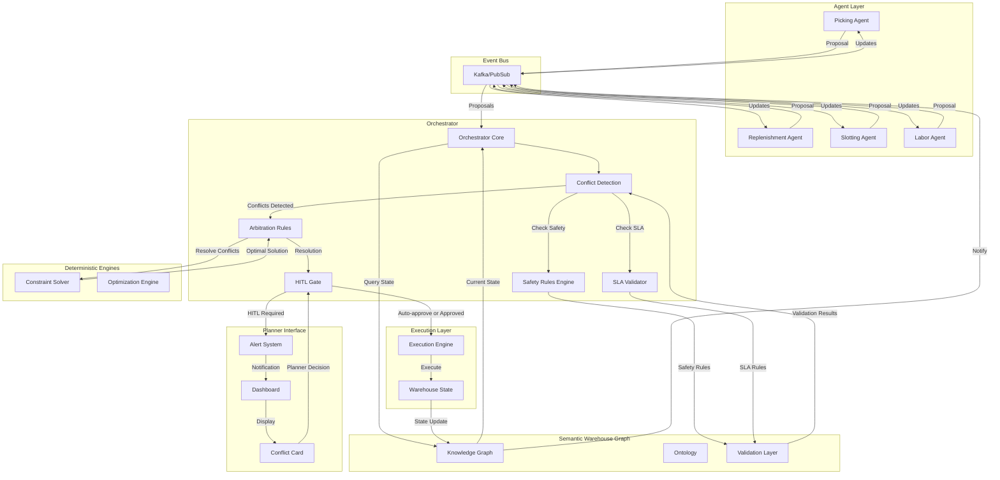
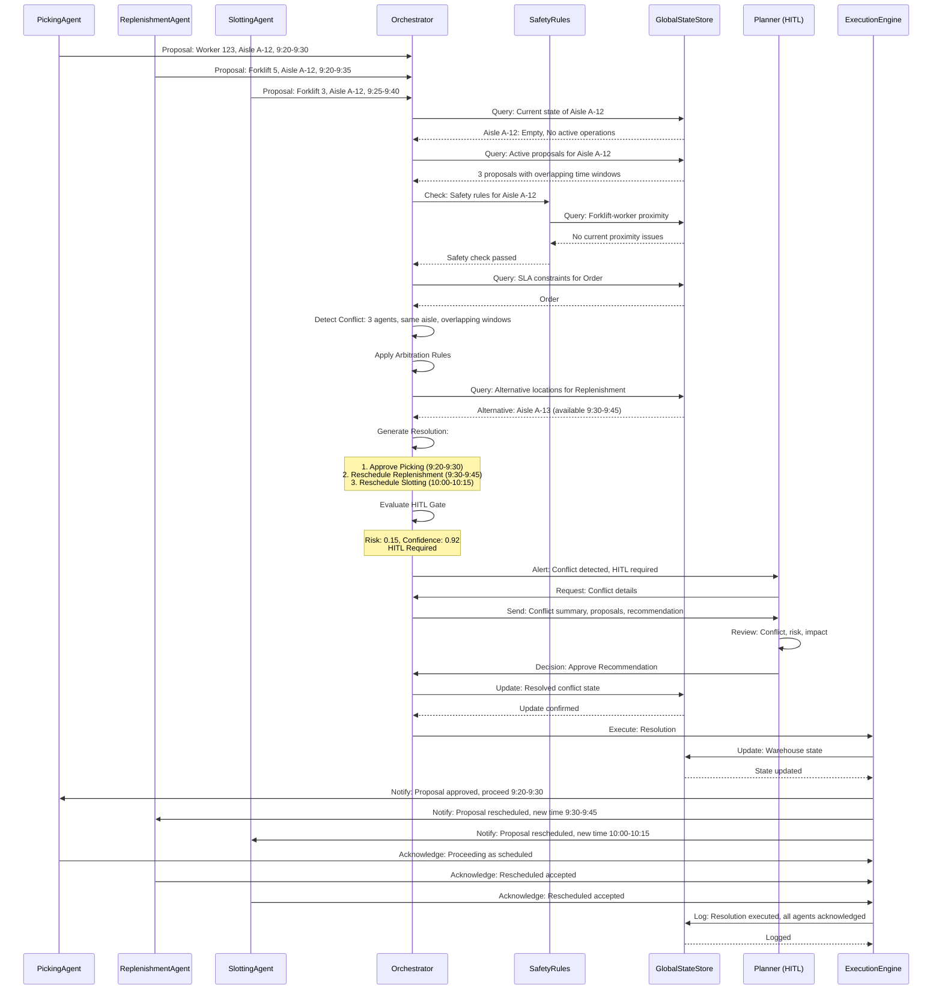
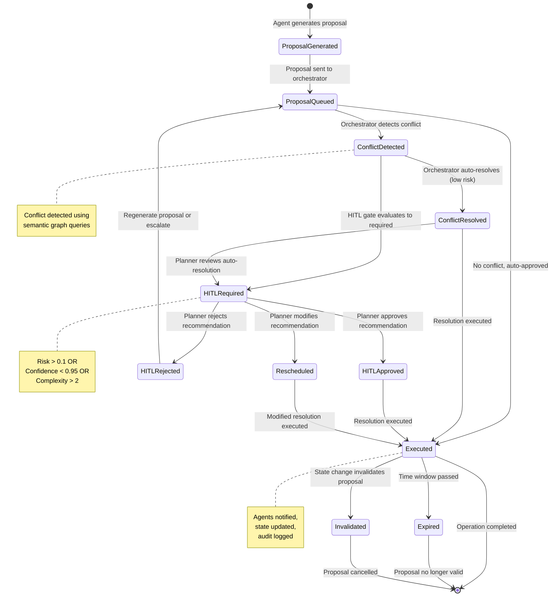

# Conflict Resolution Flow: Multi-Agent Coordination in Warehouse Management Systems

**Document Version:** 1.0  
**Author:** Senior/Director, Product Management  
**Date:** December 2025  
**Audience:** Engineering, UX Design, Product Strategy, Customer Success

---

## 1. Planner Persona

### Primary User: Outbound Operations Planner

**Role Definition:**
The Outbound Operations Planner is responsible for ensuring customer orders are fulfilled on time, in full, while maintaining warehouse safety and operational efficiency. They operate during peak fulfillment windows (typically 6 AM - 2 PM) when multiple agents are actively coordinating picking, replenishment, and slotting operations.

**Alternative Personas:**
- **Inbound Planner:** Manages receiving, put-away, and dock scheduling
- **Replenishment Coordinator:** Oversees inventory movement from reserve to forward pick locations
- **Labor Manager:** Allocates workers across zones and manages capacity constraints

**Goals:**
1. **SLA Adherence:** Ensure 99.5%+ of orders ship by promised date
2. **Safety First:** Zero tolerance for aisle congestion, forklift-worker conflicts, or unsafe conditions
3. **Operational Efficiency:** Minimize worker idle time, reduce travel distance, optimize throughput
4. **Predictability:** Understand system behavior, trust agent recommendations, maintain control

**Mental Model:**
The planner views the orchestrator as a **"control tower"** that provides visibility and coordination, but they maintain final authority over high-risk decisions. They operate on a **"trust but verify"** principle:

- **Trust:** Agents handle routine coordination automatically (90%+ of cases)
- **Verify:** Planner reviews and approves when:
  - Safety risks are non-zero
  - SLA tradeoffs exist (e.g., expedite one order delays another)
  - Multiple agents propose conflicting actions
  - System confidence is below threshold

**Pain Points Today (Without Agentic System):**
1. **Manual Triage:** Planner manually reviews 50+ exception reports per shift, determining which conflicts require intervention
2. **Siloed Systems:** WMS, Labor Management, and Slotting systems don't communicate, requiring planner to mentally reconcile conflicts
3. **Lack of Visibility:** Planner doesn't know about conflicts until they manifest as physical congestion or missed SLAs
4. **Reactive vs. Proactive:** Planner responds to problems after they occur, rather than preventing them
5. **Cognitive Overload:** Planner must track multiple systems, remember business rules, and make rapid decisions under time pressure

**Information Needs:**
- **Real-time conflict alerts:** Which agents are proposing conflicting actions?
- **Risk assessment:** What's the safety and SLA impact of each proposal?
- **Orchestrator recommendation:** What does the system recommend and why?
- **Impact preview:** If I approve this, what happens to other orders/workers?
- **Historical context:** Have we seen this conflict pattern before? What worked?

---

## 2. Purpose of Conflict Resolution Flow

### Why Multi-Agent Conflicts Occur

In a warehouse managed by specialized micro-agents, conflicts emerge from the **fundamental tension between local optimization and global constraints**:

**1. Physical Space Constraints:**
- **Aisle Congestion:** Multiple agents want to use the same aisle simultaneously
  - Slotting agent proposes moving pallet to Aisle A-12
  - Replenishment agent dispatches forklift to Aisle A-12
  - Picking agent assigns worker to Aisle A-12
  - **Result:** Physical impossibility - only one can occupy aisle at a time

**2. Resource Competition:**
- **Labor Allocation:** Multiple agents compete for same worker
  - Picking agent needs Worker 123 for high-priority order
  - Put-away agent needs Worker 123 for urgent inbound
  - Labor agent reassigns Worker 123 to different zone
  - **Result:** Worker cannot be in multiple places simultaneously

**3. Inventory Allocation:**
- **Same Item, Multiple Orders:** Multiple agents allocate same inventory
  - Order A requires Item X from Location L1
  - Order B requires Item X from Location L1
  - Only one unit available at L1
  - **Result:** One order must be delayed or sourced from alternative location

**4. Temporal Overlaps:**
- **Time Window Conflicts:** Agents propose actions in overlapping time windows
  - Slotting agent schedules movement: 10:00-10:15 AM
  - Picking agent schedules pick: 10:10-10:20 AM
  - **Result:** Actions cannot execute simultaneously in same physical space

**5. Cross-Domain Optimization:**
- **Warehouse vs. Transportation:** Agents optimize different objectives
  - Warehouse agent wants to ship from Location A (lower labor cost)
  - Transportation agent wants to ship from Location B (lower transportation cost)
  - **Result:** Conflicting optimization goals require global tradeoff

### Why Hybrid Orchestrator Model Requires Explicit Conflict Handling

The hybrid architecture (orchestrator + micro-agents) creates a **two-level decision hierarchy**:

**Agent Level (Local Validity):**
- Each agent optimizes within its domain (picking, put-away, slotting, labor)
- Agent decisions are **locally valid** (make sense within agent's context)
- Example: Picking agent correctly identifies optimal pick path for Order A

**Orchestrator Level (Global Validity):**
- Orchestrator evaluates agent decisions against **global warehouse state**
- Agent decisions may be **globally invalid** (conflict with other agents or constraints)
- Example: Picking agent's optimal path conflicts with forklift movement in same aisle

**Without explicit conflict handling:**
- Agents operate independently, unaware of each other's proposals
- Conflicts manifest as physical congestion, missed SLAs, or safety incidents
- Planner must manually detect and resolve conflicts (reactive, error-prone)

**With explicit conflict handling:**
- Orchestrator detects conflicts **before execution** (proactive)
- System proposes resolution based on safety, SLA, and optimization rules
- Planner reviews high-risk conflicts, approves routine resolutions automatically

### Safety, SLA, and Constraint Drivers

**Safety Requirements:**
- **Aisle Occupancy:** Only one forklift or worker in narrow aisle at a time
- **Forklift Proximity:** Workers must not be in forklift path (minimum 10-foot clearance)
- **Worker Density:** Maximum 3 workers per 100 sq ft in forward pick zones
- **Equipment Lockout:** Aisle locked during maintenance or safety incidents

**SLA Guarantees:**
- **Order Promise Dates:** 99.5% of orders must ship by promised date
- **Priority Orders:** Tier 1 customers get priority over Tier 2/3
- **Expedite Requests:** Same-day orders must not be delayed by routine operations
- **Cut-off Times:** Orders must be picked by cut-off to meet carrier deadlines

**Operational Constraints:**
- **Labor Capacity:** Workers have maximum throughput (picks/hour, moves/hour)
- **Equipment Availability:** Limited forklifts, pallet jacks, carts
- **Storage Capacity:** Locations have finite space (cannot overfill)
- **Accessibility:** Some locations require specific equipment or certifications

### Agent-Local Validity vs. Global Invalidity

**Agent-Local Validity:**
- Agent's decision is correct **within its domain context**
- Agent has all information needed for its domain
- Agent's reasoning is sound for its scope
- **Example:** Picking agent correctly identifies that Order A should be picked from Location L1 (closest to worker, item available)

**Global Invalidity:**
- Agent's decision conflicts with **global warehouse state**
- Agent lacks visibility into other agents' proposals or global constraints
- Agent's decision violates safety, SLA, or operational constraints
- **Example:** Picking agent's choice of Location L1 conflicts with forklift movement scheduled in same aisle

**The Orchestrator's Role:**
- **Detect:** Identify when agent-local decisions are globally invalid
- **Resolve:** Propose resolution that maintains safety, SLA, and optimization
- **Validate:** Ensure resolution satisfies all global constraints
- **Coordinate:** Notify affected agents of resolution and coordinate execution

---

## 3. Triggering Events

### Conflict Evaluation Triggers

The orchestrator evaluates conflicts when **any of the following events occur**:

#### 3.1 Slotting Agent Proposals

**Event:** Slotting agent proposes moving item from Location A to Location B

**Trigger Conditions:**
- Movement requires forklift access to aisle
- Movement scheduled in time window T1-T2
- Target location is in forward pick zone (high-traffic area)

**Conflict Scenarios:**
- Aisle already occupied by replenishment forklift
- Aisle scheduled for picking operations in overlapping window
- Target location has insufficient space (capacity constraint)

#### 3.2 Replenishment Agent Proposals

**Event:** Replenishment agent dispatches forklift to forward pick location

**Trigger Conditions:**
- Forklift movement into aisle
- Replenishment task scheduled in time window T1-T2
- Forward pick zone has active picking operations

**Conflict Scenarios:**
- Aisle occupied by picking worker
- Aisle scheduled for slotting movement in overlapping window
- Worker density in zone exceeds safety threshold

#### 3.3 Picking Agent Proposals

**Event:** Picking agent assigns worker to pick order from location

**Trigger Conditions:**
- Pick task requires worker entry into aisle
- Pick scheduled in time window T1-T2
- Location is in high-traffic forward pick zone

**Conflict Scenarios:**
- Aisle occupied by forklift (replenishment or slotting)
- Aisle scheduled for maintenance or safety lockout
- Worker already assigned to conflicting task in another zone

#### 3.4 Dock/Yard Agent Proposals

**Event:** Dock agent pushes urgent inbound pallet movement

**Trigger Conditions:**
- Inbound shipment requires immediate put-away
- Put-away location is in aisle with active operations
- Urgency flag set (hot load, temperature-sensitive, etc.)

**Conflict Scenarios:**
- Target aisle occupied by outbound operations
- Put-away conflicts with scheduled slotting movement
- Urgent movement may delay high-priority outbound orders

#### 3.5 Labor Sync Agent Reallocations

**Event:** Labor agent reassigns worker from Zone A to Zone B

**Trigger Conditions:**
- Worker reassignment changes zone capacity
- Reassignment affects active task assignments
- Reassignment optimizes global labor utilization

**Conflict Scenarios:**
- Worker reassignment breaks existing task assignments
- Reassignment conflicts with picking agent's labor plan
- Reassignment violates worker skill or certification requirements

#### 3.6 GlobalState Detections

**Event:** GlobalState detects anomaly or constraint violation

**Trigger Conditions:**
- **Congestion Detected:** Sensor data shows aisle occupancy above threshold
- **Safety Lock:** Aisle locked due to safety incident or maintenance
- **Sensor Anomaly:** Unexpected state change (e.g., location shows empty but inventory system shows stock)
- **SLA Risk:** Order promise date at risk due to delays

**Conflict Scenarios:**
- Active agent proposals conflict with detected state
- Proposals must be invalidated or rescheduled
- Emergency response required (evacuate aisle, reroute operations)

### Conflict Detection Logic

**Orchestrator evaluates conflicts using semantic graph queries:**

```sparql
# Example: Detect aisle occupancy conflict
SELECT ?conflict ?agent1 ?agent2 ?aisle ?time_window
WHERE {
  ?proposal1 :proposed_by ?agent1 .
  ?proposal1 :requires_aisle ?aisle .
  ?proposal1 :time_window ?time1 .
  
  ?proposal2 :proposed_by ?agent2 .
  ?proposal2 :requires_aisle ?aisle .
  ?proposal2 :time_window ?time2 .
  
  FILTER(?agent1 != ?agent2)
  FILTER(overlaps(?time1, ?time2))
  
  BIND("Aisle occupancy conflict" AS ?conflict)
}
```

---

## 4. High-Level UX Flow Overview (Narrative)

### A Day in the Life: Conflict Resolution in Action

**Scenario:** It's 9:15 AM on a busy Tuesday. The warehouse is operating at 85% capacity with 150 active orders, 45 workers, and 8 forklifts. Sarah, the Outbound Operations Planner, is monitoring the orchestrator dashboard.

**9:15:00 AM - Agents Generate Proposals**

Sarah sees the system is active. The Picking Agent has identified 12 high-priority orders that need to be picked in the next hour. It's proposing to assign Worker 123 to Aisle A-12 to pick Order #7892, which contains fast-moving consumer goods with a 10:30 AM ship deadline.

Simultaneously, the Replenishment Agent has detected that forward pick Location A-12-05 is running low on Product X. It's proposing to dispatch Forklift 5 to Aisle A-12 to replenish the location, scheduled for 9:20-9:35 AM.

The Slotting Agent, running its daily optimization cycle, has identified that Product Y (currently in reserve Location R-45) should be moved to forward pick Location A-12-08 to improve pick efficiency. It's proposing this movement for 9:25-9:40 AM.

**9:15:05 AM - Proposals Arrive at Orchestrator**

All three proposals arrive at the orchestrator within 5 seconds. The orchestrator's conflict detection engine immediately identifies a problem: **all three agents want to use Aisle A-12 in overlapping time windows**.

- Picking Agent: Worker 123 in Aisle A-12, 9:20-9:30 AM
- Replenishment Agent: Forklift 5 in Aisle A-12, 9:20-9:35 AM
- Slotting Agent: Forklift 3 in Aisle A-12, 9:25-9:40 AM

**9:15:06 AM - Orchestrator Evaluates Global Warehouse State**

The orchestrator queries the semantic warehouse graph to understand the current state:

- **Aisle A-12 Status:** Currently empty, no active operations
- **Worker 123 Status:** Currently in Zone B, completing previous task (expected free at 9:18 AM)
- **Forklift 5 Status:** Available, currently in dock area
- **Forklift 3 Status:** Available, currently in reserve area
- **Order #7892 Status:** Priority Tier 1, promise date 10:30 AM, 75 minutes remaining
- **Location A-12-05 Status:** 15 units remaining (below reorder point of 20)
- **Location A-12-08 Status:** Empty, available for slotting

The orchestrator also checks safety rules:
- **Aisle Occupancy Rule:** Only one forklift OR one worker in narrow aisle at a time
- **Forklift-Worker Proximity:** Minimum 10-foot clearance required
- **Worker Density:** Current zone density: 2.1 workers per 100 sq ft (below max of 3.0)

**9:15:07 AM - Conflict Detected Using Semantic Graph**

The orchestrator's semantic validator runs a conflict detection query:

```sparql
# Detect overlapping aisle usage
SELECT ?conflict WHERE {
  ?proposal1 :requires_aisle "A-12" .
  ?proposal1 :time_window [ :start "09:20" ; :end "09:30" ] .
  ?proposal1 :agent_type "PickingAgent" .
  
  ?proposal2 :requires_aisle "A-12" .
  ?proposal2 :time_window [ :start "09:20" ; :end "09:35" ] .
  ?proposal2 :agent_type "ReplenishmentAgent" .
  
  FILTER(overlaps(?proposal1.time_window, ?proposal2.time_window))
  
  BIND("Aisle A-12 occupancy conflict: Worker and Forklift in same time window" AS ?conflict)
}
```

**Result:** Conflict detected. The semantic graph identifies that Aisle A-12 cannot accommodate both a worker (picking) and a forklift (replenishment) simultaneously.

**9:15:08 AM - Safety and SLA Constraints Applied**

The orchestrator evaluates each proposal against safety and SLA constraints:

**Picking Proposal (Order #7892):**
- **SLA Risk:** High - Order promise date 10:30 AM, 75 minutes remaining
- **Safety Risk:** Low - Worker in aisle, no forklift conflict if scheduled separately
- **Priority:** Tier 1 customer, expedite flag set

**Replenishment Proposal (Location A-12-05):**
- **SLA Risk:** Medium - Low stock may cause future pick failures
- **Safety Risk:** Medium - Forklift in aisle, conflicts with worker
- **Priority:** Routine replenishment, no expedite flag

**Slotting Proposal (Location A-12-08):**
- **SLA Risk:** Low - Optimization improvement, not time-critical
- **Safety Risk:** Medium - Forklift in aisle, conflicts with worker and other forklift
- **Priority:** Daily optimization, can be rescheduled

**9:15:09 AM - Orchestrator Generates Resolution**

The orchestrator's conflict resolution engine applies arbitration rules:

1. **Safety First:** No forklift-worker proximity violations
2. **SLA Priority:** Tier 1 orders get priority over routine operations
3. **Optimization:** Minimize total delay across all operations

**Resolution:**
- **Picking Agent:** Proceed as planned (Worker 123, 9:20-9:30 AM) - **HIGHEST PRIORITY**
- **Replenishment Agent:** Reschedule to 9:30-9:45 AM (after picking completes) - **MEDIUM PRIORITY**
- **Slotting Agent:** Reschedule to 10:00-10:15 AM (lowest priority, can wait) - **LOWEST PRIORITY**

**Risk Assessment:**
- **Safety Risk:** Zero (no forklift-worker conflicts)
- **SLA Risk:** Low (Order #7892 on track, replenishment delay acceptable)
- **Operational Impact:** Minimal (15-minute delay for replenishment, 45-minute delay for slotting)

**9:15:10 AM - HITL Invoked (Risk Threshold Exceeded)**

The orchestrator's HITL gate evaluates:
- **Risk Score:** 0.15 (low, but non-zero due to SLA tradeoff)
- **Confidence:** 0.92 (high, but below threshold of 0.95 for auto-resolution)
- **Complexity:** Medium (3 agents, multiple time windows)

**Decision:** HITL required. System generates notification for planner review.

**9:15:11 AM - Planner Receives Notification**

Sarah's dashboard shows a **conflict alert**:

```
⚠️ Conflict Detected: Aisle A-12
Agents: Picking, Replenishment, Slotting
Time: 9:20-9:40 AM
Risk: Low-Medium
```

Sarah clicks to expand the conflict details.

**9:15:12 AM - Planner Reviews Conflict Summary**

Sarah sees a **conflict summary card**:

**Conflict Overview:**
- **Aisle:** A-12
- **Time Window:** 9:20-9:40 AM
- **Agents Involved:** 3 (Picking, Replenishment, Slotting)
- **Conflict Type:** Aisle Occupancy
- **Detected:** 9:15:10 AM

**Proposals:**
1. **Picking Agent:** Worker 123, Order #7892, 9:20-9:30 AM
   - Priority: Tier 1, Promise: 10:30 AM
   - Risk: Low (worker only)
   
2. **Replenishment Agent:** Forklift 5, Location A-12-05, 9:20-9:35 AM
   - Priority: Routine, Stock: 15 units (low)
   - Risk: Medium (forklift-worker conflict)
   
3. **Slotting Agent:** Forklift 3, Location A-12-08, 9:25-9:40 AM
   - Priority: Optimization, Can reschedule
   - Risk: Medium (forklift-worker conflict)

**Orchestrator Recommendation:**
- **Approve:** Picking proceeds 9:20-9:30 AM
- **Reschedule:** Replenishment to 9:30-9:45 AM
- **Reschedule:** Slotting to 10:00-10:15 AM
- **Rationale:** Tier 1 order priority, safety compliance, minimal operational impact

**Impact Preview:**
- **Order #7892:** ✅ On track (75 minutes buffer)
- **Replenishment:** ⚠️ 15-minute delay (acceptable, 15 units remaining)
- **Slotting:** ⚠️ 45-minute delay (acceptable, optimization not time-critical)
- **SLA Risk:** Low (no orders at risk)

**9:15:15 AM - Planner Approves Recommendation**

Sarah reviews the impact preview. The recommendation makes sense:
- Order #7892 is Tier 1, needs to proceed
- Replenishment delay is acceptable (15 units remaining, not critical)
- Slotting can wait (optimization, not urgent)

Sarah clicks **"Approve Recommendation"**.

**9:15:16 AM - System Executes Resolution**

The orchestrator:
1. **Confirms** Picking Agent proposal (Worker 123, 9:20-9:30 AM)
2. **Reschedules** Replenishment Agent proposal (Forklift 5, 9:30-9:45 AM)
3. **Reschedules** Slotting Agent proposal (Forklift 3, 10:00-10:15 AM)
4. **Updates** semantic graph with resolved state
5. **Notifies** all three agents of resolution
6. **Logs** resolution for audit trail

**9:15:17 AM - Agents Acknowledge and Execute**

- **Picking Agent:** Acknowledges, proceeds with Worker 123 assignment
- **Replenishment Agent:** Acknowledges, updates schedule to 9:30-9:45 AM
- **Slotting Agent:** Acknowledges, updates schedule to 10:00-10:15 AM

**9:20:00 AM - Execution Begins**

Worker 123 enters Aisle A-12 and begins picking Order #7892. The system tracks execution in real-time.

**9:30:00 AM - Picking Completes, Replenishment Begins**

Worker 123 completes picking and exits Aisle A-12. Forklift 5 enters Aisle A-12 and begins replenishment. The system confirms no conflicts.

**10:00:00 AM - Slotting Begins**

Forklift 3 enters Aisle A-12 and begins slotting movement. The system confirms no conflicts.

**Result:** All operations completed successfully, no safety incidents, no SLA violations, minimal operational impact.

---

## 5. Detailed System Behavior Flow (Step-by-Step)

### 5.1 Proposal Generation (Agent Level)

**Inputs:**
- Agent's domain state (picking tasks, replenishment needs, slotting opportunities)
- Agent's optimization objectives (minimize travel, maximize throughput, etc.)
- Agent's constraints (worker skills, equipment availability, etc.)

**Process:**
1. Agent analyzes current state and identifies action opportunity
2. Agent generates proposal with:
   - **Action:** What to do (pick, replenish, slot, etc.)
   - **Resources:** Who/what (worker ID, forklift ID, equipment)
   - **Location:** Where (aisle, zone, specific location)
   - **Time Window:** When (start time, end time, duration)
   - **Confidence:** Agent's confidence in proposal (0.0-1.0)
   - **Metadata:** Priority, dependencies, alternatives

**Output:**
- Proposal object with all required fields
- Proposal sent to orchestrator via event bus

**Example Proposal:**
```json
{
  "proposal_id": "prop-12345",
  "agent_id": "picking_agent",
  "agent_type": "PickingAgent",
  "action": "pick",
  "resources": {
    "worker_id": "W123",
    "equipment": ["cart", "scanner"]
  },
  "location": {
    "aisle": "A-12",
    "zone": "ForwardPick",
    "location_id": "A-12-05"
  },
  "time_window": {
    "start": "2025-12-15T09:20:00Z",
    "end": "2025-12-15T09:30:00Z",
    "duration_minutes": 10
  },
  "confidence": 0.95,
  "priority": "Tier1",
  "order_id": "ORD-7892",
  "dependencies": [],
  "alternatives": [
    {
      "location_id": "A-12-08",
      "confidence": 0.75,
      "reason": "Alternative location, slightly further"
    }
  ]
}
```

### 5.2 Proposal Reception (Orchestrator Level)

**Inputs:**
- Proposal from agent (via event bus)
- Current global warehouse state (from semantic graph)
- Active proposals from other agents (in-memory cache)

**Process:**
1. Orchestrator receives proposal from event bus
2. Orchestrator validates proposal schema (required fields present, types correct)
3. Orchestrator queries semantic graph for current state:
   - Aisle occupancy
   - Resource availability (workers, forklifts, equipment)
   - Active operations in proposed time window
   - Safety constraints (locks, maintenance, incidents)
4. Orchestrator checks for conflicts with active proposals:
   - Same aisle, overlapping time windows
   - Same resources (worker, forklift, equipment)
   - Conflicting optimization goals

**Output:**
- Proposal validated and queued for conflict evaluation
- Or proposal rejected immediately (invalid schema, missing resources)

### 5.3 Conflict Detection (Orchestrator Level)

**Inputs:**
- New proposal
- Active proposals from other agents
- Current global warehouse state (semantic graph)
- Safety rules and constraints

**Process:**
1. **Aisle Occupancy Check:**
   - Query semantic graph: Is aisle occupied in proposed time window?
   - Check active proposals: Do other agents propose using same aisle?
   - Result: Conflict if aisle occupied or proposed by multiple agents

2. **Resource Availability Check:**
   - Query semantic graph: Are required resources available?
   - Check active proposals: Do other agents propose using same resources?
   - Result: Conflict if resources unavailable or double-booked

3. **Safety Constraint Check:**
   - Query semantic graph: Are safety constraints violated?
   - Check: Forklift-worker proximity, worker density, aisle locks
   - Result: Conflict if safety rules violated

4. **SLA Constraint Check:**
   - Query semantic graph: Does proposal risk SLA violations?
   - Check: Order promise dates, priority orders, cut-off times
   - Result: Conflict if SLA at risk

5. **Temporal Overlap Check:**
   - Compare time windows of all proposals for same location/resource
   - Calculate overlap percentage
   - Result: Conflict if overlap > 0% and resources cannot share

**Output:**
- Conflict detected: List of conflicting proposals, conflict type, risk assessment
- No conflict: Proposal approved for execution

**Conflict Detection Algorithm:**
```
FOR each new_proposal:
  FOR each active_proposal:
    IF same_location(new_proposal, active_proposal):
      IF overlaps(new_proposal.time_window, active_proposal.time_window):
        IF incompatible_resources(new_proposal, active_proposal):
          CONFLICT_DETECTED
          
    IF same_resource(new_proposal, active_proposal):
      IF overlaps(new_proposal.time_window, active_proposal.time_window):
        CONFLICT_DETECTED
        
  IF violates_safety_rules(new_proposal):
    CONFLICT_DETECTED
    
  IF violates_sla_constraints(new_proposal):
    CONFLICT_DETECTED
```

### 5.4 Safety Checks

**Aisle Occupancy:**
- Query semantic graph: `SELECT ?occupancy WHERE { ?aisle :current_occupancy ?occupancy }`
- Check: Is occupancy > 0 in proposed time window?
- Rule: Narrow aisles (width < 8 feet) can only accommodate one forklift OR one worker

**Forklift-Worker Proximity:**
- Query semantic graph: Forklift locations and worker locations
- Calculate: Distance between forklift and worker
- Rule: Minimum 10-foot clearance required
- Check: Do any forklifts enter worker's path during proposed time window?

**Worker Density:**
- Query semantic graph: Worker count per zone
- Calculate: Workers per 100 sq ft
- Rule: Maximum 3 workers per 100 sq ft in forward pick zones
- Check: Does proposal increase density above threshold?

**Aisle Locks:**
- Query semantic graph: `SELECT ?lock_status WHERE { ?aisle :lock_status ?lock_status }`
- Check: Is aisle locked for maintenance, safety incident, or other reason?
- Rule: No operations in locked aisles

**Equipment Availability:**
- Query semantic graph: Equipment status (forklifts, carts, scanners)
- Check: Are required equipment available and operational?
- Rule: Operations cannot proceed without required equipment

### 5.5 SLA Checks

**Order Promise Dates:**
- Query semantic graph: Order promise dates and current time
- Calculate: Time remaining until promise date
- Check: Does proposal delay order fulfillment?
- Rule: Orders with < 60 minutes remaining get highest priority

**Priority Tiers:**
- Query semantic graph: Customer tier and order priority
- Check: Does proposal prioritize lower-tier orders over higher-tier?
- Rule: Tier 1 > Tier 2 > Tier 3, Expedite > Standard

**Cut-off Times:**
- Query semantic graph: Carrier cut-off times and order ship dates
- Calculate: Time until cut-off
- Check: Does proposal risk missing cut-off?
- Rule: Orders near cut-off get priority

**Expedite Requests:**
- Query semantic graph: Expedite flags and request timestamps
- Check: Does proposal delay expedite orders?
- Rule: Expedite orders get priority over standard orders

### 5.6 Congestion Prediction and Simulation

**Congestion Prediction:**
- Query semantic graph: Historical congestion patterns by time of day, day of week
- Simulate: What happens if all active proposals execute?
- Predict: Aisle occupancy, worker density, resource utilization
- Check: Does simulation show congestion above threshold?

**Simulation Signals:**
- **Green:** No congestion predicted, all proposals can proceed
- **Yellow:** Moderate congestion predicted, some proposals may need rescheduling
- **Red:** High congestion predicted, significant rescheduling required

**Simulation Algorithm:**
```
FOR each time_slot in proposed_time_window:
  FOR each active_proposal:
    IF proposal.active_in(time_slot):
      INCREMENT occupancy[proposal.location]
      INCREMENT resource_usage[proposal.resource]
      
  IF occupancy[location] > threshold:
    CONGESTION_DETECTED
    
  IF resource_usage[resource] > capacity:
    CONGESTION_DETECTED
```

### 5.7 Orchestrator Arbitration Rules

**Rule 1: Safety First**
- **Priority:** Highest
- **Logic:** No proposal that violates safety rules can proceed
- **Action:** Reject or reschedule proposals that violate safety

**Rule 2: SLA Priority**
- **Priority:** High
- **Logic:** Orders with tighter SLA deadlines get priority
- **Action:** Prioritize proposals that support high-priority orders

**Rule 3: Resource Optimization**
- **Priority:** Medium
- **Logic:** Minimize total delay across all operations
- **Action:** Reschedule lower-priority proposals to accommodate higher-priority

**Rule 4: Temporal Ordering**
- **Priority:** Medium
- **Logic:** First-come-first-served for equal priority proposals
- **Action:** Earlier proposals get priority over later proposals

**Rule 5: Risk Minimization**
- **Priority:** Medium
- **Logic:** Minimize overall risk (safety + SLA + operational)
- **Action:** Choose resolution that minimizes total risk score

**Arbitration Algorithm:**
```
FUNCTION resolve_conflict(proposals, constraints):
  // Sort proposals by priority
  sorted_proposals = SORT(proposals, BY priority DESC, THEN BY timestamp ASC)
  
  // Apply safety constraints
  FOR each proposal IN sorted_proposals:
    IF violates_safety(proposal):
      REJECT proposal
      CONTINUE
      
  // Apply SLA constraints
  FOR each proposal IN sorted_proposals:
    IF violates_sla(proposal):
      IF has_alternative(proposal):
        RESCHEDULE proposal TO alternative
      ELSE:
        ESCALATE TO HITL
        
  // Optimize resource allocation
  resolution = OPTIMIZE(sorted_proposals, constraints)
  
  RETURN resolution
```

### 5.8 HITL Gate Evaluation

**HITL Gate Criteria:**
- **Risk Score:** > 0.1 (low threshold for safety-critical operations)
- **Confidence:** < 0.95 (low confidence requires human review)
- **Complexity:** > 2 agents or > 3 conflicting proposals
- **SLA Tradeoff:** Multiple orders at risk, requires human judgment
- **Safety Risk:** Non-zero safety risk requires human approval

**HITL Gate Algorithm:**
```
FUNCTION evaluate_hitl_gate(resolution, risk_score, confidence, complexity):
  IF risk_score > 0.1:
    RETURN HITL_REQUIRED
    
  IF confidence < 0.95:
    RETURN HITL_REQUIRED
    
  IF complexity > 2:
    RETURN HITL_REQUIRED
    
  IF sla_tradeoff_exists(resolution):
    RETURN HITL_REQUIRED
    
  RETURN AUTO_APPROVE
```

---

## 6. Planner Experience Flow (Human-in-the-Loop)

### 6.1 Notification/Alert Logic

**Alert Generation:**
- **Trigger:** Conflict detected and HITL gate evaluates to HITL_REQUIRED
- **Priority:** Based on risk score and SLA impact
  - **Critical:** Safety risk > 0.3 or SLA violation imminent
  - **High:** Safety risk > 0.1 or multiple orders at risk
  - **Medium:** Low safety risk but SLA tradeoff exists
  - **Low:** Routine conflict, low risk

**Alert Delivery:**
- **Dashboard:** Real-time conflict alert appears in planner's dashboard
- **Notification:** Push notification (if planner not actively viewing dashboard)
- **Sound:** Optional audio alert for critical conflicts
- **Escalation:** If planner doesn't respond within 2 minutes, escalate to supervisor

**Alert Content:**
```
⚠️ Conflict Detected: Aisle A-12
Agents: 3 (Picking, Replenishment, Slotting)
Time: 9:20-9:40 AM
Risk: Low-Medium
SLA Impact: Low
[View Details] [Dismiss]
```

### 6.2 Conflict Summary Card

**Card Layout:**
- **Header:** Conflict type, location, time window
- **Agents Section:** List of agents involved with proposals
- **Risk Indicators:** Safety risk, SLA risk, operational impact
- **Orchestrator Recommendation:** Proposed resolution
- **Impact Preview:** What happens if recommendation approved
- **Action Buttons:** Approve, Reject, Modify, Request More Info

**Card Content:**
```
┌─────────────────────────────────────────────────────────┐
│ Conflict: Aisle Occupancy                                │
│ Location: Aisle A-12                                    │
│ Time: 9:20-9:40 AM                                      │
│ Detected: 9:15:10 AM                                     │
├─────────────────────────────────────────────────────────┤
│ Agents Involved (3):                                    │
│                                                          │
│ 1. Picking Agent                                        │
│    Proposal: Worker 123, Order #7892                    │
│    Time: 9:20-9:30 AM                                   │
│    Priority: Tier 1, Promise: 10:30 AM                  │
│    Risk: Low (worker only)                              │
│                                                          │
│ 2. Replenishment Agent                                  │
│    Proposal: Forklift 5, Location A-12-05              │
│    Time: 9:20-9:35 AM                                   │
│    Priority: Routine, Stock: 15 units (low)             │
│    Risk: Medium (forklift-worker conflict)              │
│                                                          │
│ 3. Slotting Agent                                       │
│    Proposal: Forklift 3, Location A-12-08              │
│    Time: 9:25-9:40 AM                                   │
│    Priority: Optimization, Can reschedule               │
│    Risk: Medium (forklift-worker conflict)              │
├─────────────────────────────────────────────────────────┤
│ Risk Indicators:                                        │
│ 🟢 Safety Risk: Low (no forklift-worker proximity)      │
│ 🟡 SLA Risk: Low (Order #7892 on track)                 │
│ 🟡 Operational Impact: Medium (15-45 min delays)        │
├─────────────────────────────────────────────────────────┤
│ Orchestrator Recommendation:                            │
│ ✅ Approve: Picking proceeds 9:20-9:30 AM               │
│ ⏰ Reschedule: Replenishment to 9:30-9:45 AM            │
│ ⏰ Reschedule: Slotting to 10:00-10:15 AM               │
│                                                          │
│ Rationale: Tier 1 order priority, safety compliance,   │
│ minimal operational impact                              │
├─────────────────────────────────────────────────────────┤
│ Impact Preview:                                         │
│ • Order #7892: ✅ On track (75 minutes buffer)          │
│ • Replenishment: ⚠️ 15-minute delay (acceptable)       │
│ • Slotting: ⚠️ 45-minute delay (acceptable)              │
│ • SLA Risk: Low (no orders at risk)                     │
├─────────────────────────────────────────────────────────┤
│ [Approve Recommendation] [Reject] [Modify] [More Info] │
└─────────────────────────────────────────────────────────┘
```

### 6.3 Orchestrator Recommendation

**Recommendation Structure:**
- **Primary Action:** What to approve (usually highest priority proposal)
- **Secondary Actions:** What to reschedule (lower priority proposals)
- **Rationale:** Why this resolution (safety, SLA, optimization)
- **Confidence:** Orchestrator's confidence in recommendation (0.0-1.0)
- **Alternatives:** Other possible resolutions (if available)

**Recommendation Display:**
- **Visual Hierarchy:** Primary action prominent, secondary actions indented
- **Icons:** ✅ for approve, ⏰ for reschedule, ❌ for reject
- **Color Coding:** Green for safe, yellow for caution, red for risk
- **Expandable Details:** Click to see full rationale and alternatives

### 6.4 Planner Choices

**Approve Recommendation:**
- **Action:** Planner accepts orchestrator's proposed resolution
- **Result:** System executes resolution, notifies agents, updates semantic graph
- **Confirmation:** Planner sees execution status in real-time

**Reject:**
- **Action:** Planner rejects orchestrator's recommendation
- **Result:** System prompts planner for alternative resolution
- **Options:** Planner can specify different resolution or request system to regenerate

**Modify:**
- **Action:** Planner modifies orchestrator's recommendation
- **Result:** System validates modified resolution against constraints
- **Validation:** If valid, execute; if invalid, show error and suggest corrections

**Request More Info:**
- **Action:** Planner requests additional context
- **Result:** System shows:
  - Full agent reasoning traces
  - Historical conflict patterns
  - Alternative resolution options
  - Impact simulations

**Defer:**
- **Action:** Planner defers decision (if time allows)
- **Result:** System holds conflict, re-evaluates when planner returns
- **Timeout:** If deferred > 5 minutes, system auto-applies recommendation or escalates

### 6.5 Impact Previews

**SLA Impact:**
- **Order Status:** Shows affected orders and their promise dates
- **Time Remaining:** Calculates time until promise date
- **Risk Assessment:** Visual indicator (green/yellow/red) for each order
- **Projection:** Shows if orders will meet promise dates with proposed resolution

**Congestion Projection:**
- **Aisle Occupancy:** Visual timeline showing aisle usage
- **Worker Density:** Shows worker count per zone over time
- **Resource Utilization:** Shows forklift, equipment usage
- **Bottleneck Prediction:** Highlights potential congestion points

**Operational Impact:**
- **Delay Summary:** Total delay minutes across all operations
- **Throughput Impact:** Estimated picks/moves per hour change
- **Labor Efficiency:** Worker utilization change
- **Cost Impact:** Estimated cost increase/decrease

**Safety Impact:**
- **Risk Score:** Overall safety risk (0.0-1.0)
- **Violation Check:** Lists any safety rule violations
- **Proximity Warnings:** Highlights forklift-worker proximity risks
- **Lock Status:** Shows any aisle locks or maintenance windows

### 6.6 Confirmation and Rationale Logging

**Confirmation:**
- **Action Logged:** Planner's decision (approve/reject/modify) recorded
- **Timestamp:** Exact time of decision
- **User ID:** Planner's identity for audit trail
- **Rationale:** Planner's optional notes explaining decision

**Rationale Logging:**
- **System Rationale:** Orchestrator's reasoning automatically logged
- **Planner Rationale:** Planner's notes (if provided) logged
- **Outcome:** Execution results logged (success/failure, delays, issues)
- **Learning:** System uses outcomes to improve future recommendations

**Audit Trail:**
```
Conflict Resolution Log Entry:
- Conflict ID: conflict-12345
- Detected: 2025-12-15T09:15:10Z
- Resolved: 2025-12-15T09:15:25Z
- Resolution Time: 15 seconds
- Planner: Sarah Johnson (user_id: sjohnson)
- Decision: Approve Recommendation
- System Rationale: Tier 1 order priority, safety compliance, minimal operational impact
- Planner Notes: "Standard conflict, recommendation makes sense"
- Outcome: Success - All operations completed on schedule
- Learning: Pattern recognized, future similar conflicts can auto-resolve
```

---

## 7. Data Flow Diagram (Mermaid)



---

## 8. Sequence Diagram (Mermaid)



---

## 9. State Machine Diagram (Mermaid)



---

## 10. Edge Cases & Failure Modes

### 10.1 Stale Proposals

**Scenario:** Agent submits proposal based on outdated location information.

**Example:**
- Picking Agent queries inventory at 9:00 AM, finds Item X at Location L1
- Picking Agent generates proposal to pick from L1 at 9:20 AM
- Between 9:00-9:20 AM, Replenishment Agent moves Item X to Location L2
- Picking Agent's proposal arrives at orchestrator with stale location data

**Detection:**
- Orchestrator queries semantic graph for current state before processing proposal
- Semantic graph shows Item X is now at L2, not L1
- Orchestrator detects stale proposal

**Handling:**
- Orchestrator rejects stale proposal with error: "Location data stale, item moved"
- Orchestrator notifies agent to regenerate proposal with current state
- Agent re-queries current state and generates new proposal

**Prevention:**
- Agents query semantic graph immediately before generating proposal (not cached)
- Proposals include timestamp of state query
- Orchestrator validates proposal timestamp against current state timestamp

### 10.2 Missing Metadata

**Scenario:** Agent proposal missing required metadata (confidence score, alternatives, etc.).

**Example:**
- Replenishment Agent generates proposal but fails to include confidence score
- Orchestrator cannot evaluate proposal risk without confidence

**Detection:**
- Orchestrator validates proposal schema on receipt
- Missing required fields detected in schema validation

**Handling:**
- Orchestrator rejects proposal with error: "Missing required field: confidence"
- Orchestrator notifies agent to regenerate proposal with all required fields
- Agent regenerates proposal with complete metadata

**Prevention:**
- Strict schema validation at agent level before sending proposal
- Orchestrator enforces schema validation before processing
- Missing metadata defaults to conservative values (low confidence, no alternatives)

### 10.3 Conflicting Timestamps or Overlapping Windows

**Scenario:** Multiple agents propose actions with conflicting timestamps or overlapping windows.

**Example:**
- Picking Agent: 9:20-9:30 AM
- Replenishment Agent: 9:25-9:35 AM (5-minute overlap)
- Slotting Agent: 9:28-9:40 AM (8-minute overlap)

**Detection:**
- Orchestrator's conflict detection algorithm identifies overlapping time windows
- Semantic graph query confirms all proposals require same physical space

**Handling:**
- Orchestrator applies arbitration rules to resolve conflict
- If auto-resolvable: Reschedule lower-priority proposals
- If not auto-resolvable: Escalate to HITL

**Prevention:**
- Agents query semantic graph for scheduled operations before proposing time windows
- Agents avoid proposing overlapping windows when alternatives exist
- Orchestrator provides time window suggestions to agents based on availability

### 10.4 Safety-Rule Override Attempts

**Scenario:** Agent attempts to override safety rules (e.g., forklift and worker in same aisle).

**Example:**
- Picking Agent proposes worker in Aisle A-12 at 9:20 AM
- Replenishment Agent proposes forklift in Aisle A-12 at 9:25 AM
- Agent attempts to proceed despite safety rule violation

**Detection:**
- Orchestrator's safety rules engine validates all proposals
- Safety rule violation detected: "Forklift and worker cannot occupy same narrow aisle simultaneously"

**Handling:**
- Orchestrator **rejects** proposal that violates safety rules (no override allowed)
- Orchestrator notifies agent: "Safety rule violation, proposal rejected"
- Agent must regenerate proposal that complies with safety rules

**Prevention:**
- Safety rules encoded in semantic graph and enforced before execution
- Agents trained to never propose actions that violate safety rules
- System prevents safety rule overrides (hard constraint, not soft)

### 10.5 Aisle Lock Failures

**Scenario:** Aisle locked for maintenance, but agent proposes operation in locked aisle.

**Example:**
- Aisle A-12 locked for maintenance 9:00-10:00 AM
- Picking Agent proposes worker in Aisle A-12 at 9:30 AM
- Agent unaware of lock status

**Detection:**
- Orchestrator queries semantic graph for aisle lock status
- Semantic graph shows Aisle A-12 locked until 10:00 AM
- Orchestrator detects conflict: Proposal in locked aisle

**Handling:**
- Orchestrator rejects proposal with error: "Aisle A-12 locked until 10:00 AM"
- Orchestrator suggests alternative: "Use Aisle A-13 or reschedule after 10:00 AM"
- Agent regenerates proposal with alternative location or later time

**Prevention:**
- Agents query semantic graph for aisle lock status before proposing
- Semantic graph updates lock status in real-time
- Orchestrator validates lock status before processing proposals

### 10.6 Parallel Conflicting Proposals

**Scenario:** Multiple agents submit conflicting proposals simultaneously.

**Example:**
- Picking Agent, Replenishment Agent, and Slotting Agent all submit proposals at 9:15:00 AM
- All proposals require Aisle A-12 in overlapping time windows
- Orchestrator receives all proposals before conflict detection completes

**Detection:**
- Orchestrator processes proposals in order received (first-come-first-served)
- Conflict detection algorithm identifies all conflicting proposals
- Orchestrator evaluates all conflicts together (not individually)

**Handling:**
- Orchestrator applies arbitration rules to all conflicting proposals simultaneously
- Orchestrator generates resolution that considers all proposals
- If resolution too complex: Escalate to HITL

**Prevention:**
- Orchestrator uses optimistic locking to prevent race conditions
- Semantic graph locks entities during conflict resolution
- Proposals processed atomically to prevent partial conflicts

### 10.7 Sensor Anomalies or Unexpected State Changes

**Scenario:** Sensor data shows unexpected state change (e.g., location shows empty but inventory system shows stock).

**Example:**
- Semantic graph shows Item X at Location L1 with quantity 10
- Sensor data shows Location L1 empty
- Agent generates proposal to pick from L1, but sensor anomaly suggests item not there

**Detection:**
- Orchestrator queries both semantic graph and sensor data
- Orchestrator detects discrepancy: Graph shows stock, sensor shows empty
- Orchestrator flags anomaly for investigation

**Handling:**
- Orchestrator **holds** proposal pending anomaly resolution
- Orchestrator escalates to Inventory Research Agent for investigation
- Once anomaly resolved, proposal proceeds or is rejected based on resolution

**Prevention:**
- Regular reconciliation between semantic graph and sensor data
- Anomaly detection algorithms identify discrepancies automatically
- System flags anomalies before processing proposals

---

## 11. Recovery Patterns

### 11.1 Automatic Retries

**Scenario:** Proposal fails due to transient error (network timeout, temporary resource unavailability).

**Retry Logic:**
- **Max Retries:** 3 attempts
- **Backoff Strategy:** Exponential backoff (1s, 2s, 4s)
- **Retry Conditions:** Network errors, temporary resource unavailability, transient state conflicts

**Process:**
1. Proposal fails with transient error
2. System waits for backoff period
3. System retries proposal
4. If successful: Proceed with execution
5. If failed after max retries: Escalate to planner or fallback to deterministic engine

**Example:**
```
Proposal fails: Network timeout
Wait 1 second
Retry 1: Still fails
Wait 2 seconds
Retry 2: Still fails
Wait 4 seconds
Retry 3: Success
Proceed with execution
```

### 11.2 Auto-Rescheduling with Backoff

**Scenario:** Proposal conflicts with existing operations, but auto-rescheduling possible.

**Rescheduling Logic:**
- **Max Reschedules:** 5 attempts
- **Backoff Strategy:** Incremental time delay (5 min, 10 min, 15 min, 20 min, 30 min)
- **Rescheduling Conditions:** Time window conflicts, resource conflicts (non-critical)

**Process:**
1. Proposal conflicts with existing operation
2. System identifies alternative time window
3. System reschedules proposal to alternative window
4. If alternative available: Proceed with rescheduled proposal
5. If no alternatives after max reschedules: Escalate to planner

**Example:**
```
Proposal: 9:20-9:30 AM conflicts
Reschedule 1: 9:30-9:40 AM (still conflicts)
Reschedule 2: 9:40-9:50 AM (still conflicts)
Reschedule 3: 9:50-10:00 AM (available)
Proceed with rescheduled proposal
```

### 11.3 Planner Escalation Paths

**Scenario:** System cannot auto-resolve conflict or proposal fails after retries.

**Escalation Logic:**
- **Level 1:** Planner notification (standard HITL)
- **Level 2:** Supervisor notification (if planner doesn't respond within 2 minutes)
- **Level 3:** Manager notification (if supervisor doesn't respond within 5 minutes)
- **Level 4:** Emergency stop (if critical safety issue and no response within 1 minute)

**Escalation Conditions:**
- **Safety Risk:** > 0.3 (critical safety issue)
- **SLA Risk:** Multiple orders at risk, no auto-resolution possible
- **System Failure:** Proposal fails after max retries, no fallback available
- **Planner Unavailable:** Planner doesn't respond to HITL request

**Process:**
1. System detects escalation condition
2. System notifies planner (Level 1)
3. If no response within timeout: Notify supervisor (Level 2)
4. If no response within timeout: Notify manager (Level 3)
5. If critical safety issue: Emergency stop (Level 4)

### 11.4 Fail-Safe Mode

**Scenario:** System detects critical safety issue or multiple system failures.

**Fail-Safe Logic:**
- **Trigger Conditions:**
  - Critical safety risk detected (forklift-worker proximity violation imminent)
  - Multiple system failures (orchestrator unavailable, semantic graph unavailable)
  - Sensor anomalies indicating unsafe conditions
- **Fail-Safe Actions:**
  - **Deny all movements** into affected aisle/zone
  - **Lock affected areas** until safety verified
  - **Notify safety team** immediately
  - **Preserve all logs** for investigation

**Process:**
1. System detects critical safety issue
2. System enters fail-safe mode
3. System denies all new proposals for affected area
4. System locks affected area in semantic graph
5. System notifies safety team and management
6. System preserves all logs and traces
7. System remains in fail-safe until human verification

**Example:**
```
Critical safety risk detected: Forklift-worker proximity < 5 feet
Entering fail-safe mode
Denying all proposals for Aisle A-12
Locking Aisle A-12 in semantic graph
Notifying safety team: [email, SMS, phone]
Preserving logs: conflict-12345, trace-67890
Waiting for safety team verification
```

### 11.5 Log and Trace Preservation

**Scenario:** System needs to preserve all conflict resolution data for audit, debugging, or investigation.

**Preservation Requirements:**
- **All Proposals:** Every proposal from every agent
- **Conflict Detection:** All conflict detection queries and results
- **Resolution Logic:** All arbitration rule applications and decisions
- **HITL Interactions:** All planner decisions and rationales
- **Execution Results:** All execution outcomes and state changes
- **Error Logs:** All errors, failures, and recovery attempts

**Preservation Format:**
- **Structured Logs:** JSON format with consistent schema
- **Trace IDs:** Every operation has unique trace ID for correlation
- **Timestamps:** All events timestamped with microsecond precision
- **User Context:** All HITL interactions include user ID and session ID

**Storage:**
- **Hot Storage:** Last 7 days in fast-access database (for real-time debugging)
- **Warm Storage:** Last 90 days in data warehouse (for analysis)
- **Cold Storage:** All logs archived to S3/object storage (for compliance)

**Retention:**
- **Operational Logs:** 90 days
- **Audit Logs:** 1 year (compliance requirement)
- **Safety Incidents:** 7 years (regulatory requirement)

**Example Log Entry:**
```json
{
  "trace_id": "trace-12345",
  "timestamp": "2025-12-15T09:15:10.123456Z",
  "event_type": "conflict_resolution",
  "conflict_id": "conflict-67890",
  "proposals": [
    {
      "proposal_id": "prop-111",
      "agent_id": "picking_agent",
      "action": "pick",
      "location": "A-12",
      "time_window": {"start": "09:20:00", "end": "09:30:00"}
    }
  ],
  "conflict_detection": {
    "query": "SELECT ?conflict WHERE {...}",
    "result": "Aisle occupancy conflict detected"
  },
  "resolution": {
    "method": "arbitration_rules",
    "decision": "Approve Picking, Reschedule Replenishment",
    "confidence": 0.92
  },
  "hitl_interaction": {
    "required": true,
    "planner_id": "sjohnson",
    "decision": "approve",
    "rationale": "Standard conflict, recommendation makes sense",
    "response_time_seconds": 15
  },
  "execution": {
    "status": "success",
    "outcome": "All operations completed on schedule"
  }
}
```

---

## 12. UX Mock (Markdown-based)

### 12.1 Conflict Notification

```
┌─────────────────────────────────────────────────────────────────┐
│  Manhattan Active WMS - Conflict Resolution Dashboard          │
│  [Sarah Johnson] [09:15 AM] [3 Active Conflicts]               │
└─────────────────────────────────────────────────────────────────┘

┌─────────────────────────────────────────────────────────────────┐
│  ⚠️  NEW CONFLICT DETECTED                                       │
│                                                                  │
│  Conflict: Aisle Occupancy                                      │
│  Location: Aisle A-12                                           │
│  Time: 9:20-9:40 AM                                             │
│  Risk: Low-Medium                                               │
│  SLA Impact: Low                                                │
│                                                                  │
│  [View Details] [Dismiss] [Snooze 5 min]                       │
└─────────────────────────────────────────────────────────────────┘
```

### 12.2 Conflict Summary Card

```
┌─────────────────────────────────────────────────────────────────┐
│  Conflict Details: Aisle A-12 Occupancy                        │
│  Detected: 9:15:10 AM | Resolved: Pending                       │
├─────────────────────────────────────────────────────────────────┤
│                                                                  │
│  AGENTS INVOLVED (3)                                            │
│  ────────────────────────────────────────────────────────────  │
│                                                                  │
│  1. Picking Agent                                               │
│     ┌─────────────────────────────────────────────────────┐    │
│     │ Proposal: Worker 123, Order #7892                   │    │
│     │ Time: 9:20-9:30 AM                                   │    │
│     │ Priority: Tier 1 | Promise: 10:30 AM               │    │
│     │ Risk: 🟢 Low (worker only)                           │    │
│     │ Confidence: 0.95                                    │    │
│     └─────────────────────────────────────────────────────┘    │
│                                                                  │
│  2. Replenishment Agent                                         │
│     ┌─────────────────────────────────────────────────────┐    │
│     │ Proposal: Forklift 5, Location A-12-05            │    │
│     │ Time: 9:20-9:35 AM                                   │    │
│     │ Priority: Routine | Stock: 15 units (low)          │    │
│     │ Risk: 🟡 Medium (forklift-worker conflict)          │    │
│     │ Confidence: 0.88                                    │    │
│     └─────────────────────────────────────────────────────┘    │
│                                                                  │
│  3. Slotting Agent                                              │
│     ┌─────────────────────────────────────────────────────┐    │
│     │ Proposal: Forklift 3, Location A-12-08             │    │
│     │ Time: 9:25-9:40 AM                                   │    │
│     │ Priority: Optimization | Can reschedule            │    │
│     │ Risk: 🟡 Medium (forklift-worker conflict)          │    │
│     │ Confidence: 0.82                                    │    │
│     └─────────────────────────────────────────────────────┘    │
│                                                                  │
├─────────────────────────────────────────────────────────────────┤
│  RISK INDICATORS                                                │
│  ────────────────────────────────────────────────────────────  │
│                                                                  │
│  🟢 Safety Risk: Low                                            │
│     • No forklift-worker proximity violations                   │
│     • Worker density within limits                             │
│     • Aisle lock status: Unlocked                              │
│                                                                  │
│  🟡 SLA Risk: Low                                               │
│     • Order #7892: 75 minutes buffer (on track)                 │
│     • No orders at immediate risk                              │
│     • Replenishment delay acceptable (15 units remaining)      │
│                                                                  │
│  🟡 Operational Impact: Medium                                  │
│     • Replenishment: 15-minute delay                           │
│     • Slotting: 45-minute delay                                │
│     • Throughput impact: Minimal                                │
│                                                                  │
├─────────────────────────────────────────────────────────────────┤
│  ORCHESTRATOR RECOMMENDATION                                     │
│  ────────────────────────────────────────────────────────────  │
│                                                                  │
│  ✅ Approve: Picking Agent                                      │
│     Worker 123, Order #7892, 9:20-9:30 AM                      │
│                                                                  │
│  ⏰ Reschedule: Replenishment Agent                            │
│     Forklift 5, Location A-12-05, 9:30-9:45 AM                 │
│                                                                  │
│  ⏰ Reschedule: Slotting Agent                                  │
│     Forklift 3, Location A-12-08, 10:00-10:15 AM               │
│                                                                  │
│  Rationale:                                                     │
│  Tier 1 order priority, safety compliance, minimal             │
│  operational impact. Replenishment delay acceptable given      │
│  15 units remaining. Slotting optimization can wait.            │
│                                                                  │
│  Confidence: 0.92 (High)                                        │
│                                                                  │
├─────────────────────────────────────────────────────────────────┤
│  IMPACT PREVIEW                                                 │
│  ────────────────────────────────────────────────────────────  │
│                                                                  │
│  Order #7892 (Tier 1)                                           │
│  ┌─────────────────────────────────────────────────────┐      │
│  │ Status: ✅ On track                                  │      │
│  │ Promise: 10:30 AM | Remaining: 75 minutes           │      │
│  │ Impact: None (proceeds as planned)                  │      │
│  └─────────────────────────────────────────────────────┘      │
│                                                                  │
│  Replenishment (Location A-12-05)                             │
│  ┌─────────────────────────────────────────────────────┐      │
│  │ Status: ⚠️ 15-minute delay                            │      │
│  │ Current Stock: 15 units | Reorder Point: 20         │      │
│  │ Impact: Acceptable (15 units remaining, not critical)│     │
│  └─────────────────────────────────────────────────────┘      │
│                                                                  │
│  Slotting (Location A-12-08)                                   │
│  ┌─────────────────────────────────────────────────────┐      │
│  │ Status: ⚠️ 45-minute delay                            │      │
│  │ Type: Optimization | Urgency: Low                    │      │
│  │ Impact: Acceptable (optimization, not time-critical) │      │
│  └─────────────────────────────────────────────────────┘      │
│                                                                  │
│  Overall SLA Risk: 🟢 Low                                      │
│  • No orders at immediate risk                                 │
│  • All high-priority orders on track                           │
│                                                                  │
├─────────────────────────────────────────────────────────────────┤
│  ACTIONS                                                        │
│  ────────────────────────────────────────────────────────────  │
│                                                                  │
│  [✅ Approve Recommendation]  [❌ Reject]  [✏️ Modify]  [ℹ️ More Info]│
│                                                                  │
│  Notes (optional):                                              │
│  ┌─────────────────────────────────────────────────────┐      │
│  │                                                     │      │
│  └─────────────────────────────────────────────────────┘      │
│                                                                  │
└─────────────────────────────────────────────────────────────────┘
```

### 12.3 Impact Side-Panel

```
┌─────────────────────────────────────────────────────────────────┐
│  Impact Analysis                                                │
├─────────────────────────────────────────────────────────────────┤
│                                                                  │
│  TIMELINE VIEW                                                   │
│  ────────────────────────────────────────────────────────────  │
│                                                                  │
│  Aisle A-12 Occupancy                                           │
│                                                                  │
│  9:00 AM  ████████████████████                                  │
│  9:15 AM  ████████████████████                                  │
│  9:20 AM  ████ Worker 123 (Picking) ████                       │
│  9:30 AM  ████ Forklift 5 (Replen) ████                        │
│  9:40 AM  ████████████████████                                  │
│  9:50 AM  ████████████████████                                  │
│  10:00 AM ████ Forklift 3 (Slotting) ████                      │
│  10:10 AM ████████████████████                                  │
│                                                                  │
│  Legend: ████ = Occupied | ░░░░ = Available                    │
│                                                                  │
│  CONGESTION PROJECTION                                           │
│  ────────────────────────────────────────────────────────────  │
│                                                                  │
│  Worker Density (Forward Pick Zone)                             │
│  ┌─────────────────────────────────────────────────────┐      │
│  │ Current: 2.1 workers / 100 sq ft                    │      │
│  │ After Resolution: 2.3 workers / 100 sq ft           │      │
│  │ Threshold: 3.0 workers / 100 sq ft                  │      │
│  │ Status: 🟢 Within limits                            │      │
│  └─────────────────────────────────────────────────────┘      │
│                                                                  │
│  OPERATIONAL METRICS                                             │
│  ────────────────────────────────────────────────────────────  │
│                                                                  │
│  Total Delay: 60 minutes (15 + 45)                              │
│  Throughput Impact: -2% (minimal)                                │
│  Labor Efficiency: +1% (better worker utilization)               │
│  Cost Impact: -$15 (reduced idle time)                         │
│                                                                  │
│  ALTERNATIVE RESOLUTIONS                                         │
│  ────────────────────────────────────────────────────────────  │
│                                                                  │
│  Option 1: Current Recommendation (Selected)                    │
│  • Safety: ✅ No violations                                     │
│  • SLA: ✅ All orders on track                                   │
│  • Cost: ✅ Optimal                                             │
│                                                                  │
│  Option 2: Reschedule Picking to 9:30 AM                        │
│  • Safety: ✅ No violations                                     │
│  • SLA: ⚠️ Order #7892: 65 minutes buffer (tight)              │
│  • Cost: ⚠️ Higher (worker idle time)                           │
│                                                                  │
│  Option 3: Use Alternative Aisle A-13                            │
│  • Safety: ✅ No violations                                     │
│  • SLA: ✅ All orders on track                                   │
│  • Cost: ⚠️ Higher (longer travel distance)                     │
│                                                                  │
└─────────────────────────────────────────────────────────────────┘
```

---

## 13. Final Summary

### 13.1 How This UX Flow Improves Safety, SLA Adherence, and Predictability

**Safety Improvements:**
- **Proactive Detection:** Conflicts detected before execution, preventing physical safety incidents
- **Safety-First Rules:** System enforces safety constraints (forklift-worker proximity, aisle occupancy) automatically
- **Fail-Safe Mode:** Critical safety issues trigger automatic lockdowns and safety team notifications
- **Audit Trail:** All safety-related decisions logged for compliance and investigation

**SLA Adherence:**
- **Priority Enforcement:** Tier 1 orders and expedite requests automatically prioritized
- **Promise Date Tracking:** System monitors order promise dates and flags at-risk orders
- **Impact Preview:** Planners see SLA impact before approving resolutions
- **Automatic Rescheduling:** Lower-priority operations automatically rescheduled to protect high-priority orders

**Predictability:**
- **Consistent Resolution:** Orchestrator applies consistent arbitration rules across all conflicts
- **Transparent Logic:** Planners see orchestrator's reasoning and can understand why recommendations are made
- **Historical Patterns:** System learns from past resolutions to improve future recommendations
- **Real-Time Visibility:** Planners see conflicts as they occur, not after they manifest

### 13.2 How It Reduces Cognitive Load for Planners

**Automation:**
- **90%+ Auto-Resolution:** Routine conflicts resolved automatically without planner intervention
- **Intelligent Filtering:** Only high-risk or complex conflicts require planner review
- **Contextual Information:** All relevant information (proposals, risks, impacts) presented in one place

**Clarity:**
- **Structured Presentation:** Conflict summary cards present information in clear, scannable format
- **Visual Indicators:** Color coding (green/yellow/red) and icons make risk assessment immediate
- **Impact Previews:** Planners see consequences before making decisions, reducing uncertainty

**Efficiency:**
- **Quick Decisions:** Most conflicts resolved in 15-30 seconds with clear recommendations
- **Bulk Actions:** Planners can approve multiple similar conflicts in batch
- **Delegation:** System can auto-approve low-risk conflicts when planner unavailable

### 13.3 How Explainability and Trust Are Preserved

**Explainability:**
- **Orchestrator Rationale:** Every recommendation includes clear explanation of why it was chosen
- **Agent Reasoning:** Planners can drill down to see agent's reasoning for each proposal
- **Impact Transparency:** All impacts (SLA, congestion, cost) shown before approval
- **Historical Context:** System shows similar past conflicts and how they were resolved

**Trust:**
- **Human Authority:** Planners maintain final authority over all high-risk decisions
- **Audit Trail:** All decisions logged with full trace for accountability
- **Consistent Behavior:** System applies rules consistently, building trust over time
- **Learning:** System learns from planner decisions, improving recommendations

### 13.4 How This Flow Fits into the Larger Hybrid WMS Architecture

**Integration Points:**
- **Orchestrator:** Central coordination layer that detects and resolves conflicts
- **Semantic Warehouse Graph:** Provides current state and constraint validation
- **Micro-Agents:** Generate proposals that may conflict with each other
- **Deterministic Engines:** Provide safety guarantees and optimization for conflict resolution
- **Event Bus:** Enables async communication between agents and orchestrator
- **Execution Engine:** Executes resolved conflicts and updates warehouse state

**Architecture Benefits:**
- **Scalability:** System handles 100+ concurrent agents without performance degradation
- **Reliability:** Fail-safe modes and recovery patterns ensure system continues operating
- **Flexibility:** New agents can be added without changing conflict resolution logic
- **Observability:** Full tracing and logging enable debugging and continuous improvement

**Strategic Value:**
- **Competitive Differentiation:** Explicit conflict resolution differentiates Manhattan from competitors
- **Customer Trust:** Safety-first approach builds customer confidence in agentic systems
- **Operational Excellence:** Reduces manual triage, improves SLA adherence, prevents safety incidents
- **Foundation for Autonomy:** Establishes patterns for future fully autonomous operation

---

**Document Status:** Ready for Engineering and UX Review  
**Next Steps:** Prototype conflict resolution UI, implement orchestrator conflict detection, validate with pilot customers

