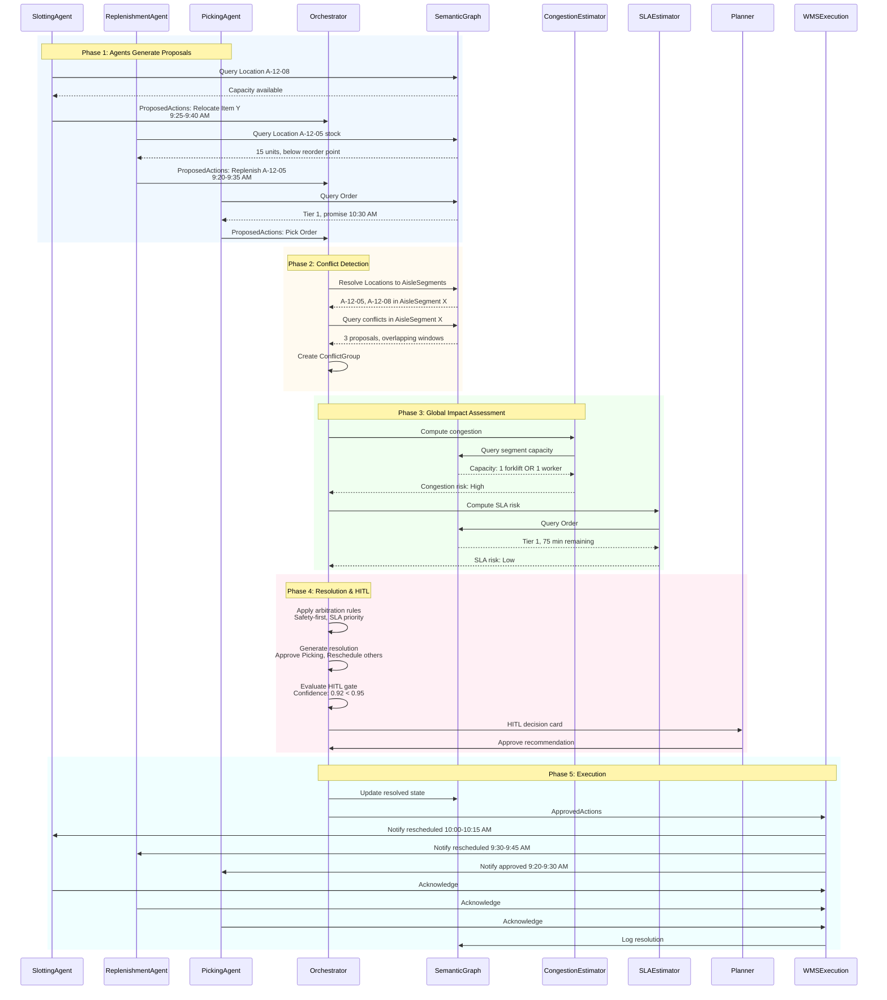

# Conflict Resolution Sequence: Multi-Agent Coordination in Constrained Aisle Segments

**Document Version:** 1.0  
**Date:** December 2025  
**Audience:** Architects, UX Stakeholders, Engineering Leadership

---

## 1. Purpose

This document illustrates the *dynamic sequence* of how the Orchestrator detects and resolves conflicts between multiple micro-agents in an agentic WMS. Unlike static architecture diagrams that show component relationships, this sequence shows the runtime flow of proposals, conflict detection, semantic graph queries, shared tool invocations, and human-in-the-loop (HITL) decision-making.

The focus is on one concrete pattern: multiple agents proposing actions that compete for the same constrained aisle segment. The Orchestrator uses the semantic warehouse graph to identify spatial and temporal conflicts, consults shared tools (congestion estimators, SLA risk calculators) to assess global impact, applies arbitration rules that prioritize safety and SLA adherence, and optionally escalates ambiguous tradeoffs to planners via structured decision cards. This sequence demonstrates how the hybrid architecture enables proactive conflict resolution rather than reactive problem-solving, ensuring that physical safety constraints are never violated and high-priority orders are protected even when multiple agents have valid local optimization objectives.

---

## 2. Scenario Overview

**AisleSegment X** is a narrow, constrained forward pick zone aisle segment (8 feet wide) in Zone A. The segment contains multiple storage locations (A-12-05, A-12-08, A-12-10) that serve high-velocity picking operations. Due to its narrow width, the segment can only safely accommodate one forklift OR one worker at a time—simultaneous occupancy by conflicting equipment types violates safety rules requiring minimum 10-foot clearance between forklifts and workers.

**SlottingAgent** proposes relocating Item Y from reserve Location R-45 to forward pick Location A-12-08 within AisleSegment X. The agent's analysis shows this relocation would reduce average pick travel time by 67% (from 45 seconds to 15 seconds) for an item that is picked 12 times per day. The proposed time window is 9:25-9:40 AM, requiring forklift access to AisleSegment X.

**ReplenishmentAgent** detects that Location A-12-05 (also in AisleSegment X) has 15 units remaining, below the reorder point of 20 units. The agent projects stockout within 6 hours if replenishment does not occur. Three high-priority orders scheduled for the next 2 hours require items from this location. The agent proposes dispatching Forklift 5 to replenish Location A-12-05 from reserve storage, scheduled for 9:20-9:35 AM, also requiring forklift access to AisleSegment X.

**PickingAgent** has identified Order #7892, a Tier 1 customer order with promise date 10:30 AM (75 minutes remaining). The order requires picking from Location A-12-05, which is in AisleSegment X. The agent proposes assigning Worker 123 to pick this order, with a time window of 9:20-9:30 AM, requiring worker access to AisleSegment X.

All three proposals are individually valid from each agent's local perspective: SlottingAgent correctly identifies a storage optimization opportunity, ReplenishmentAgent correctly identifies a stockout risk, and PickingAgent correctly identifies a high-priority order requiring fulfillment. However, the Orchestrator must decide which actions can safely coexist, what to schedule now versus later, and whether to escalate choices to a planner when tradeoffs are ambiguous or high-impact.

---

## 3. Sequence Diagram (Mermaid)

---

## 4. Narrative Walkthrough of the Sequence

### Step 1: Agents Generate Proposals

**SlottingAgent, ReplenishmentAgent, and PickingAgent** each independently observe warehouse state and generate proposals:

- **SlottingAgent:**
  - Reads warehouse state: Item Y currently in reserve Location R-45
  - Queries SemanticGraph for Location A-12-08 capacity, compatibility constraints, and congestion patterns
  - Calls deterministic tools: Storage Location Scoring, Travel Time Estimator
  - Builds ProposedAction with:
    - Priority: 5 (optimization, not time-critical)
    - Risk_score: 0.2 (low risk, but congestion concern)
    - Uncertainty: 0.10 (high confidence in slotting benefit)
    - Constraints_respected: Location capacity, compatibility, no current conflicts
    - Potential_conflicts: "May conflict with picking or replenishment in AisleSegment X"
    - Explanation: "Relocate Item Y to A-12-08: 67% travel time reduction, 12 picks/day frequency"

- **ReplenishmentAgent:**
  - Reads warehouse state: Location A-12-05 has 15 units remaining
  - Queries SemanticGraph for reorder point, stockout risk, and location availability
  - Calls deterministic tools: Safety Stock Checker, Replenishment Job Generator
  - Builds ProposedAction with:
    - Priority: 7 (routine replenishment, but stockout risk)
    - Risk_score: 0.3 (medium risk due to conflicts)
    - Uncertainty: 0.12 (high confidence in stockout risk)
    - Constraints_respected: Forklift availability, location capacity
    - Potential_conflicts: "May conflict with picking or slotting in AisleSegment X"
    - Explanation: "Replenish A-12-05: 15 units remaining, 6 hours to stockout, 3 high-priority orders require location"

- **PickingAgent:**
  - Reads warehouse state: Order #7892 requires picking from Location A-12-05
  - Queries SemanticGraph for order SLA status, location availability, and worker skills
  - Calls deterministic tools: Wave Builder, Route Optimizer, SLA Risk Estimator
  - Builds ProposedAction with:
    - Priority: 9 (Tier 1 customer, expedite flag)
    - Risk_score: 0.1 (low risk, worker-only operation)
    - Uncertainty: 0.05 (very high confidence in location availability)
    - Constraints_respected: Worker skills, location availability, SLA commitments
    - Potential_conflicts: "May conflict with forklift operations in AisleSegment X"
    - Explanation: "Pick Order #7892: Tier 1, promise 10:30 AM, 75 minutes remaining, 5 items"

### Step 2: Proposals Arrive at Orchestrator

All three agents send their ProposedActions to the Orchestrator via the event bus. The Orchestrator receives proposals within a 5-second window (9:15:00-9:15:05 AM), performs basic validation (schema checks, staleness detection, duplicate filtering), and adds valid proposals to the active set.

### Step 3: Orchestrator Detects Conflicts Using Semantic Graph

The Orchestrator queries the SemanticGraph to resolve Locations to AisleSegments:

- Query: "Which AisleSegment contains Location A-12-05 and Location A-12-08?"
- Response: Both locations belong to AisleSegment X

The Orchestrator then queries for active proposals that touch AisleSegment X:

- Query: "Find all ProposedActions that require AisleSegment X in time window 9:20-9:40 AM"
- Response: Three proposals detected:
  - PickingAgent: Worker 123, 9:20-9:30 AM
  - ReplenishmentAgent: Forklift 5, 9:20-9:35 AM
  - SlottingAgent: Forklift 3, 9:25-9:40 AM

The Orchestrator detects that all three proposals have overlapping time windows and require incompatible operations (worker and forklifts cannot safely occupy narrow aisle simultaneously). The Orchestrator creates a ConflictGroup:
- conflict_type: "aisle_occupancy"
- conflict_location: "AisleSegment X"
- conflict_time_window: {earliest_start: 9:20 AM, latest_end: 9:40 AM}
- conflicting_proposals: [PickingAgent, ReplenishmentAgent, SlottingAgent]
- risk_score: 0.15 (medium risk due to stockout potential and operational impact)

### Step 4: Orchestrator Consults Shared Tools

The Orchestrator calls shared tools to assess global impact:

- **CongestionEstimator:**
  - Query SemanticGraph for AisleSegment X capacity constraints
  - Response: Capacity = 1 forklift OR 1 worker (narrow aisle, 8 feet wide)
  - Compute occupancy: 3 operations in 20-minute window, all require segment access
  - Result: Congestion risk = High (cannot accommodate all operations simultaneously)

- **SLAEstimator:**
  - Query SemanticGraph for Order #7892 promise date, priority tier, and time remaining
  - Response: Tier 1, promise 10:30 AM, 75 minutes remaining
  - Compute SLA risk: If picking proceeds on time (9:20-9:30 AM), order has 45-minute buffer before promise date
  - Result: SLA risk = Low (adequate buffer if picking proceeds as planned)

- **Labor Capacity Forecaster (optional):**
  - Query SemanticGraph for worker availability and capacity
  - Response: Worker 123 available, has required skills, capacity sufficient
  - Result: Labor capacity adequate for proposed operations

### Step 5: Orchestrator Applies Global Policy

The Orchestrator applies arbitration rules in priority order:

1. **Safety First:**
   - Check: Can all proposals proceed without violating safety rules?
   - Evaluation: No—forklift and worker cannot occupy narrow aisle simultaneously
   - Action: Must serialize operations or reschedule to avoid proximity violations

2. **SLA Priority:**
   - Check: Which proposals support high-priority orders?
   - Evaluation: PickingAgent supports Tier 1 order with 75-minute buffer; ReplenishmentAgent prevents stockout for 3 high-priority orders; SlottingAgent is optimization only
   - Action: Prioritize PickingAgent (highest priority), then ReplenishmentAgent (stockout prevention), then SlottingAgent (optimization)

3. **Optimization:**
   - Check: How to minimize total delay across all operations?
   - Evaluation: Reschedule lower-priority operations to accommodate higher-priority ones
   - Action: Reschedule Replenishment to 9:30-9:45 AM (after picking), reschedule Slotting to 10:00-10:15 AM (lowest priority)

**Resolution Generated:**
- **Approve:** PickingAgent proceeds 9:20-9:30 AM (highest priority, Tier 1 order)
- **Reschedule:** ReplenishmentAgent to 9:30-9:45 AM (after picking completes, prevents stockout)
- **Reschedule:** SlottingAgent to 10:00-10:15 AM (optimization, can wait)

**Risk Assessment:**
- Safety risk: 0.0 (no forklift-worker conflicts after rescheduling)
- SLA risk: 0.1 (Order #7892 on track, replenishment delay acceptable)
- Operational impact: 15-minute delay for replenishment, 45-minute delay for slotting (both acceptable)

### Step 6: Orchestrator Evaluates HITL Gate

The Orchestrator evaluates whether escalation to planner is required:

- **Risk Score:** 0.15 (low, but non-zero due to SLA tradeoff)
- **Confidence:** 0.92 (high, but below threshold of 0.95 for auto-resolution)
- **Complexity:** 3 agents, multiple time windows, multiple tradeoffs
- **SLA Tradeoff:** Replenishment delay acceptable but requires human verification

**Decision:** HITL required (confidence < 0.95 threshold, complexity > 2 agents)

### Step 7: Orchestrator Builds HITL Decision Card

The Orchestrator builds a PlannerDecisionRequest that includes:

- **Conflict Summary:** "Aisle occupancy conflict in AisleSegment X, 9:20-9:40 AM. Three agents: Picking, Replenishment, Slotting."
- **Risk Indicators:**
  - Safety risk: Low (no violations after resolution)
  - SLA risk: Low (Order #7892 on track)
  - Operational impact: Medium (15-45 minute delays)
- **Proposals:**
  - PickingAgent: Worker 123, Order #7892, 9:20-9:30 AM, Tier 1, 75 min buffer
  - ReplenishmentAgent: Forklift 5, Location A-12-05, 9:20-9:35 AM, stockout risk
  - SlottingAgent: Forklift 3, Location A-12-08, 9:25-9:40 AM, optimization
- **Orchestrator Recommendation:**
  - Approve Picking (9:20-9:30 AM)
  - Reschedule Replenishment (9:30-9:45 AM)
  - Reschedule Slotting (10:00-10:15 AM)
  - Rationale: "Tier 1 order priority, safety compliance, minimal operational impact"
- **Impact Preview:**
  - Order #7892: On track (75 minutes buffer)
  - Replenishment: 15-minute delay (acceptable, 15 units remaining)
  - Slotting: 45-minute delay (acceptable, optimization not time-critical)
  - SLA risk: Low (no orders at immediate risk)

### Step 8: Planner Reviews and Responds

The Planner receives the HITL decision card in the conflict resolution dashboard. The Planner reviews:
- Conflict summary and risk indicators
- Each agent's proposal with priority and rationale
- Orchestrator recommendation with impact analysis
- Alternative resolutions (if any)

The Planner evaluates that the recommendation makes sense:
- Order #7892 is Tier 1 and needs to proceed
- Replenishment delay is acceptable (15 units remaining, not critical)
- Slotting can wait (optimization, not urgent)

The Planner clicks **"Approve Recommendation"** (or optionally modifies priorities or constraints).

### Step 9: Orchestrator Finalizes and Executes

The Orchestrator:
1. Updates SemanticGraph with resolved conflict state
2. Converts approved proposals to ApprovedAction objects
3. Sends ApprovedActions to WMSExecution:
   - PickingAgent: Proceed 9:20-9:30 AM
   - ReplenishmentAgent: Rescheduled to 9:30-9:45 AM
   - SlottingAgent: Rescheduled to 10:00-10:15 AM
4. Notifies all three agents of resolution
5. Logs all decisions for evaluation and root-cause analysis

**Execution Timeline:**
- 9:20 AM: Worker 123 enters AisleSegment X, begins picking Order #7892
- 9:30 AM: Picking completes, Worker 123 exits
- 9:30 AM: Forklift 5 enters AisleSegment X, begins replenishment
- 9:45 AM: Replenishment completes, Forklift 5 exits
- 10:00 AM: Forklift 3 enters AisleSegment X, begins slotting movement
- 10:15 AM: Slotting completes, Forklift 3 exits

**Result:** All operations completed successfully, no safety incidents, no SLA violations, minimal operational impact.

---

## 5. UX Implications

This sequence demonstrates how conflict resolution appears in the planner's user interface:

**Aggregated Conflict View:** The Planner sees conflicts as aggregated, structured decision cards—not raw tool outputs or individual agent proposals. The Orchestrator synthesizes information from multiple agents, semantic graph queries, and shared tool outputs into a single, actionable decision request. This reduces cognitive load by presenting one conflict resolution task rather than requiring the planner to manually correlate information across multiple systems.

**Decision Card Structure:** The HITL decision card surfaces:
- **Top options:** Clear recommendation with approved, rescheduled, and rejected actions
- **Key metrics:** Safety risk, SLA risk, operational impact with color-coded indicators (green/yellow/red)
- **Recommended default action:** Orchestrator's recommendation aligned with agent personalities (safety-first, SLA priority, optimization)
- **Impact preview:** What happens to each affected order, operation, and resource if the recommendation is approved

**Planner Control:** The Planner can:
- **Accept orchestrator's plan:** One-click approval for routine conflicts with clear recommendations
- **Override priorities or constraints:** Modify the resolution in a controlled way (e.g., "Prioritize Slotting over Replenishment for this conflict")
- **Request more information:** Drill down into agent reasoning traces, semantic graph queries, or historical conflict patterns
- **Defer decision:** Hold the conflict for later review if time allows (with timeout escalation)

**Bridge Between Backend and UX:** This document bridges backend orchestration behavior (how the Orchestrator detects conflicts, queries semantic graph, applies arbitration rules) and the HITL experience defined in UX flows. The sequence shows how semantic graph queries translate into conflict detection, how shared tool outputs inform risk assessment, and how orchestrator recommendations become structured decision cards that planners interact with. This alignment ensures that UX designers understand the data flow and decision logic that drives interface elements, enabling them to design interfaces that surface the right information at the right time in a way that feels calm, structured, and respectful.

---

## 6. Linkages

This conflict resolution sequence is referenced and extended in several related documents:

- **Coordination Diagram** (`architecture/agentic_coordination_diagram.md`): Shows the high-level interaction pattern between agents, orchestrator, semantic graph, and tools. This sequence document provides the detailed runtime flow that implements those coordination patterns.

- **Semantic Warehouse Graph** (`semantics/warehouse_graph.md`): Defines how conflicts are identified through semantic relationships (Location → AisleSegment, Task → AisleSegment). This sequence shows how those relationships are queried at runtime to detect spatial and temporal conflicts.

- **Orchestrator Logic** (`prototype/orchestrator_logic.py`): Contains the behavioral specification for conflict detection, arbitration rules, and HITL escalation. This sequence demonstrates how those behaviors manifest in a concrete scenario with specific proposals, conflicts, and resolutions.

- **Agent Personalities** (`agent_design/agent_personalities.md`): Defines how each agent generates proposals, evaluates risks, and escalates uncertainty. This sequence shows how agent personalities influence proposal generation (SlottingAgent's optimization focus, ReplenishmentAgent's stockout prevention, PickingAgent's SLA adherence) and how the Orchestrator personality (safety-first, balanced on SLA vs congestion) drives resolution decisions.

- **Conflict Resolution Flow** (`ux-flows/conflict_resolution_flow.md`): Defines the UX patterns and planner experience for HITL decision-making. This sequence shows the backend data flow and decision logic that generates the HITL decision cards and impact previews that planners interact with.

- **Evaluation Framework** (`evals/evaluation_framework.md`): Uses conflict scenarios like this one to test orchestrator behavior, agent coordination, and system correctness. This sequence provides a concrete test case that evaluators can simulate and measure against expected behavior.

- **Picking Agent Cases** (`evals/picking_agent_cases.md`): Contains concrete test scenarios for picking agent behavior. This sequence shows how picking agent proposals interact with other agents in multi-agent conflicts, enabling evaluators to test cross-agent coordination.

---

**Document Status:** Sequence Specification  
**Next Steps:** Implement orchestrator conflict detection logic, build HITL decision card interface, validate sequence with pilot scenarios

